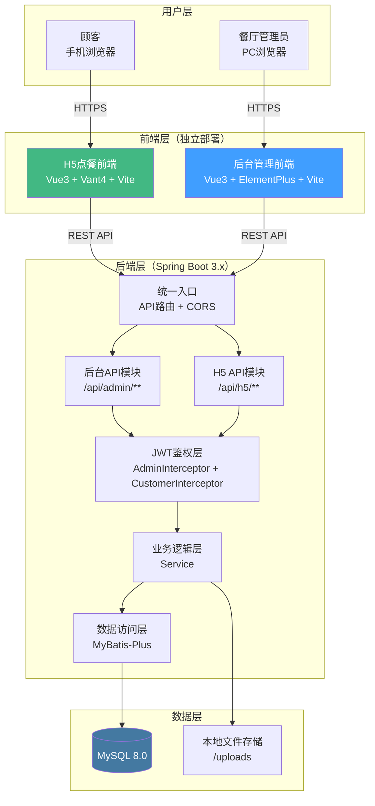
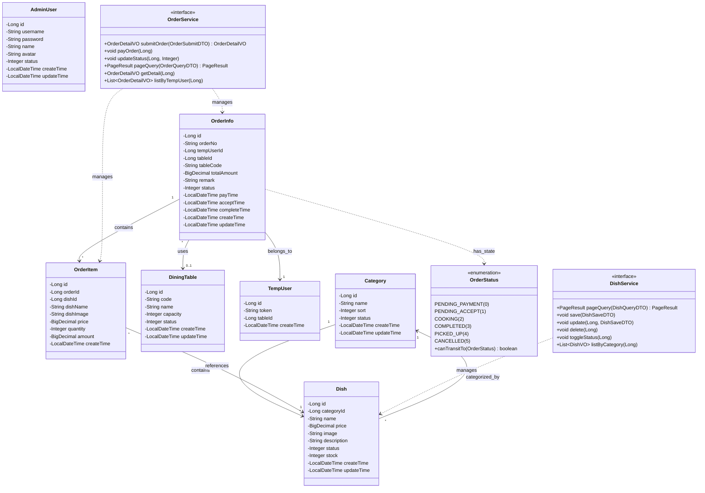
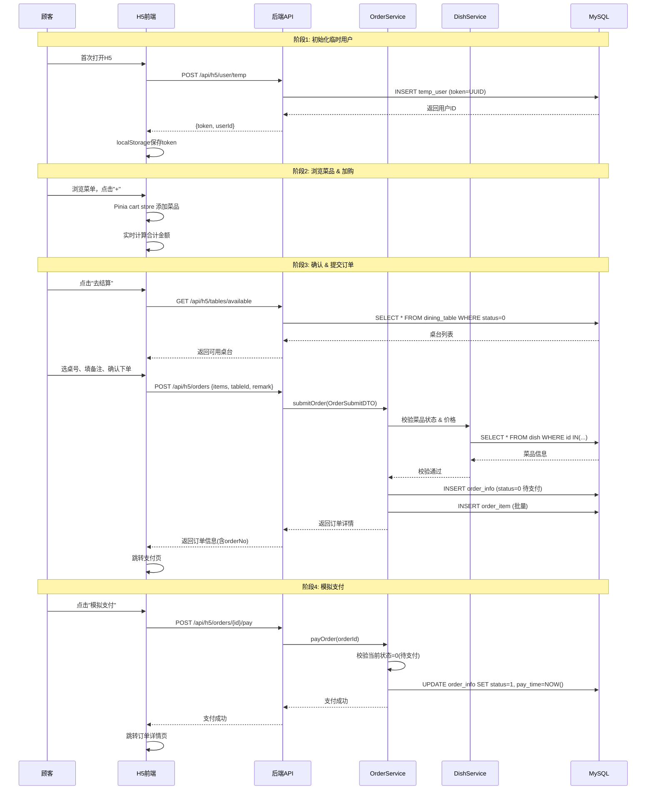
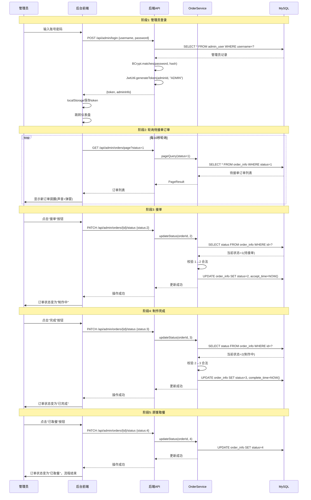
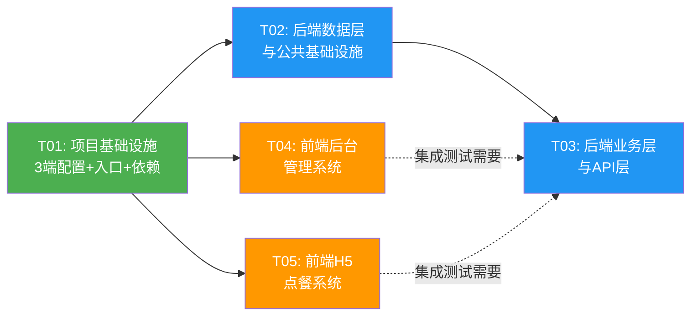

# 智能点餐系统 — 架构设计文档

> **项目名称**: order_food  
> **技术栈**: Java 21 + Spring Boot 3.x + MySQL 8.0 + MyBatis-Plus | Vue 3 + Element Plus + Vant 4 + Vite  
> **文档版本**: v1.0  
> **创建日期**: 2025-07-06  
> **编写人**: 架构师 高见远（Bob）

---

## 目录

- [Part A: 系统设计](#part-a-系统设计)
  - [1. 实现方案](#1-实现方案)
  - [2. 文件列表](#2-文件列表)
  - [3. 数据结构与接口](#3-数据结构与接口)
  - [4. 程序调用流程](#4-程序调用流程)
  - [5. 待明确事项](#5-待明确事项)
- [Part B: 任务分解](#part-b-任务分解)
  - [6. 依赖包列表](#6-依赖包列表)
  - [7. 任务列表](#7-任务列表)
  - [8. 共享知识](#8-共享知识)
  - [9. 任务依赖图](#9-任务依赖图)

---

# Part A: 系统设计

## 1. 实现方案

### 1.1 核心技术挑战

| 挑战 | 说明 | 解决方案 |
|------|------|----------|
| **订单状态机** | 订单需按严格状态流转，禁止非法跳转 | 后端封装 `OrderStatusEnum` 枚举 + `OrderService` 内状态校验逻辑，非法流转抛出 `BizException` |
| **双端鉴权** | 后台管理员 API 与 H5 顾客 API 权限隔离 | 双 JWT 拦截器：`AdminAuthInterceptor`（路径 `/api/admin/**`）与 `CustomerAuthInterceptor`（路径 `/api/h5/**` 部分），Token 中携带角色标识 |
| **临时用户体系** | 顾客无需注册登录，扫码即用 | 首次访问 H5 时后端生成 `temp_user` 记录 + Token，存于 localStorage，后续请求携带该 Token |
| **购物车状态** | H5 购物车需在页面间共享、实时计算 | 前端 Pinia store 管理购物车，纯客户端逻辑，下单时才提交后端 |
| **文件上传** | 菜品图片需上传存储 | 后端 `FileService` 本地存储，返回访问 URL；前端 Element Plus Upload 组件对接 |
| **订单轮询** | 后台需实时感知新订单（MVP 用轮询） | 前端 `setInterval` 每 10s 调用待接单订单接口，WebSocket 留 P1 升级 |

### 1.2 整体架构图



### 1.3 后端分层架构

```
┌─────────────────────────────────────────────────────┐
│                   Controller 层                      │
│   admin/ 目录: 后台管理API    h5/ 目录: H5点餐API     │
│   职责: 接收请求、参数校验、调用Service、返回Result    │
├─────────────────────────────────────────────────────┤
│                    Service 层                        │
│   职责: 核心业务逻辑、状态机校验、事务管理             │
├─────────────────────────────────────────────────────┤
│                    Mapper 层                         │
│   职责: 数据库CRUD (MyBatis-Plus BaseMapper)         │
├─────────────────────────────────────────────────────┤
│                   MySQL 8.0 数据库                    │
└─────────────────────────────────────────────────────┘

横向切面:
┌─────────────┐  ┌──────────────┐  ┌──────────────┐
│  Config     │  │ Interceptor  │  │   Common     │
│  (配置层)    │  │  (拦截器层)   │  │  (公共组件)   │
└─────────────┘  └──────────────┘  └──────────────┘
```

**分层规范**：
- Controller 不含业务逻辑，仅做参数接收 + 调用 Service + 包装 Result
- Service 接口与实现分离（`XxxService` 接口 + `XxxServiceImpl` 实现）
- Mapper 继承 `BaseMapper<T>`，复杂查询用 XML 或 `@Select` 注解
- 所有实体类继承统一 BaseModel（MyBatis-Plus 自动填充 createTime/updateTime）

### 1.4 前端项目结构说明

**后台管理前端（frontend-admin）**：
```
src/
├── api/           # Axios 请求封装 + 各模块 API
├── store/         # Pinia 状态管理 (auth)
├── router/        # Vue Router 路由配置 + 守卫
├── layout/        # 后台布局 (侧边栏 + 顶栏 + 内容区)
├── views/         # 页面组件 (login/dashboard/dish/order...)
├── components/    # 可复用弹窗/组件
├── types/         # TypeScript 类型定义
├── utils/         # 工具函数
└── styles/        # 全局样式
```

**H5 点餐前端（frontend-h5）**：
```
src/
├── api/           # Axios 请求封装 + 各模块 API
├── store/         # Pinia 状态管理 (cart/user)
├── router/        # Vue Router 路由配置
├── views/         # 页面组件 (home/menu/cart/confirm/order...)
├── components/    # 可复用组件 (DishCard/CartBar/OrderCard)
├── types/         # TypeScript 类型定义
├── utils/         # 工具函数
└── styles/        # 全局样式
```

---

## 2. 文件列表

### 2.1 后端 Java 项目

| # | 文件路径 | 说明 |
|---|---------|------|
| **配置 & 入口** | | |
| 1 | `backend/pom.xml` | Maven 依赖管理 |
| 2 | `backend/src/main/resources/application.yml` | 主配置文件 |
| 3 | `backend/src/main/resources/application-dev.yml` | 开发环境配置 |
| 4 | `backend/src/main/java/com/restaurant/RestaurantApplication.java` | Spring Boot 启动类 |
| **数据库脚本** | | |
| 5 | `backend/src/main/resources/db/schema.sql` | 建表 DDL |
| 6 | `backend/src/main/resources/db/data.sql` | 初始数据 |
| **配置类** | | |
| 7 | `backend/src/main/java/com/restaurant/config/MybatisPlusConfig.java` | MyBatis-Plus 配置（分页插件、自动填充） |
| 8 | `backend/src/main/java/com/restaurant/config/WebMvcConfig.java` | Web MVC 配置（拦截器注册、静态资源） |
| 9 | `backend/src/main/java/com/restaurant/config/CorsConfig.java` | 跨域配置 |
| **公共组件** | | |
| 10 | `backend/src/main/java/com/restaurant/common/Result.java` | 统一响应封装 |
| 11 | `backend/src/main/java/com/restaurant/common/ResultCode.java` | 响应码枚举 |
| 12 | `backend/src/main/java/com/restaurant/common/PageResult.java` | 分页结果封装 |
| 13 | `backend/src/main/java/com/restaurant/common/BizException.java` | 业务异常 |
| 14 | `backend/src/main/java/com/restaurant/common/GlobalExceptionHandler.java` | 全局异常处理器 |
| **拦截器** | | |
| 15 | `backend/src/main/java/com/restaurant/interceptor/AdminAuthInterceptor.java` | 管理员 JWT 拦截器 |
| 16 | `backend/src/main/java/com/restaurant/interceptor/CustomerAuthInterceptor.java` | 顾客 Token 拦截器 |
| **工具类** | | |
| 17 | `backend/src/main/java/com/restaurant/util/JwtUtil.java` | JWT 生成与解析 |
| 18 | `backend/src/main/java/com/restaurant/util/OrderNoUtil.java` | 订单号生成器 |
| **枚举** | | |
| 19 | `backend/src/main/java/com/restaurant/enums/OrderStatus.java` | 订单状态枚举 |
| 20 | `backend/src/main/java/com/restaurant/enums/DishStatus.java` | 菜品状态枚举 |
| 21 | `backend/src/main/java/com/restaurant/enums/TableStatus.java` | 桌台状态枚举 |
| **实体类** | | |
| 22 | `backend/src/main/java/com/restaurant/entity/AdminUser.java` | 管理员实体 |
| 23 | `backend/src/main/java/com/restaurant/entity/Category.java` | 分类实体 |
| 24 | `backend/src/main/java/com/restaurant/entity/Dish.java` | 菜品实体 |
| 25 | `backend/src/main/java/com/restaurant/entity/DiningTable.java` | 桌台实体 |
| 26 | `backend/src/main/java/com/restaurant/entity/OrderInfo.java` | 订单实体 |
| 27 | `backend/src/main/java/com/restaurant/entity/OrderItem.java` | 订单明细实体 |
| 28 | `backend/src/main/java/com/restaurant/entity/TempUser.java` | 临时用户实体 |
| **Mapper** | | |
| 29 | `backend/src/main/java/com/restaurant/mapper/AdminUserMapper.java` | 管理员 Mapper |
| 30 | `backend/src/main/java/com/restaurant/mapper/CategoryMapper.java` | 分类 Mapper |
| 31 | `backend/src/main/java/com/restaurant/mapper/DishMapper.java` | 菜品 Mapper |
| 32 | `backend/src/main/java/com/restaurant/mapper/DiningTableMapper.java` | 桌台 Mapper |
| 33 | `backend/src/main/java/com/restaurant/mapper/OrderInfoMapper.java` | 订单 Mapper |
| 34 | `backend/src/main/java/com/restaurant/mapper/OrderItemMapper.java` | 订单明细 Mapper |
| 35 | `backend/src/main/java/com/restaurant/mapper/TempUserMapper.java` | 临时用户 Mapper |
| 36 | `backend/src/main/resources/mapper/OrderInfoMapper.xml` | 订单复杂查询 XML |
| 37 | `backend/src/main/resources/mapper/DishMapper.xml` | 菜品复杂查询 XML |
| **DTO（请求）** | | |
| 38 | `backend/src/main/java/com/restaurant/dto/AdminLoginDTO.java` | 管理员登录请求 |
| 39 | `backend/src/main/java/com/restaurant/dto/DishSaveDTO.java` | 菜品新增/修改请求 |
| 40 | `backend/src/main/java/com/restaurant/dto/DishQueryDTO.java` | 菜品分页查询请求 |
| 41 | `backend/src/main/java/com/restaurant/dto/CategorySaveDTO.java` | 分类新增/修改请求 |
| 42 | `backend/src/main/java/com/restaurant/dto/OrderQueryDTO.java` | 订单分页查询请求 |
| 43 | `backend/src/main/java/com/restaurant/dto/TableSaveDTO.java` | 桌台新增/修改请求 |
| 44 | `backend/src/main/java/com/restaurant/dto/OrderStatusDTO.java` | 订单状态变更请求 |
| 45 | `backend/src/main/java/com/restaurant/dto/OrderSubmitDTO.java` | H5 下单请求 |
| 46 | `backend/src/main/java/com/restaurant/dto/CartItemDTO.java` | 购物车项请求 |
| **VO（响应）** | | |
| 47 | `backend/src/main/java/com/restaurant/vo/AdminLoginVO.java` | 管理员登录响应 |
| 48 | `backend/src/main/java/com/restaurant/vo/DishVO.java` | 菜品响应 |
| 49 | `backend/src/main/java/com/restaurant/vo/CategoryVO.java` | 分类响应 |
| 50 | `backend/src/main/java/com/restaurant/vo/OrderDetailVO.java` | 订单详情响应 |
| 51 | `backend/src/main/java/com/restaurant/vo/OrderItemVO.java` | 订单明细响应 |
| 52 | `backend/src/main/java/com/restaurant/vo/TableVO.java` | 桌台响应 |
| 53 | `backend/src/main/java/com/restaurant/vo/DashboardVO.java` | 仪表盘数据响应 |
| **Service 接口** | | |
| 54 | `backend/src/main/java/com/restaurant/service/AdminAuthService.java` | 管理员认证服务接口 |
| 55 | `backend/src/main/java/com/restaurant/service/DishService.java` | 菜品服务接口 |
| 56 | `backend/src/main/java/com/restaurant/service/CategoryService.java` | 分类服务接口 |
| 57 | `backend/src/main/java/com/restaurant/service/OrderService.java` | 订单服务接口 |
| 58 | `backend/src/main/java/com/restaurant/service/DiningTableService.java` | 桌台服务接口 |
| 59 | `backend/src/main/java/com/restaurant/service/StatsService.java` | 统计服务接口 |
| 60 | `backend/src/main/java/com/restaurant/service/FileService.java` | 文件服务接口 |
| 61 | `backend/src/main/java/com/restaurant/service/TempUserService.java` | 临时用户服务接口 |
| **Service 实现** | | |
| 62 | `backend/src/main/java/com/restaurant/service/impl/AdminAuthServiceImpl.java` | 管理员认证服务实现 |
| 63 | `backend/src/main/java/com/restaurant/service/impl/DishServiceImpl.java` | 菜品服务实现 |
| 64 | `backend/src/main/java/com/restaurant/service/impl/CategoryServiceImpl.java` | 分类服务实现 |
| 65 | `backend/src/main/java/com/restaurant/service/impl/OrderServiceImpl.java` | 订单服务实现 |
| 66 | `backend/src/main/java/com/restaurant/service/impl/DiningTableServiceImpl.java` | 桌台服务实现 |
| 67 | `backend/src/main/java/com/restaurant/service/impl/StatsServiceImpl.java` | 统计服务实现 |
| 68 | `backend/src/main/java/com/restaurant/service/impl/FileServiceImpl.java` | 文件服务实现 |
| 69 | `backend/src/main/java/com/restaurant/service/impl/TempUserServiceImpl.java` | 临时用户服务实现 |
| **Controller** | | |
| 70 | `backend/src/main/java/com/restaurant/controller/admin/AdminAuthController.java` | 管理员登录接口 |
| 71 | `backend/src/main/java/com/restaurant/controller/admin/DishController.java` | 菜品管理接口 |
| 72 | `backend/src/main/java/com/restaurant/controller/admin/CategoryController.java` | 分类管理接口 |
| 73 | `backend/src/main/java/com/restaurant/controller/admin/OrderController.java` | 订单管理接口 |
| 74 | `backend/src/main/java/com/restaurant/controller/admin/DiningTableController.java` | 桌台管理接口 |
| 75 | `backend/src/main/java/com/restaurant/controller/admin/StatsController.java` | 统计仪表盘接口 |
| 76 | `backend/src/main/java/com/restaurant/controller/admin/FileController.java` | 文件上传接口 |
| 77 | `backend/src/main/java/com/restaurant/controller/h5/H5DishController.java` | H5 菜品浏览接口 |
| 78 | `backend/src/main/java/com/restaurant/controller/h5/H5OrderController.java` | H5 下单/支付/查看接口 |
| 79 | `backend/src/main/java/com/restaurant/controller/h5/H5TableController.java` | H5 桌台查询接口 |
| 80 | `backend/src/main/java/com/restaurant/controller/h5/H5UserController.java` | H5 临时用户接口 |

### 2.2 前端后台管理系统

| # | 文件路径 | 说明 |
|---|---------|------|
| 81 | `frontend-admin/package.json` | 依赖管理 |
| 82 | `frontend-admin/vite.config.ts` | Vite 配置 |
| 83 | `frontend-admin/tsconfig.json` | TypeScript 配置 |
| 84 | `frontend-admin/tsconfig.node.json` | Node 环境配置 |
| 85 | `frontend-admin/index.html` | HTML 入口 |
| 86 | `frontend-admin/.env.development` | 开发环境变量 |
| 87 | `frontend-admin/.env.production` | 生产环境变量 |
| 88 | `frontend-admin/src/main.ts` | 应用入口 |
| 89 | `frontend-admin/src/App.vue` | 根组件 |
| 90 | `frontend-admin/src/env.d.ts` | 类型声明 |
| 91 | `frontend-admin/src/router/index.ts` | 路由配置 + 守卫 |
| 92 | `frontend-admin/src/store/index.ts` | Pinia store 入口 |
| 93 | `frontend-admin/src/store/modules/auth.ts` | 认证状态管理 |
| 94 | `frontend-admin/src/api/request.ts` | Axios 实例封装 |
| 95 | `frontend-admin/src/api/auth.ts` | 认证 API |
| 96 | `frontend-admin/src/api/dish.ts` | 菜品 API |
| 97 | `frontend-admin/src/api/category.ts` | 分类 API |
| 98 | `frontend-admin/src/api/order.ts` | 订单 API |
| 99 | `frontend-admin/src/api/table.ts` | 桌台 API |
| 100 | `frontend-admin/src/api/stats.ts` | 统计 API |
| 101 | `frontend-admin/src/layout/index.vue` | 后台布局 |
| 102 | `frontend-admin/src/layout/Sidebar.vue` | 侧边栏导航 |
| 103 | `frontend-admin/src/layout/Header.vue` | 顶部导航栏 |
| 104 | `frontend-admin/src/views/login/index.vue` | 登录页 |
| 105 | `frontend-admin/src/views/dashboard/index.vue` | 仪表盘 |
| 106 | `frontend-admin/src/views/dish/index.vue` | 菜品管理页 |
| 107 | `frontend-admin/src/views/category/index.vue` | 分类管理页 |
| 108 | `frontend-admin/src/views/order/index.vue` | 订单管理页 |
| 109 | `frontend-admin/src/views/table/index.vue` | 桌台管理页 |
| 110 | `frontend-admin/src/views/user/index.vue` | 用户管理页(P1) |
| 111 | `frontend-admin/src/components/DishDialog.vue` | 菜品新增/编辑弹窗 |
| 112 | `frontend-admin/src/components/CategoryDialog.vue` | 分类新增/编辑弹窗 |
| 113 | `frontend-admin/src/components/OrderDetailDialog.vue` | 订单详情弹窗 |
| 114 | `frontend-admin/src/components/TableDialog.vue` | 桌台新增/编辑弹窗 |
| 115 | `frontend-admin/src/types/index.ts` | 类型定义 |
| 116 | `frontend-admin/src/utils/index.ts` | 工具函数 |
| 117 | `frontend-admin/src/styles/index.css` | 全局样式 |

### 2.3 前端 H5 点餐系统

| # | 文件路径 | 说明 |
|---|---------|------|
| 118 | `frontend-h5/package.json` | 依赖管理 |
| 119 | `frontend-h5/vite.config.ts` | Vite 配置 |
| 120 | `frontend-h5/tsconfig.json` | TypeScript 配置 |
| 121 | `frontend-h5/tsconfig.node.json` | Node 环境配置 |
| 122 | `frontend-h5/index.html` | HTML 入口 |
| 123 | `frontend-h5/.env.development` | 开发环境变量 |
| 124 | `frontend-h5/.env.production` | 生产环境变量 |
| 125 | `frontend-h5/src/main.ts` | 应用入口 |
| 126 | `frontend-h5/src/App.vue` | 根组件 |
| 127 | `frontend-h5/src/env.d.ts` | 类型声明 |
| 128 | `frontend-h5/src/router/index.ts` | 路由配置 |
| 129 | `frontend-h5/src/store/index.ts` | Pinia store 入口 |
| 130 | `frontend-h5/src/store/modules/cart.ts` | 购物车状态管理 |
| 131 | `frontend-h5/src/store/modules/user.ts` | 用户状态管理 |
| 132 | `frontend-h5/src/api/request.ts` | Axios 实例封装 |
| 133 | `frontend-h5/src/api/dish.ts` | 菜品 API |
| 134 | `frontend-h5/src/api/order.ts` | 订单 API |
| 135 | `frontend-h5/src/api/table.ts` | 桌台 API |
| 136 | `frontend-h5/src/api/user.ts` | 用户 API |
| 137 | `frontend-h5/src/views/home/index.vue` | 首页 |
| 138 | `frontend-h5/src/views/menu/index.vue` | 菜单页 |
| 139 | `frontend-h5/src/views/cart/index.vue` | 购物车页 |
| 140 | `frontend-h5/src/views/confirm/index.vue` | 订单确认页 |
| 141 | `frontend-h5/src/views/order/list.vue` | 订单列表页 |
| 142 | `frontend-h5/src/views/order/detail.vue` | 订单详情页 |
| 143 | `frontend-h5/src/views/pay/index.vue` | 支付页（模拟） |
| 144 | `frontend-h5/src/components/DishCard.vue` | 菜品卡片组件 |
| 145 | `frontend-h5/src/components/CartBar.vue` | 底部购物车栏 |
| 146 | `frontend-h5/src/components/OrderCard.vue` | 订单卡片组件 |
| 147 | `frontend-h5/src/types/index.ts` | 类型定义 |
| 148 | `frontend-h5/src/utils/index.ts` | 工具函数 |
| 149 | `frontend-h5/src/styles/index.css` | 全局样式 |

---

## 3. 数据结构与接口

### 3.1 数据库表结构设计（DDL）

```sql
-- ============================================================
-- 智能点餐系统 数据库建表脚本
-- Database: order_food
-- Engine: InnoDB  Charset: utf8mb4
-- ============================================================

CREATE DATABASE IF NOT EXISTS order_food DEFAULT CHARACTER SET utf8mb4 COLLATE utf8mb4_unicode_ci;
USE order_food;

-- -----------------------------------------------------------
-- 1. 管理员表
-- -----------------------------------------------------------
CREATE TABLE admin_user (
    id          BIGINT       PRIMARY KEY AUTO_INCREMENT,
    username    VARCHAR(50)  NOT NULL UNIQUE          COMMENT '登录用户名',
    password    VARCHAR(100) NOT NULL                 COMMENT '密码(BCrypt加密)',
    name        VARCHAR(50)                           COMMENT '姓名',
    avatar      VARCHAR(255)                          COMMENT '头像URL',
    status      TINYINT      NOT NULL DEFAULT 1       COMMENT '状态: 0禁用 1启用',
    create_time DATETIME     NOT NULL DEFAULT CURRENT_TIMESTAMP,
    update_time DATETIME     NOT NULL DEFAULT CURRENT_TIMESTAMP ON UPDATE CURRENT_TIMESTAMP
) ENGINE=InnoDB DEFAULT CHARSET=utf8mb4 COMMENT='管理员表';

-- -----------------------------------------------------------
-- 2. 菜品分类表
-- -----------------------------------------------------------
CREATE TABLE category (
    id          BIGINT       PRIMARY KEY AUTO_INCREMENT,
    name        VARCHAR(50)  NOT NULL                 COMMENT '分类名称',
    sort        INT          NOT NULL DEFAULT 0       COMMENT '排序值(升序)',
    status      TINYINT      NOT NULL DEFAULT 1       COMMENT '状态: 0禁用 1启用',
    create_time DATETIME     NOT NULL DEFAULT CURRENT_TIMESTAMP,
    update_time DATETIME     NOT NULL DEFAULT CURRENT_TIMESTAMP ON UPDATE CURRENT_TIMESTAMP
) ENGINE=InnoDB DEFAULT CHARSET=utf8mb4 COMMENT='菜品分类表';

-- -----------------------------------------------------------
-- 3. 菜品表
-- -----------------------------------------------------------
CREATE TABLE dish (
    id          BIGINT        PRIMARY KEY AUTO_INCREMENT,
    category_id BIGINT        NOT NULL                 COMMENT '分类ID',
    name        VARCHAR(100)  NOT NULL                 COMMENT '菜品名称',
    price       DECIMAL(10,2) NOT NULL                 COMMENT '单价',
    image       VARCHAR(255)                           COMMENT '图片URL',
    description VARCHAR(500)                           COMMENT '描述',
    status      TINYINT       NOT NULL DEFAULT 1       COMMENT '状态: 0下架 1上架',
    stock       INT           NOT NULL DEFAULT -1      COMMENT '库存(-1表示无限)',
    create_time DATETIME      NOT NULL DEFAULT CURRENT_TIMESTAMP,
    update_time DATETIME      NOT NULL DEFAULT CURRENT_TIMESTAMP ON UPDATE CURRENT_TIMESTAMP,
    INDEX idx_category (category_id),
    INDEX idx_status (status)
) ENGINE=InnoDB DEFAULT CHARSET=utf8mb4 COMMENT='菜品表';

-- -----------------------------------------------------------
-- 4. 桌台表
-- -----------------------------------------------------------
CREATE TABLE dining_table (
    id          BIGINT       PRIMARY KEY AUTO_INCREMENT,
    code        VARCHAR(20)  NOT NULL UNIQUE          COMMENT '桌号(如A01)',
    name        VARCHAR(50)                           COMMENT '桌台名称',
    capacity    INT          NOT NULL DEFAULT 4       COMMENT '容纳人数',
    status      TINYINT      NOT NULL DEFAULT 0       COMMENT '状态: 0空闲 1就餐中',
    create_time DATETIME     NOT NULL DEFAULT CURRENT_TIMESTAMP,
    update_time DATETIME     NOT NULL DEFAULT CURRENT_TIMESTAMP ON UPDATE CURRENT_TIMESTAMP
) ENGINE=InnoDB DEFAULT CHARSET=utf8mb4 COMMENT='桌台表';

-- -----------------------------------------------------------
-- 5. 临时用户表
-- -----------------------------------------------------------
CREATE TABLE temp_user (
    id          BIGINT       PRIMARY KEY AUTO_INCREMENT,
    token       VARCHAR(64)  NOT NULL UNIQUE          COMMENT '访问Token',
    table_id    BIGINT                                COMMENT '绑定的桌台ID(扫码场景)',
    create_time DATETIME     NOT NULL DEFAULT CURRENT_TIMESTAMP
) ENGINE=InnoDB DEFAULT CHARSET=utf8mb4 COMMENT='临时用户表';

-- -----------------------------------------------------------
-- 6. 订单表
-- -----------------------------------------------------------
CREATE TABLE order_info (
    id            BIGINT        PRIMARY KEY AUTO_INCREMENT,
    order_no      VARCHAR(32)   NOT NULL UNIQUE        COMMENT '订单号(yyyyMMdd+序列)',
    temp_user_id  BIGINT        NOT NULL               COMMENT '临时用户ID',
    table_id      BIGINT                               COMMENT '桌台ID',
    table_code    VARCHAR(20)                          COMMENT '桌号(冗余)',
    total_amount  DECIMAL(10,2) NOT NULL               COMMENT '订单总金额',
    remark        VARCHAR(500)                         COMMENT '订单备注',
    status        TINYINT       NOT NULL DEFAULT 0     COMMENT '0待支付 1待接单 2制作中 3已完成 4已取餐 5已取消',
    pay_time      DATETIME                             COMMENT '支付时间',
    accept_time   DATETIME                             COMMENT '接单时间',
    complete_time DATETIME                             COMMENT '完成时间',
    create_time   DATETIME      NOT NULL DEFAULT CURRENT_TIMESTAMP,
    update_time   DATETIME      NOT NULL DEFAULT CURRENT_TIMESTAMP ON UPDATE CURRENT_TIMESTAMP,
    INDEX idx_status (status),
    INDEX idx_temp_user (temp_user_id),
    INDEX idx_create_time (create_time)
) ENGINE=InnoDB DEFAULT CHARSET=utf8mb4 COMMENT='订单表';

-- -----------------------------------------------------------
-- 7. 订单明细表
-- -----------------------------------------------------------
CREATE TABLE order_item (
    id          BIGINT        PRIMARY KEY AUTO_INCREMENT,
    order_id    BIGINT        NOT NULL                 COMMENT '订单ID',
    dish_id     BIGINT        NOT NULL                 COMMENT '菜品ID',
    dish_name   VARCHAR(100)  NOT NULL                 COMMENT '菜品名称(冗余)',
    dish_image  VARCHAR(255)                           COMMENT '菜品图片(冗余)',
    price       DECIMAL(10,2) NOT NULL                 COMMENT '单价(下单时快照)',
    quantity    INT           NOT NULL                 COMMENT '数量',
    amount      DECIMAL(10,2) NOT NULL                 COMMENT '小计金额',
    create_time DATETIME      NOT NULL DEFAULT CURRENT_TIMESTAMP,
    INDEX idx_order (order_id)
) ENGINE=InnoDB DEFAULT CHARSET=utf8mb4 COMMENT='订单明细表';
```

### 3.2 初始数据脚本

```sql
USE order_food;

-- 管理员初始账号 (密码: admin123, BCrypt加密)
INSERT INTO admin_user (username, password, name, status) VALUES
('admin', '$2a$10$N.zmdr9k7uOCQb376NoUnuTJ8iAt6Z5EHsM8lE9lBOsl7iKTVKIUi', '超级管理员', 1);

-- 初始分类
INSERT INTO category (name, sort, status) VALUES
('热菜', 1, 1),
('凉菜', 2, 1),
('主食', 3, 1),
('汤品', 4, 1),
('饮品', 5, 1);

-- 初始桌台
INSERT INTO dining_table (code, name, capacity, status) VALUES
('A01', '大厅A01', 4, 0),
('A02', '大厅A02', 4, 0),
('A03', '大厅A03', 2, 0),
('B01', '包间B01', 8, 0),
('B02', '包间B02', 6, 0);
```

### 3.3 核心实体类关系（类图）

> 完整 Mermaid 源码见 `docs/class-diagram.mermaid`



### 3.4 REST API 接口列表

#### 3.4.1 后台管理 API（`/api/admin/**`，需管理员 JWT）

| 方法 | 路径 | 描述 | 权限 |
|------|------|------|------|
| POST | `/api/admin/login` | 管理员登录 | 公开 |
| POST | `/api/admin/logout` | 管理员登出 | 管理员 |
| GET | `/api/admin/dishes/page` | 菜品分页查询 | 管理员 |
| POST | `/api/admin/dishes` | 新增菜品 | 管理员 |
| PUT | `/api/admin/dishes/{id}` | 修改菜品 | 管理员 |
| DELETE | `/api/admin/dishes/{id}` | 删除菜品 | 管理员 |
| PATCH | `/api/admin/dishes/{id}/status` | 菜品上下架 | 管理员 |
| GET | `/api/admin/categories` | 分类列表 | 管理员 |
| POST | `/api/admin/categories` | 新增分类 | 管理员 |
| PUT | `/api/admin/categories/{id}` | 修改分类 | 管理员 |
| DELETE | `/api/admin/categories/{id}` | 删除分类 | 管理员 |
| PUT | `/api/admin/categories/sort` | 分类排序 | 管理员 |
| GET | `/api/admin/orders/page` | 订单分页查询 | 管理员 |
| GET | `/api/admin/orders/{id}` | 订单详情 | 管理员 |
| PATCH | `/api/admin/orders/{id}/status` | 修改订单状态 | 管理员 |
| GET | `/api/admin/tables` | 桌台列表 | 管理员 |
| POST | `/api/admin/tables` | 新增桌台 | 管理员 |
| PUT | `/api/admin/tables/{id}` | 修改桌台 | 管理员 |
| DELETE | `/api/admin/tables/{id}` | 删除桌台 | 管理员 |
| GET | `/api/admin/stats/dashboard` | 仪表盘数据 | 管理员 |
| POST | `/api/admin/upload` | 文件上传 | 管理员 |

#### 3.4.2 H5 点餐 API（`/api/h5/**`）

| 方法 | 路径 | 描述 | 权限 |
|------|------|------|------|
| POST | `/api/h5/user/temp` | 创建临时用户(获取Token) | 公开 |
| GET | `/api/h5/categories` | 分类列表(启用) | 公开 |
| GET | `/api/h5/dishes` | 菜品列表(按分类/上架) | 公开 |
| GET | `/api/h5/dishes/search` | 菜品搜索(P1) | 公开 |
| GET | `/api/h5/tables/available` | 可用桌台列表 | 顾客Token |
| POST | `/api/h5/orders` | 提交订单 | 顾客Token |
| POST | `/api/h5/orders/{id}/pay` | 模拟支付 | 顾客Token |
| GET | `/api/h5/orders` | 我的订单列表 | 顾客Token |
| GET | `/api/h5/orders/{id}` | 订单详情 | 顾客Token |

#### 3.4.3 统一响应格式

```json
{
  "code": 200,
  "message": "操作成功",
  "data": {}
}
```

```json
// 分页响应
{
  "code": 200,
  "message": "操作成功",
  "data": {
    "records": [],
    "total": 100,
    "current": 1,
    "size": 10
  }
}
```

---

## 4. 程序调用流程

### 4.1 顾客下单流程

> 完整 Mermaid 源码见 `docs/sequence-diagram.mermaid`



### 4.2 管理员接单流程



### 4.3 订单状态机定义

```
状态流转规则 (OrderStatusEnum):

  ┌──────────┐   支付成功    ┌──────────┐  管理员接单  ┌──────────┐
  │ 待支付(0) │ ──────────→ │ 待接单(1) │ ──────────→ │ 制作中(2) │
  └──────────┘              └──────────┘             └──────────┘
                                  │                       │
                                  │ 超时取消               │ 制作完成
                                  ▼                       ▼
                             ┌──────────┐          ┌──────────┐
                             │ 已取消(5) │          │ 已完成(3) │
                             └──────────┘          └──────────┘
                                                          │
                                                          │ 顾客取餐
                                                          ▼
                                                    ┌──────────┐
                                                    │ 已取餐(4) │
                                                    └──────────┘

合法流转:
  0 → 1 (支付成功)
  0 → 5 (超时取消)
  1 → 2 (接单)
  1 → 5 (管理员取消)
  2 → 3 (制作完成)
  3 → 4 (顾客取餐)

非法流转: 抛出 BizException("非法的订单状态变更")
```

---

## 5. 待明确事项

| # | 事项 | 当前假设 | 影响范围 |
|---|------|---------|---------|
| 1 | **密码加密方案** | 使用 Spring Security 的 BCryptPasswordEncoder，不引入完整 Spring Security 框架（仅用工具类） | AdminAuthService |
| 2 | **文件上传大小限制** | 假设单文件最大 5MB，在 application.yml 中配置 `spring.servlet.multipart.max-file-size=5MB` | FileService, application.yml |
| 3 | **订单号生成策略** | 使用 `yyyyMMdd + HHmmss + 4位随机数` 格式，保证基本唯一性 | OrderNoUtil |
| 4 | **临时用户Token有效期** | 假设 24 小时过期，但 MVP 阶段暂不做清理任务 | TempUser |
| 5 | **库存扣减时机** | P1 需求，MVP 阶段 dish.stock 字段预留但不下单扣减，仅展示"已售完" | OrderService |
| 6 | **跨域配置** | 开发环境允许所有源（`*`），生产环境需配置具体域名 | CorsConfig |
| 7 | **前后端端口分配** | 后端 8080，后台前端 5173，H5 前端 5174 | vite.config.ts, application.yml |
| 8 | **MyBatis-Plus 逻辑删除** | MVP 不使用逻辑删除，直接物理删除（简化实现），P1 可升级 | Entity, Mapper |

---

# Part B: 任务分解

## 6. 依赖包列表

### 6.1 后端 Maven 依赖（pom.xml）

| 依赖 | 版本 | 用途 |
|------|------|------|
| `spring-boot-starter-web` | 3.2.5 | Web MVC + 内嵌 Tomcat |
| `spring-boot-starter-validation` | 3.2.5 | 参数校验 (@Valid) |
| `mybatis-plus-spring-boot3-starter` | 3.5.7 | MyBatis-Plus ORM |
| `mysql-connector-j` | 8.0.33 | MySQL 驱动 |
| `jjwt-api` / `jjwt-impl` / `jjwt-jackson` | 0.12.6 | JWT 生成与解析 |
| `spring-boot-starter-security`（仅工具类） | 3.2.5 | BCryptPasswordEncoder |
| `lombok` | 1.18.32 | 简化实体类代码 |
| `hutool-all` | 5.8.27 | 通用工具库（UUID、日期等） |
| `springdoc-openapi-starter-webmvc-ui` | 2.5.0 | Swagger API 文档（可选） |

### 6.2 前端后台管理 npm 依赖（package.json）

| 依赖 | 版本 | 用途 |
|------|------|------|
| `vue` | ^3.4.0 | Vue 3 框架 |
| `vue-router` | ^4.3.0 | 路由管理 |
| `pinia` | ^2.1.0 | 状态管理 |
| `element-plus` | ^2.7.0 | UI 组件库 |
| `@element-plus/icons-vue` | ^2.3.0 | Element Plus 图标 |
| `axios` | ^1.7.0 | HTTP 请求 |
| `echarts` | ^5.5.0 | 仪表盘图表 |
| `vue-echarts` | ^7.0.0 | ECharts Vue 封装 |
| `dayjs` | ^1.11.0 | 日期处理 |
| `typescript` | ^5.4.0 | TypeScript |
| `vite` | ^5.3.0 | 构建工具 |
| `@vitejs/plugin-vue` | ^5.0.0 | Vue Vite 插件 |
| `unplugin-auto-import` | ^0.17.0 | 自动导入 |
| `unplugin-vue-components` | ^0.27.0 | 组件自动注册 |

### 6.3 前端 H5 点餐 npm 依赖（package.json）

| 依赖 | 版本 | 用途 |
|------|------|------|
| `vue` | ^3.4.0 | Vue 3 框架 |
| `vue-router` | ^4.3.0 | 路由管理 |
| `pinia` | ^2.1.0 | 状态管理 |
| `vant` | ^4.9.0 | 移动端 UI 组件库 |
| `axios` | ^1.7.0 | HTTP 请求 |
| `dayjs` | ^1.11.0 | 日期处理 |
| `typescript` | ^5.4.0 | TypeScript |
| `vite` | ^5.3.0 | 构建工具 |
| `@vitejs/plugin-vue` | ^5.0.0 | Vue Vite 插件 |
| `unplugin-vue-components` | ^0.27.0 | 组件自动注册 |
| `postcss-px-to-viewport-8-plugin` | ^1.2.0 | px → vw 自适应 |

---

## 7. 任务列表

> 共 5 个任务，按依赖顺序排列。每个任务按功能模块分组，包含 3 个以上文件。

### T01: 项目基础设施（3端配置 + 入口 + 依赖声明）

| 属性 | 值 |
|------|-----|
| **任务编号** | T01 |
| **任务名称** | 项目基础设施 |
| **优先级** | P0 |
| **预估复杂度** | 低 |
| **依赖** | 无 |

**涉及文件**：

<details>
<summary>后端（4 文件）</summary>

| 文件 | 说明 |
|------|------|
| `backend/pom.xml` | Maven 依赖、Java 21 编译配置、Spring Boot 3.2.5 parent |
| `backend/src/main/resources/application.yml` | 主配置：数据源、MyBatis-Plus、JWT 密钥、文件上传路径、端口 8080 |
| `backend/src/main/resources/application-dev.yml` | 开发环境覆盖配置 |
| `backend/src/main/java/com/restaurant/RestaurantApplication.java` | `@SpringBootApplication` + `@MapperScan("com.restaurant.mapper")` |
</details>

<details>
<summary>前端后台管理（8 文件）</summary>

| 文件 | 说明 |
|------|------|
| `frontend-admin/package.json` | 依赖声明 + scripts（dev/build/preview） |
| `frontend-admin/vite.config.ts` | Vite 配置：端口 5173、代理 `/api` → `localhost:8080`、自动导入 |
| `frontend-admin/tsconfig.json` | TypeScript 编译配置 |
| `frontend-admin/tsconfig.node.json` | Node 环境配置 |
| `frontend-admin/index.html` | HTML 入口 |
| `frontend-admin/src/env.d.ts` | Vue + Vite 类型声明 |
| `frontend-admin/src/main.ts` | 创建 Vue app、挂载 ElementPlus、Pinia、Router |
| `frontend-admin/src/App.vue` | 根组件 `<router-view />` |
</details>

<details>
<summary>前端 H5 点餐（8 文件）</summary>

| 文件 | 说明 |
|------|------|
| `frontend-h5/package.json` | 依赖声明 + scripts |
| `frontend-h5/vite.config.ts` | Vite 配置：端口 5174、代理 `/api` → `localhost:8080`、postcss px→vw |
| `frontend-h5/tsconfig.json` | TypeScript 编译配置 |
| `frontend-h5/tsconfig.node.json` | Node 环境配置 |
| `frontend-h5/index.html` | HTML 入口（meta viewport、rem 自适应） |
| `frontend-h5/src/env.d.ts` | Vue + Vite 类型声明 |
| `frontend-h5/src/main.ts` | 创建 Vue app、挂载 Vant、Pinia、Router |
| `frontend-h5/src/App.vue` | 根组件 `<router-view />` |
</details>

**验收标准**：
- 后端 `mvn spring-boot:run` 可正常启动（连不上数据库不报启动失败即可）
- 后台前端 `npm run dev` 可访问 `http://localhost:5173` 显示空白页面
- H5 前端 `npm run dev` 可访问 `http://localhost:5174` 显示空白页面

---

### T02: 后端数据层与公共基础设施

| 属性 | 值 |
|------|-----|
| **任务编号** | T02 |
| **任务名称** | 后端数据层与公共基础设施 |
| **优先级** | P0 |
| **预估复杂度** | 中 |
| **依赖** | T01 |

**涉及文件**：

<details>
<summary>数据库脚本（2 文件）</summary>

| 文件 | 说明 |
|------|------|
| `backend/src/main/resources/db/schema.sql` | 7 张表 DDL（admin_user, category, dish, dining_table, temp_user, order_info, order_item） |
| `backend/src/main/resources/db/data.sql` | 初始数据（管理员账号、5 个分类、5 个桌台） |
</details>

<details>
<summary>实体类（7 文件）</summary>

| 文件 | 说明 |
|------|------|
| `backend/src/main/java/com/restaurant/entity/AdminUser.java` | 管理员实体（@TableName, @TableId, @TableField 自动填充） |
| `backend/src/main/java/com/restaurant/entity/Category.java` | 分类实体 |
| `backend/src/main/java/com/restaurant/entity/Dish.java` | 菜品实体 |
| `backend/src/main/java/com/restaurant/entity/DiningTable.java` | 桌台实体 |
| `backend/src/main/java/com/restaurant/entity/OrderInfo.java` | 订单实体 |
| `backend/src/main/java/com/restaurant/entity/OrderItem.java` | 订单明细实体 |
| `backend/src/main/java/com/restaurant/entity/TempUser.java` | 临时用户实体 |
</details>

<details>
<summary>Mapper 接口 + XML（9 文件）</summary>

| 文件 | 说明 |
|------|------|
| `backend/src/main/java/com/restaurant/mapper/AdminUserMapper.java` | 继承 BaseMapper\<AdminUser\> |
| `backend/src/main/java/com/restaurant/mapper/CategoryMapper.java` | 继承 BaseMapper\<Category\> |
| `backend/src/main/java/com/restaurant/mapper/DishMapper.java` | 继承 BaseMapper\<Dish\> |
| `backend/src/main/java/com/restaurant/mapper/DiningTableMapper.java` | 继承 BaseMapper\<DiningTable\> |
| `backend/src/main/java/com/restaurant/mapper/OrderInfoMapper.java` | 继承 BaseMapper\<OrderInfo\> |
| `backend/src/main/java/com/restaurant/mapper/OrderItemMapper.java` | 继承 BaseMapper\<OrderItem\> |
| `backend/src/main/java/com/restaurant/mapper/TempUserMapper.java` | 继承 BaseMapper\<TempUser\> |
| `backend/src/main/resources/mapper/OrderInfoMapper.xml` | 订单关联查询（订单+明细+桌台） |
| `backend/src/main/resources/mapper/DishMapper.xml` | 菜品分页查询（关联分类名称） |
</details>

<details>
<summary>公共组件（5 文件）</summary>

| 文件 | 说明 |
|------|------|
| `backend/src/main/java/com/restaurant/common/Result.java` | 统一响应：`code`/`message`/`data`，静态工厂 `success()`/`error()` |
| `backend/src/main/java/com/restaurant/common/ResultCode.java` | 响应码枚举（200/400/401/403/500） |
| `backend/src/main/java/com/restaurant/common/PageResult.java` | 分页结果：`records`/`total`/`current`/`size` |
| `backend/src/main/java/com/restaurant/common/BizException.java` | 业务异常（携带 code + message） |
| `backend/src/main/java/com/restaurant/common/GlobalExceptionHandler.java` | `@RestControllerAdvice` 全局异常捕获 |
</details>

<details>
<summary>枚举 + 工具类 + 配置 + 拦截器（10 文件）</summary>

| 文件 | 说明 |
|------|------|
| `backend/src/main/java/com/restaurant/enums/OrderStatus.java` | 订单状态枚举 + `canTransitTo()` 状态流转校验方法 |
| `backend/src/main/java/com/restaurant/enums/DishStatus.java` | 菜品状态枚举（上架/下架） |
| `backend/src/main/java/com/restaurant/enums/TableStatus.java` | 桌台状态枚举（空闲/就餐中） |
| `backend/src/main/java/com/restaurant/util/JwtUtil.java` | JWT 生成/解析/校验（jjwt 库） |
| `backend/src/main/java/com/restaurant/util/OrderNoUtil.java` | 订单号生成：`yyyyMMddHHmmss + 4位随机` |
| `backend/src/main/java/com/restaurant/config/MybatisPlusConfig.java` | 分页插件 + MetaObjectHandler 自动填充 createTime/updateTime |
| `backend/src/main/java/com/restaurant/config/WebMvcConfig.java` | 拦截器注册 + 静态资源映射（/uploads/**） |
| `backend/src/main/java/com/restaurant/config/CorsConfig.java` | 跨域配置（开发环境允许 `*`，生产环境配置具体域名） |
| `backend/src/main/java/com/restaurant/interceptor/AdminAuthInterceptor.java` | 拦截 `/api/admin/**`，校验 JWT 中 role=ADMIN |
| `backend/src/main/java/com/restaurant/interceptor/CustomerAuthInterceptor.java` | 拦截需登录的 H5 接口，校验临时用户 Token |
</details>

**验收标准**：
- 执行 `schema.sql` + `data.sql` 建表成功
- 后端启动无报错，MyBatis-Plus 分页插件生效
- 所有实体类字段与数据库表字段一一对应
- `Result.success(data)` 返回正确的 JSON 结构

---

### T03: 后端业务层与 API 层

| 属性 | 值 |
|------|-----|
| **任务编号** | T03 |
| **任务名称** | 后端业务层与 API 层 |
| **优先级** | P0 |
| **预估复杂度** | 高 |
| **依赖** | T02 |

**涉及文件**：

<details>
<summary>DTO 请求对象（9 文件）</summary>

| 文件 | 说明 |
|------|------|
| `backend/src/main/java/com/restaurant/dto/AdminLoginDTO.java` | username + password |
| `backend/src/main/java/com/restaurant/dto/DishSaveDTO.java` | 菜品新增/修改（categoryId, name, price, image, description, stock） |
| `backend/src/main/java/com/restaurant/dto/DishQueryDTO.java` | 菜品分页查询（name, categoryId, status, page, size） |
| `backend/src/main/java/com/restaurant/dto/CategorySaveDTO.java` | 分类新增/修改（name, sort, status） |
| `backend/src/main/java/com/restaurant/dto/OrderQueryDTO.java` | 订单分页查询（status, tableCode, startDate, endDate, page, size） |
| `backend/src/main/java/com/restaurant/dto/TableSaveDTO.java` | 桌台新增/修改（code, name, capacity, status） |
| `backend/src/main/java/com/restaurant/dto/OrderStatusDTO.java` | 订单状态变更（status） |
| `backend/src/main/java/com/restaurant/dto/OrderSubmitDTO.java` | H5 下单（tableId, remark, items[{dishId, quantity}]） |
| `backend/src/main/java/com/restaurant/dto/CartItemDTO.java` | 购物车项（dishId, quantity） |
</details>

<details>
<summary>VO 响应对象（7 文件）</summary>

| 文件 | 说明 |
|------|------|
| `backend/src/main/java/com/restaurant/vo/AdminLoginVO.java` | token + adminInfo（id, name, avatar） |
| `backend/src/main/java/com/restaurant/vo/DishVO.java` | 菜品信息 + categoryName |
| `backend/src/main/java/com/restaurant/vo/CategoryVO.java` | 分类信息 + dishCount |
| `backend/src/main/java/com/restaurant/vo/OrderDetailVO.java` | 订单完整信息 + items 列表 |
| `backend/src/main/java/com/restaurant/vo/OrderItemVO.java` | 订单明细信息 |
| `backend/src/main/java/com/restaurant/vo/TableVO.java` | 桌台信息 |
| `backend/src/main/java/com/restaurant/vo/DashboardVO.java` | 仪表盘（todayOrderCount, todayRevenue, tableUsage, revenueTrend, topDishes） |
</details>

<details>
<summary>Service 接口 + 实现（16 文件）</summary>

| 文件 | 说明 |
|------|------|
| `backend/src/main/java/com/restaurant/service/AdminAuthService.java` | 接口：login(AdminLoginDTO) |
| `backend/src/main/java/com/restaurant/service/impl/AdminAuthServiceImpl.java` | 实现：BCrypt 校验 + JWT 生成 |
| `backend/src/main/java/com/restaurant/service/DishService.java` | 接口：CRUD + 上下架 + 分页查询 |
| `backend/src/main/java/com/restaurant/service/impl/DishServiceImpl.java` | 实现 |
| `backend/src/main/java/com/restaurant/service/CategoryService.java` | 接口：CRUD + 排序 |
| `backend/src/main/java/com/restaurant/service/impl/CategoryServiceImpl.java` | 实现 |
| `backend/src/main/java/com/restaurant/service/OrderService.java` | 接口：下单 + 支付 + 状态变更 + 查询 |
| `backend/src/main/java/com/restaurant/service/impl/OrderServiceImpl.java` | 实现：核心状态机逻辑 + 事务 |
| `backend/src/main/java/com/restaurant/service/DiningTableService.java` | 接口：CRUD |
| `backend/src/main/java/com/restaurant/service/impl/DiningTableServiceImpl.java` | 实现 |
| `backend/src/main/java/com/restaurant/service/StatsService.java` | 接口：仪表盘数据 |
| `backend/src/main/java/com/restaurant/service/impl/StatsServiceImpl.java` | 实现：今日统计 + 趋势 + Top10 |
| `backend/src/main/java/com/restaurant/service/FileService.java` | 接口：upload(MultipartFile) |
| `backend/src/main/java/com/restaurant/service/impl/FileServiceImpl.java` | 实现：本地存储 + 返回 URL |
| `backend/src/main/java/com/restaurant/service/TempUserService.java` | 接口：createTempUser() |
| `backend/src/main/java/com/restaurant/service/impl/TempUserServiceImpl.java` | 实现：生成 Token + 存储 |
</details>

<details>
<summary>Controller（11 文件）</summary>

| 文件 | 说明 |
|------|------|
| `backend/src/main/java/com/restaurant/controller/admin/AdminAuthController.java` | POST /api/admin/login, POST /api/admin/logout |
| `backend/src/main/java/com/restaurant/controller/admin/DishController.java` | 菜品 CRUD + 上下架 + 分页 |
| `backend/src/main/java/com/restaurant/controller/admin/CategoryController.java` | 分类 CRUD + 排序 |
| `backend/src/main/java/com/restaurant/controller/admin/OrderController.java` | 订单分页 + 详情 + 状态变更 |
| `backend/src/main/java/com/restaurant/controller/admin/DiningTableController.java` | 桌台 CRUD |
| `backend/src/main/java/com/restaurant/controller/admin/StatsController.java` | GET /api/admin/stats/dashboard |
| `backend/src/main/java/com/restaurant/controller/admin/FileController.java` | POST /api/admin/upload |
| `backend/src/main/java/com/restaurant/controller/h5/H5DishController.java` | H5 菜品/分类列表 + 搜索 |
| `backend/src/main/java/com/restaurant/controller/h5/H5OrderController.java` | H5 下单 + 支付 + 订单列表/详情 |
| `backend/src/main/java/com/restaurant/controller/h5/H5TableController.java` | H5 可用桌台列表 |
| `backend/src/main/java/com/restaurant/controller/h5/H5UserController.java` | POST /api/h5/user/temp 创建临时用户 |
</details>

**验收标准**：
- 管理员登录返回 JWT Token
- 菜品/分类/桌台 CRUD 接口完整可用
- 下单 → 支付 → 状态流转 全链路通过
- 非法状态变更返回 400 错误
- 未携带 Token 访问受保护接口返回 401
- 文件上传返回可访问的图片 URL
- 仪表盘统计接口返回正确数据

---

### T04: 前端后台管理系统

| 属性 | 值 |
|------|-----|
| **任务编号** | T04 |
| **任务名称** | 前端后台管理系统 |
| **优先级** | P0 |
| **预估复杂度** | 高 |
| **依赖** | T01（可与 T02/T03 并行开发，集成时需 T03 完成） |

**涉及文件**：

<details>
<summary>路由 + 状态 + API（10 文件）</summary>

| 文件 | 说明 |
|------|------|
| `frontend-admin/src/router/index.ts` | 路由定义 + beforeEach 守卫（Token 校验 + 重定向登录） |
| `frontend-admin/src/store/index.ts` | Pinia 创建 |
| `frontend-admin/src/store/modules/auth.ts` | token 管理、adminInfo、login/logout action |
| `frontend-admin/src/api/request.ts` | Axios 实例：baseURL、请求拦截器（加 Token）、响应拦截器（统一处理 code） |
| `frontend-admin/src/api/auth.ts` | login API |
| `frontend-admin/src/api/dish.ts` | 菜品 CRUD API |
| `frontend-admin/src/api/category.ts` | 分类 CRUD API |
| `frontend-admin/src/api/order.ts` | 订单查询 + 状态变更 API |
| `frontend-admin/src/api/table.ts` | 桌台 CRUD API |
| `frontend-admin/src/api/stats.ts` | 仪表盘数据 API |
</details>

<details>
<summary>布局组件（3 文件）</summary>

| 文件 | 说明 |
|------|------|
| `frontend-admin/src/layout/index.vue` | 后台主布局：el-container（侧边栏 + 顶栏 + 内容区） |
| `frontend-admin/src/layout/Sidebar.vue` | el-menu 侧边栏导航（仪表盘/菜品/分类/订单/桌台/用户） |
| `frontend-admin/src/layout/Header.vue` | 顶栏：面包屑 + 管理员信息下拉 |
</details>

<details>
<summary>页面视图（7 文件）</summary>

| 文件 | 说明 |
|------|------|
| `frontend-admin/src/views/login/index.vue` | 登录页：用户名 + 密码表单 |
| `frontend-admin/src/views/dashboard/index.vue` | 仪表盘：数据卡片 + ECharts 趋势图 + 热销 Top10 |
| `frontend-admin/src/views/dish/index.vue` | 菜品管理：搜索筛选 + 表格 + 上下架 + 分页 |
| `frontend-admin/src/views/category/index.vue` | 分类管理：表格 + 排序 + CRUD |
| `frontend-admin/src/views/order/index.vue` | 订单管理：筛选 + 表格 + 状态操作 + 详情弹窗 |
| `frontend-admin/src/views/table/index.vue` | 桌台管理：表格 + CRUD |
| `frontend-admin/src/views/user/index.vue` | 用户管理页（P1）：用户列表 + 消费记录查看 |
</details>

<details>
<summary>弹窗组件 + 类型 + 工具 + 样式 + 环境变量（9 文件）</summary>

| 文件 | 说明 |
|------|------|
| `frontend-admin/src/components/DishDialog.vue` | 菜品新增/编辑弹窗（含图片上传） |
| `frontend-admin/src/components/CategoryDialog.vue` | 分类新增/编辑弹窗 |
| `frontend-admin/src/components/OrderDetailDialog.vue` | 订单详情弹窗（含状态时间轴） |
| `frontend-admin/src/components/TableDialog.vue` | 桌台新增/编辑弹窗 |
| `frontend-admin/src/types/index.ts` | TypeScript 接口定义（Dish, Category, Order, Table 等） |
| `frontend-admin/src/utils/index.ts` | 工具函数（格式化金额、日期等） |
| `frontend-admin/src/styles/index.css` | 全局样式重置 + 公共类 |
| `frontend-admin/.env.development` | VITE_API_BASE_URL=http://localhost:8080 |
| `frontend-admin/.env.production` | VITE_API_BASE_URL=/ |
</details>

**验收标准**：
- 登录页可输入账号密码，登录成功跳转仪表盘
- 仪表盘展示数据卡片 + 趋势折线图 + 热销 Top10
- 菜品管理：列表展示、搜索筛选、新增/编辑弹窗（含图片上传）、上下架、删除
- 分类管理：列表展示、新增/编辑、排序
- 订单管理：列表展示、状态筛选、查看详情、接单/完成/取餐操作
- 桌台管理：列表展示、新增/编辑/删除
- 路由守卫：未登录自动跳转登录页

---

### T05: 前端 H5 点餐系统

| 属性 | 值 |
|------|-----|
| **任务编号** | T05 |
| **任务名称** | 前端 H5 点餐系统 |
| **优先级** | P0 |
| **预估复杂度** | 高 |
| **依赖** | T01（可与 T02/T03 并行开发，集成时需 T03 完成） |

**涉及文件**：

<details>
<summary>路由 + 状态 + API（9 文件）</summary>

| 文件 | 说明 |
|------|------|
| `frontend-h5/src/router/index.ts` | 路由定义（home/menu/cart/confirm/order-list/order-detail/pay） |
| `frontend-h5/src/store/index.ts` | Pinia 创建 |
| `frontend-h5/src/store/modules/cart.ts` | 购物车状态：items、totalCount、totalAmount、add/remove/clear actions |
| `frontend-h5/src/store/modules/user.ts` | 临时用户 token 管理、initUser action |
| `frontend-h5/src/api/request.ts` | Axios 实例：请求拦截器（加 tempUser Token）、响应拦截器 |
| `frontend-h5/src/api/dish.ts` | 菜品列表 + 分类列表 + 搜索 API |
| `frontend-h5/src/api/order.ts` | 下单 + 支付 + 订单列表/详情 API |
| `frontend-h5/src/api/table.ts` | 可用桌台 API |
| `frontend-h5/src/api/user.ts` | 创建临时用户 API |
</details>

<details>
<summary>页面视图（7 文件）</summary>

| 文件 | 说明 |
|------|------|
| `frontend-h5/src/views/home/index.vue` | 首页：Banner + 分类导航 + 热门推荐 + 底部购物车栏 |
| `frontend-h5/src/views/menu/index.vue` | 菜单页：左侧分类侧边栏 + 右侧菜品列表 + 加购 |
| `frontend-h5/src/views/cart/index.vue` | 购物车页：桌号选择 + 菜品列表 + 数量调整 + 备注 + 合计 |
| `frontend-h5/src/views/confirm/index.vue` | 订单确认页：就餐方式 + 明细 + 支付方式 + 提交 |
| `frontend-h5/src/views/order/list.vue` | 订单列表页：状态 Tab 筛选 + 订单卡片 |
| `frontend-h5/src/views/order/detail.vue` | 订单详情页：完整信息 + 状态时间轴 |
| `frontend-h5/src/views/pay/index.vue` | 模拟支付页：支付按钮 → 支付成功动画 |
</details>

<details>
<summary>组件 + 类型 + 工具 + 样式 + 环境变量（8 文件）</summary>

| 文件 | 说明 |
|------|------|
| `frontend-h5/src/components/DishCard.vue` | 菜品卡片：图片 + 名称 + 价格 + 描述 + 加购按钮 |
| `frontend-h5/src/components/CartBar.vue` | 底部固定购物车栏：数量 + 合计 + 去结算 |
| `frontend-h5/src/components/OrderCard.vue` | 订单卡片：订单号 + 菜品摘要 + 金额 + 状态 + 查看详情 |
| `frontend-h5/src/types/index.ts` | TypeScript 接口定义（Dish, CartItem, Order 等） |
| `frontend-h5/src/utils/index.ts` | 工具函数（格式化金额、日期等） |
| `frontend-h5/src/styles/index.css` | 全局样式 + Vant 主题覆盖 |
| `frontend-h5/.env.development` | VITE_API_BASE_URL=http://localhost:8080 |
| `frontend-h5/.env.production` | VITE_API_BASE_URL=/ |
</details>

**验收标准**：
- 首次打开自动创建临时用户，Token 存入 localStorage
- 首页展示 Banner、分类导航、热门菜品、底部购物车栏
- 菜单页左右联动，点击"+"加入购物车，实时更新购物车栏
- 购物车页可调整数量、选择桌号、填写备注、查看合计
- 订单确认页展示明细，点击提交生成订单，跳转支付页
- 支付页模拟支付成功后跳转订单详情
- 订单列表页按状态 Tab 筛选，点击卡片查看详情
- 订单详情页展示状态时间轴

---

## 8. 共享知识

### 8.1 统一响应格式

```java
// 所有 API 响应统一使用 Result<T> 包装
{
    "code": 200,        // 200成功, 400参数错误, 401未认证, 403无权限, 500服务器错误
    "message": "操作成功",
    "data": { ... }     // 业务数据，可为 null
}

// 分页响应统一使用 PageResult<T>（也包在 Result.data 中）
{
    "code": 200,
    "message": "操作成功",
    "data": {
        "records": [...],   // 当前页数据
        "total": 100,       // 总记录数
        "current": 1,       // 当前页码
        "size": 10          // 每页条数
    }
}
```

### 8.2 分页约定

- **请求参数**：`page`（页码，从 1 开始）、`size`（每页条数，默认 10）
- **响应格式**：MyBatis-Plus `IPage` 转换为 `PageResult`
- **前端**：Element Plus `el-pagination` / Vant `van-pagination` 组件对接

### 8.3 异常处理策略

| 异常类型 | HTTP Status | code | 处理方式 |
|---------|-------------|------|---------|
| 参数校验失败 | 400 | 400 | `@Valid` 触发，`GlobalExceptionHandler` 捕获 `MethodArgumentNotValidException` |
| 业务异常 | 200 | 自定义 | `throw new BizException(code, message)`，`GlobalExceptionHandler` 捕获 |
| 未认证 | 200 | 401 | 拦截器抛出，`GlobalExceptionHandler` 捕获 |
| 无权限 | 200 | 403 | 拦截器抛出 |
| 其他异常 | 200 | 500 | `GlobalExceptionHandler` 兜底捕获 `Exception` |

> **注意**：HTTP Status 统一返回 200（除参数校验外），通过 `code` 字段区分业务结果，前端统一在 Axios 响应拦截器中根据 `code` 处理。

### 8.4 接口命名规范

| 规则 | 示例 |
|------|------|
| 后台 API 前缀 | `/api/admin/**` |
| H5 API 前缀 | `/api/h5/**` |
| RESTful 风格 | `GET /api/admin/dishes/page`（分页查询） |
| | `POST /api/admin/dishes`（新增） |
| | `PUT /api/admin/dishes/{id}`（修改） |
| | `DELETE /api/admin/dishes/{id}`（删除） |
| | `PATCH /api/admin/dishes/{id}/status`（部分更新） |
| 路径使用复数名词 | `/dishes` 而非 `/dish` |
| 查询参数用驼峰 | `?categoryId=1&status=1&page=1&size=10` |

### 8.5 前端状态管理方案

**后台管理（Pinia）**：
```typescript
// store/modules/auth.ts
- state: { token, adminInfo }
- getters: { isLoggedIn }
- actions: { login(), logout(), getAdminInfo() }
```

**H5 点餐（Pinia）**：
```typescript
// store/modules/cart.ts
- state: { items: CartItem[] }  // {dishId, name, price, image, quantity}
- getters: { totalCount, totalAmount }
- actions: { addItem(), removeItem(), updateQuantity(), clearCart() }

// store/modules/user.ts
- state: { token, tempUserId, tableId }
- getters: { isLoggedIn }
- actions: { initUser(), setTable() }
```

### 8.6 前后端 Token 传递

| 端 | 请求头 | Token 来源 |
|----|--------|-----------|
| 后台管理 | `Authorization: Bearer <admin_jwt>` | 登录接口返回 |
| H5 点餐 | `Authorization: Bearer <temp_user_token>` | `/api/h5/user/temp` 返回 |

### 8.7 文件上传与访问

- **上传接口**：`POST /api/admin/upload`，`multipart/form-data`，字段名 `file`
- **存储路径**：`{project.root}/uploads/{yyyy/MM/dd}/{uuid}.{ext}`
- **访问路径**：`http://localhost:8080/uploads/{yyyy/MM/dd}/{uuid}.{ext}`
- **静态资源映射**：`WebMvcConfig` 中 `addResourceHandlers` 映射 `/uploads/**` → 本地目录

### 8.8 日期时间格式

- **数据库**：`DATETIME` 类型，存储 `CURRENT_TIMESTAMP`
- **Java 实体**：`LocalDateTime` 类型
- **JSON 序列化**：统一格式 `yyyy-MM-dd HH:mm:ss`（Jackson 配置 `@JsonFormat`）
- **前端展示**：dayjs 格式化

---

## 9. 任务依赖图



**执行建议**：

| 阶段 | 任务 | 说明 |
|------|------|------|
| 第 1 阶段 | T01 | 搭建三端项目骨架，确保可启动 |
| 第 2 阶段 | T02 + T04 + T05（并行） | T02 建数据层；T04/T05 用 Mock 数据开发前端页面 |
| 第 3 阶段 | T03 | 实现后端完整业务逻辑 |
| 第 4 阶段 | 集成联调 | T04/T05 对接 T03 的真实 API，端到端测试 |

> **关键路径**：T01 → T02 → T03（后端主线）  
> **并行开发**：T04、T05 可在 T01 完成后立即开始，使用 Mock 数据开发，待 T03 完成后联调

---

## 附录：技术选型决策记录

| 决策 | 选项 | 选择 | 理由 |
|------|------|------|------|
| ORM 框架 | MyBatis / MyBatis-Plus / JPA | MyBatis-Plus | 内置 CRUD + 分页插件，减少样板代码，同时保留 XML 灵活查询 |
| JWT 库 | jjwt / java-jwt / auth0 | jjwt 0.12.x | 社区活跃，API 简洁，Spring Boot 3 兼容 |
| 密码加密 | Spring Security / 手动 BCrypt | Spring Security 的 BCryptPasswordEncoder（仅工具类） | 避免引入完整 Security 框架的复杂配置 |
| 前端状态管理 | Vuex / Pinia | Pinia | Vue 3 官方推荐，TypeScript 支持好，API 更简洁 |
| H5 UI 框架 | Vant / NutUI / Varlet | Vant 4 | 社区最大、组件最全、Vue 3 原生支持 |
| 后台 UI 框架 | Element Plus / Ant Design Vue / Naive UI | Element Plus | 生态最成熟、中文文档好、企业级后台首选 |
| 图表库 | ECharts / Chart.js | ECharts | 功能强大、中文文档好、vue-echarts 封装成熟 |
| H5 自适应 | rem / vw / postcss-px-to-viewport | postcss-px-to-viewport | 自动转换 px → vw，开发时按设计稿 px 编写即可 |
