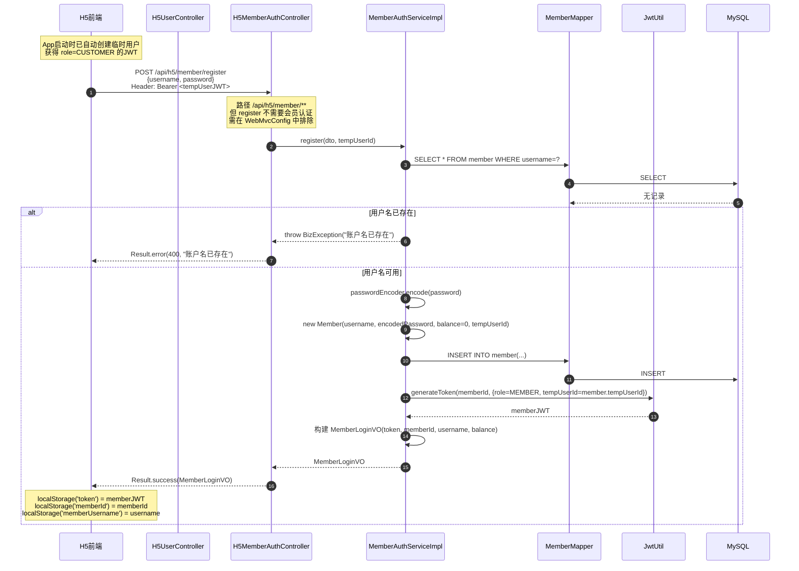
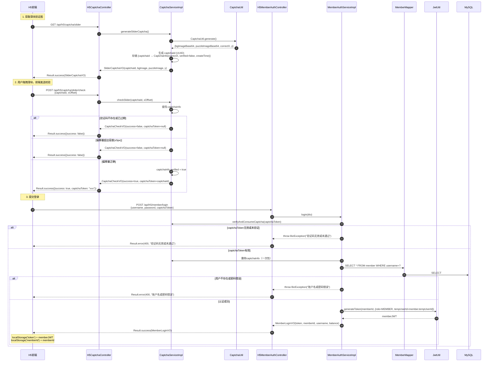
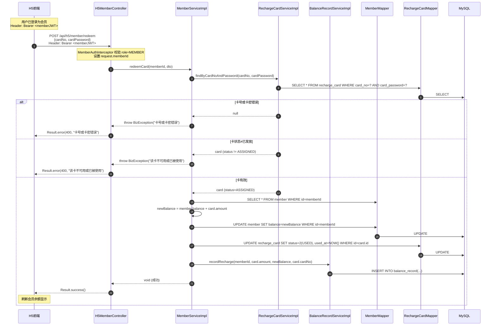
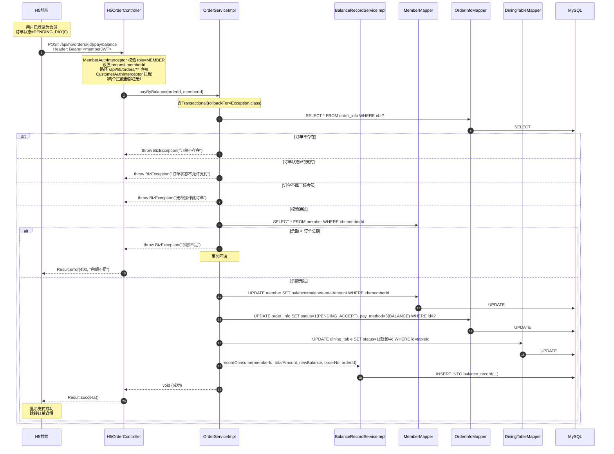
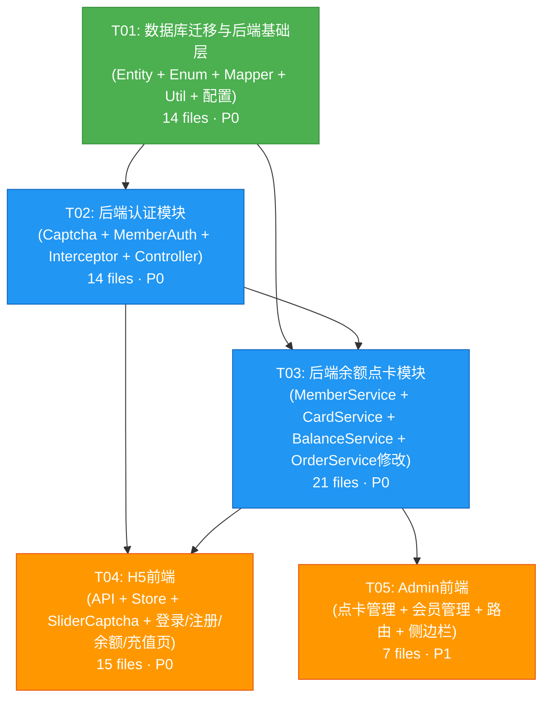

# 架构设计文档：用户注册登录 + 余额点卡支付

> **项目**: 智能点餐系统 — 新增用户注册登录与余额点卡支付模块
> **技术栈**: Java 21 + Spring Boot 3.2.5 + MyBatis-Plus 3.5.7 + MySQL 8.0 / Vue 3 + Vant 4 (H5) / Vue 3 + Element Plus (Admin)
> **日期**: 2025-07-07
> **架构师**: 高见远 (Bob)

---

## 目录

1. [实现方案 + 框架选型](#1-实现方案--框架选型)
2. [文件列表及相对路径](#2-文件列表及相对路径)
3. [数据结构和接口（类图）](#3-数据结构和接口类图)
4. [程序调用流程（时序图）](#4-程序调用流程时序图)
5. [任务列表](#5-任务列表)
6. [依赖包列表](#6-依赖包列表)
7. [共享知识（跨文件约定）](#7-共享知识跨文件约定)
8. [待明确事项](#8-待明确事项)

---

## 1. 实现方案 + 框架选型

### 1.1 核心技术挑战分析

| 挑战 | 难点 | 解决方案 |
|------|------|----------|
| 滑块验证码生成 | 纯Java实现，不引入额外依赖 | 使用 `java.awt.image.BufferedImage` + `javax.imageio.ImageIO` 生成验证图，内存缓存验证状态 |
| 会员与临时用户共存 | 两套认证体系并行，订单需同时关联 | JWT 中携带 `role` + `tempUserId` claim，拦截器按角色放行 |
| 余额支付原子性 | 扣款 + 订单状态变更必须在同一事务 | `@Transactional` 注解，余额不足时抛异常回滚 |
| 卡号卡密唯一性 | 批量生成需保证不重复 | 卡号 `RC+yyyyMMdd+6位随机数` + 数据库唯一索引，卡密16位随机字母数字 |
| 前端双Token切换 | 临时用户Token与会员Token切换 | 统一使用 `localStorage('token')`，登录时替换，401时按角色区分处理 |

### 1.2 滑块验证码实现方案

**纯Java AWT实现，不引入额外依赖**：

```
CaptchaUtil.generateSliderCaptcha()
├── 创建 310×160 的 BufferedImage（背景图）
├── 填充随机渐变色 + 干扰线 + 噪点
├── 在随机X位置（60~260）裁剪 44×44 拼图块
├── 背景图挖空（填充半透明灰）
├── 拼图块独立输出（带 alpha 通道）
└── 返回 SliderCaptchaResult { bgImageBase64, puzzleImageBase64, correctX, y }
```

**验证状态管理**：
- 使用 `ConcurrentHashMap<String, CaptchaInfo>` 存储验证状态（captchaId → {correctX, verified, createTime}）
- TTL 5分钟，通过 `@Scheduled` 定时清理过期数据
- 一次性有效：校验通过后标记 verified，登录消费后删除

### 1.3 密码加密方案

复用现有 `SecurityConfig` 中已配置的 `BCryptPasswordEncoder` Bean：

```java
// 注册时加密
String encoded = passwordEncoder.encode(rawPassword);
// 登录时校验
passwordEncoder.matches(rawPassword, storedHash);
```

### 1.4 事务方案

```java
@Transactional(rollbackFor = Exception.class)
public void payByBalance(Long orderId, Long memberId) {
    // 1. 查询订单 + 校验状态
    // 2. 查询会员余额
    // 3. 余额不足 → throw BizException（自动回滚）
    // 4. 扣减余额
    // 5. 订单状态变更 PENDING_PAY → PENDING_ACCEPT
    // 6. 记录 balance_record
    // 7. 设置桌台为就餐中
}
```

### 1.5 卡号卡密生成方案

| 字段 | 格式 | 示例 | 唯一性保障 |
|------|------|------|------------|
| 卡号 | `RC` + `yyyyMMdd` + 6位随机数字 | `RC20250707A8K3M9` → 实际为 `RC20250707` + 6位随机 | 数据库 `UNIQUE KEY uk_card_no` |
| 卡密 | 16位随机字母数字（大小写混合+数字） | `aB3kM9xP2nQ7rT5v` | 无需唯一索引，概率碰撞极低 |

```java
// 卡号生成
String cardNo = "RC" + LocalDate.now().format(DateTimeFormatter.BASIC_ISO_DATE)
    + RandomUtil.randomNumbers(6);  // Hutool 已有依赖

// 卡密生成
String password = RandomUtil.randomString("abcdefghijklmnopqrstuvwxyzABCDEFGHIJKLMNOPQRSTUVWXYZ0123456789", 16);
```

### 1.6 认证体系架构

```
                    ┌─────────────────────────────────────────┐
                    │           H5 请求路由                    │
                    └────────────────┬────────────────────────┘
                                     │
           ┌─────────────────────────┼─────────────────────────┐
           ▼                         ▼                         ▼
  /api/h5/captcha/**        /api/h5/member/**          /api/h5/orders/**
  (无需认证)                MemberAuthInterceptor      CustomerAuthInterceptor
                            要求 role=MEMBER           接受 role=CUSTOMER 或 MEMBER
                            设置 memberId 属性          设置 tempUserId 属性
                                                      设置 memberId 属性(如果是MEMBER)
```

**关键设计**：修改 `CustomerAuthInterceptor` 同时接受 `CUSTOMER` 和 `MEMBER` 角色，使会员也能下单。`MemberAuthInterceptor` 仅接受 `MEMBER` 角色，保护会员专属接口。

---

## 2. 文件列表及相对路径

### 2.1 后端新增文件（40个）

#### 数据库迁移
| # | 文件路径 | 说明 |
|---|---------|------|
| 1 | `backend/src/main/resources/db/migration_user_balance.sql` | 新增3张表 + 修改order_info表 |

#### Entity（3个）
| # | 文件路径 | 说明 |
|---|---------|------|
| 2 | `backend/src/main/java/com/restaurant/entity/Member.java` | 注册会员实体 |
| 3 | `backend/src/main/java/com/restaurant/entity/RechargeCard.java` | 点卡实体 |
| 4 | `backend/src/main/java/com/restaurant/entity/BalanceRecord.java` | 余额变动记录实体 |

#### Enum（3个）
| # | 文件路径 | 说明 |
|---|---------|------|
| 5 | `backend/src/main/java/com/restaurant/enums/CardStatus.java` | 卡状态：未使用/已发放/已使用 |
| 6 | `backend/src/main/java/com/restaurant/enums/PayMethod.java` | 支付方式：微信/支付宝/余额 |
| 7 | `backend/src/main/java/com/restaurant/enums/BalanceRecordType.java` | 记录类型：充值/消费 |

#### Mapper（3个）
| # | 文件路径 | 说明 |
|---|---------|------|
| 8 | `backend/src/main/java/com/restaurant/mapper/MemberMapper.java` | 会员Mapper |
| 9 | `backend/src/main/java/com/restaurant/mapper/RechargeCardMapper.java` | 点卡Mapper |
| 10 | `backend/src/main/java/com/restaurant/mapper/BalanceRecordMapper.java` | 余额记录Mapper |

#### DTO（7个）
| # | 文件路径 | 说明 |
|---|---------|------|
| 11 | `backend/src/main/java/com/restaurant/dto/MemberRegisterDTO.java` | 注册请求 |
| 12 | `backend/src/main/java/com/restaurant/dto/MemberLoginDTO.java` | 登录请求（含captchaToken） |
| 13 | `backend/src/main/java/com/restaurant/dto/SliderCaptchaCheckDTO.java` | 滑块校验请求 |
| 14 | `backend/src/main/java/com/restaurant/dto/RedeemCardDTO.java` | 兑换点卡请求 |
| 15 | `backend/src/main/java/com/restaurant/dto/BatchCreateCardDTO.java` | 批量创建点卡请求 |
| 16 | `backend/src/main/java/com/restaurant/dto/AssignCardDTO.java` | 发放点卡请求 |
| 17 | `backend/src/main/java/com/restaurant/dto/CardQueryDTO.java` | 点卡查询请求 |

#### VO（7个）
| # | 文件路径 | 说明 |
|---|---------|------|
| 18 | `backend/src/main/java/com/restaurant/vo/SliderCaptchaVO.java` | 滑块验证图响应 |
| 19 | `backend/src/main/java/com/restaurant/vo/MemberLoginVO.java` | 登录响应 |
| 20 | `backend/src/main/java/com/restaurant/vo/MemberInfoVO.java` | 会员信息响应 |
| 21 | `backend/src/main/java/com/restaurant/vo/BalanceRecordVO.java` | 余额记录响应 |
| 22 | `backend/src/main/java/com/restaurant/vo/CardVO.java` | 点卡响应（后台） |
| 23 | `backend/src/main/java/com/restaurant/vo/AdminMemberVO.java` | 后台会员列表响应 |
| 24 | `backend/src/main/java/com/restaurant/vo/CaptchaCheckVO.java` | 滑块校验结果响应 |

#### Util（1个）
| # | 文件路径 | 说明 |
|---|---------|------|
| 25 | `backend/src/main/java/com/restaurant/util/CaptchaUtil.java` | 滑块验证码图片生成工具 |

#### Service 接口（5个）
| # | 文件路径 | 说明 |
|---|---------|------|
| 26 | `backend/src/main/java/com/restaurant/service/CaptchaService.java` | 验证码服务接口 |
| 27 | `backend/src/main/java/com/restaurant/service/MemberAuthService.java` | 会员认证服务接口 |
| 28 | `backend/src/main/java/com/restaurant/service/MemberService.java` | 会员信息服务接口 |
| 29 | `backend/src/main/java/com/restaurant/service/RechargeCardService.java` | 点卡服务接口 |
| 30 | `backend/src/main/java/com/restaurant/service/BalanceRecordService.java` | 余额记录服务接口 |

#### Service 实现（5个）
| # | 文件路径 | 说明 |
|---|---------|------|
| 31 | `backend/src/main/java/com/restaurant/service/impl/CaptchaServiceImpl.java` | 验证码服务实现 |
| 32 | `backend/src/main/java/com/restaurant/service/impl/MemberAuthServiceImpl.java` | 会员认证服务实现 |
| 33 | `backend/src/main/java/com/restaurant/service/impl/MemberServiceImpl.java` | 会员信息服务实现 |
| 34 | `backend/src/main/java/com/restaurant/service/impl/RechargeCardServiceImpl.java` | 点卡服务实现 |
| 35 | `backend/src/main/java/com/restaurant/service/impl/BalanceRecordServiceImpl.java` | 余额记录服务实现 |

#### Controller（5个）
| # | 文件路径 | 说明 |
|---|---------|------|
| 36 | `backend/src/main/java/com/restaurant/controller/h5/H5CaptchaController.java` | H5验证码接口 |
| 37 | `backend/src/main/java/com/restaurant/controller/h5/H5MemberAuthController.java` | H5注册登录接口 |
| 38 | `backend/src/main/java/com/restaurant/controller/h5/H5MemberController.java` | H5会员信息/兑换/余额记录 |
| 39 | `backend/src/main/java/com/restaurant/controller/admin/AdminCardController.java` | 后台点卡管理 |
| 40 | `backend/src/main/java/com/restaurant/controller/admin/AdminMemberController.java` | 后台会员管理 |

#### Interceptor（1个）
| # | 文件路径 | 说明 |
|---|---------|------|
| 41 | `backend/src/main/java/com/restaurant/interceptor/MemberAuthInterceptor.java` | 会员认证拦截器 |

### 2.2 后端修改文件（7个）

| # | 文件路径 | 修改内容 |
|---|---------|---------|
| 42 | `backend/src/main/java/com/restaurant/entity/OrderInfo.java` | 新增 `memberId`, `payMethod` 字段 |
| 43 | `backend/src/main/java/com/restaurant/interceptor/CustomerAuthInterceptor.java` | 同时接受 `MEMBER` 角色，设置 `memberId` 属性 |
| 44 | `backend/src/main/java/com/restaurant/config/WebMvcConfig.java` | 注册 `MemberAuthInterceptor`，配置拦截路径 |
| 45 | `backend/src/main/java/com/restaurant/service/OrderService.java` | 新增 `payByBalance` 方法签名，`submitOrder` 增加 memberId 参数 |
| 46 | `backend/src/main/java/com/restaurant/service/impl/OrderServiceImpl.java` | 实现余额支付，修改 `payOrder` 设置 payMethod，`submitOrder` 填充 memberId |
| 47 | `backend/src/main/java/com/restaurant/controller/h5/H5OrderController.java` | 新增余额支付端点，修改 pay 端点传 payMethod，submitOrder 传 memberId |
| 48 | `backend/src/main/java/com/restaurant/vo/OrderDetailVO.java` | 新增 `memberId`, `payMethod`, `payMethodText` 字段 |

### 2.3 H5前端新增文件（8个）

| # | 文件路径 | 说明 |
|---|---------|------|
| 49 | `frontend-h5/src/api/captcha.ts` | 验证码API |
| 50 | `frontend-h5/src/api/member.ts` | 会员API（注册/登录/信息/兑换/记录） |
| 51 | `frontend-h5/src/store/modules/member.ts` | 会员状态管理 |
| 52 | `frontend-h5/src/components/SliderCaptcha.vue` | 滑块验证码组件 |
| 53 | `frontend-h5/src/views/login/index.vue` | 登录页 |
| 54 | `frontend-h5/src/views/register/index.vue` | 注册页 |
| 55 | `frontend-h5/src/views/balance/index.vue` | 余额记录页 |
| 56 | `frontend-h5/src/views/recharge/index.vue` | 兑换点卡页 |

### 2.4 H5前端修改文件（7个）

| # | 文件路径 | 修改内容 |
|---|---------|---------|
| 57 | `frontend-h5/src/router/index.ts` | 新增 login/register/balance/recharge 路由 |
| 58 | `frontend-h5/src/types/index.ts` | 新增 Member/BalanceRecord/RechargeCard 等类型 |
| 59 | `frontend-h5/src/views/me/index.vue` | 展示会员信息/余额/登录注册入口/退出登录 |
| 60 | `frontend-h5/src/views/pay/index.vue` | 新增余额支付选项 |
| 61 | `frontend-h5/src/api/request.ts` | 401处理区分会员/临时用户 |
| 62 | `frontend-h5/src/api/order.ts` | 新增 `payByBalance` API，`payOrder` 增加 payMethod 参数 |
| 63 | `frontend-h5/src/store/modules/user.ts` | 增加 `isMember` getter，logout 方法 |

### 2.5 Admin前端新增文件（4个）

| # | 文件路径 | 说明 |
|---|---------|------|
| 64 | `frontend-admin/src/api/card.ts` | 点卡管理API |
| 65 | `frontend-admin/src/api/member.ts` | 会员管理API |
| 66 | `frontend-admin/src/views/card/index.vue` | 点卡管理页 |
| 67 | `frontend-admin/src/views/member/index.vue` | 会员管理页 |

### 2.6 Admin前端修改文件（3个）

| # | 文件路径 | 修改内容 |
|---|---------|---------|
| 68 | `frontend-admin/src/router/index.ts` | 新增 card/member 路由，将 user 路由改为 member |
| 69 | `frontend-admin/src/layout/Sidebar.vue` | 新增点卡管理、会员管理菜单项 |
| 70 | `frontend-admin/src/types/index.ts` | 新增 Card/Member/BalanceRecord 类型 |

---

## 3. 数据结构和接口（类图）

### 3.1 数据库表结构（新增3张表 + 修改1张表）

#### 新增表：member（注册会员）

```sql
CREATE TABLE `member` (
    `id`          BIGINT         NOT NULL AUTO_INCREMENT COMMENT '主键ID',
    `username`    VARCHAR(50)    NOT NULL COMMENT '账户名（唯一）',
    `password`    VARCHAR(100)   NOT NULL COMMENT '密码（BCrypt加密）',
    `balance`     DECIMAL(10, 2) DEFAULT 0.00 COMMENT '账户余额',
    `temp_user_id` BIGINT        DEFAULT NULL COMMENT '关联的临时用户ID',
    `create_time` DATETIME       DEFAULT CURRENT_TIMESTAMP COMMENT '创建时间',
    `update_time` DATETIME       DEFAULT CURRENT_TIMESTAMP ON UPDATE CURRENT_TIMESTAMP COMMENT '更新时间',
    `deleted`     TINYINT        DEFAULT 0 COMMENT '逻辑删除：0未删除，1已删除',
    PRIMARY KEY (`id`),
    UNIQUE KEY `uk_username` (`username`)
) ENGINE=InnoDB DEFAULT CHARSET=utf8mb4 COMMENT='注册会员表';
```

#### 新增表：recharge_card（点卡）

```sql
CREATE TABLE `recharge_card` (
    `id`            BIGINT         NOT NULL AUTO_INCREMENT COMMENT '主键ID',
    `card_no`       VARCHAR(32)    NOT NULL COMMENT '卡号（RC+yyyyMMdd+6位随机数）',
    `card_password` VARCHAR(16)    NOT NULL COMMENT '卡密（16位随机字母数字）',
    `amount`        DECIMAL(10, 2) NOT NULL COMMENT '额度',
    `status`        TINYINT        DEFAULT 0 COMMENT '状态：0未使用，1已发放，2已使用',
    `member_id`     BIGINT         DEFAULT NULL COMMENT '发放给的会员ID',
    `assigned_at`   DATETIME       DEFAULT NULL COMMENT '发放时间',
    `used_at`       DATETIME       DEFAULT NULL COMMENT '使用时间',
    `create_time`   DATETIME       DEFAULT CURRENT_TIMESTAMP COMMENT '创建时间',
    `update_time`   DATETIME       DEFAULT CURRENT_TIMESTAMP ON UPDATE CURRENT_TIMESTAMP COMMENT '更新时间',
    `deleted`       TINYINT        DEFAULT 0 COMMENT '逻辑删除：0未删除，1已删除',
    PRIMARY KEY (`id`),
    UNIQUE KEY `uk_card_no` (`card_no`),
    KEY `idx_member_id` (`member_id`),
    KEY `idx_status` (`status`)
) ENGINE=InnoDB DEFAULT CHARSET=utf8mb4 COMMENT='充值点卡表';
```

#### 新增表：balance_record（余额变动记录）

```sql
CREATE TABLE `balance_record` (
    `id`            BIGINT         NOT NULL AUTO_INCREMENT COMMENT '主键ID',
    `member_id`     BIGINT         NOT NULL COMMENT '会员ID',
    `type`          TINYINT        NOT NULL COMMENT '类型：1充值，2消费',
    `amount`        DECIMAL(10, 2) NOT NULL COMMENT '变动金额',
    `balance_after` DECIMAL(10, 2) NOT NULL COMMENT '变动后余额',
    `card_no`       VARCHAR(32)    DEFAULT NULL COMMENT '充值卡号（充值时）',
    `order_no`      VARCHAR(32)    DEFAULT NULL COMMENT '订单号（消费时）',
    `order_id`      BIGINT         DEFAULT NULL COMMENT '订单ID（消费时）',
    `remark`        VARCHAR(200)   DEFAULT NULL COMMENT '备注',
    `create_time`   DATETIME       DEFAULT CURRENT_TIMESTAMP COMMENT '创建时间',
    `deleted`       TINYINT        DEFAULT 0 COMMENT '逻辑删除：0未删除，1已删除',
    PRIMARY KEY (`id`),
    KEY `idx_member_id` (`member_id`)
) ENGINE=InnoDB DEFAULT CHARSET=utf8mb4 COMMENT='余额变动记录表';
```

#### 修改表：order_info（新增2个字段）

```sql
ALTER TABLE `order_info`
    ADD COLUMN `member_id` BIGINT DEFAULT NULL COMMENT '会员ID' AFTER `temp_user_id`,
    ADD COLUMN `pay_method` TINYINT DEFAULT NULL COMMENT '支付方式：1微信，2支付宝，3余额' AFTER `status`;
```

### 3.2 类图

> 完整类图见 `docs/class-diagram-user-balance.mermaid`

```mermaid
classDiagram
    direction TB

    %% ===== Entity 层 =====
    class Member {
        -Long id
        -String username
        -String password
        -BigDecimal balance
        -Long tempUserId
        -LocalDateTime createTime
        -LocalDateTime updateTime
        -Integer deleted
    }

    class RechargeCard {
        -Long id
        -String cardNo
        -String cardPassword
        -BigDecimal amount
        -Integer status
        -Long memberId
        -LocalDateTime assignedAt
        -LocalDateTime usedAt
        -LocalDateTime createTime
        -LocalDateTime updateTime
        -Integer deleted
    }

    class BalanceRecord {
        -Long id
        -Long memberId
        -Integer type
        -BigDecimal amount
        -BigDecimal balanceAfter
        -String cardNo
        -String orderNo
        -Long orderId
        -String remark
        -LocalDateTime createTime
        -Integer deleted
    }

    class OrderInfo {
        -Long id
        -String orderNo
        -Long tempUserId
        -Long memberId
        -Long tableId
        -String tableCode
        -BigDecimal totalAmount
        -Integer status
        -Integer payMethod
        -String remark
        -LocalDateTime createTime
        -LocalDateTime updateTime
        -Integer deleted
    }

    %% ===== Enum 层 =====
    class CardStatus {
        <<enumeration>>
        +UNUSED(int=0)
        +ASSIGNED(int=1)
        +USED(int=2)
        +fromCode(int) CardStatus
    }

    class PayMethod {
        <<enumeration>>
        +WECHAT(int=1)
        +ALIPAY(int=2)
        +BALANCE(int=3)
        +fromCode(int) PayMethod
    }

    class BalanceRecordType {
        <<enumeration>>
        +RECHARGE(int=1)
        +CONSUME(int=2)
        +fromCode(int) BalanceRecordType
    }

    %% ===== DTO 层 =====
    class MemberRegisterDTO {
        +String username
        +String password
    }

    class MemberLoginDTO {
        +String username
        +String password
        +String captchaToken
    }

    class SliderCaptchaCheckDTO {
        +String captchaId
        +Integer xOffset
    }

    class RedeemCardDTO {
        +String cardNo
        +String cardPassword
    }

    class BatchCreateCardDTO {
        +BigDecimal amount
        +Integer count
    }

    class AssignCardDTO {
        +Long memberId
    }

    %% ===== VO 层 =====
    class SliderCaptchaVO {
        +String captchaId
        +String backgroundImage
        +String puzzleImage
        +Integer y
    }

    class CaptchaCheckVO {
        +Boolean success
        +String captchaToken
    }

    class MemberLoginVO {
        +String token
        +Long memberId
        +String username
        +BigDecimal balance
    }

    class MemberInfoVO {
        +Long memberId
        +String username
        +BigDecimal balance
        +String createTime
    }

    class BalanceRecordVO {
        +Long id
        +Integer type
        +String typeText
        +BigDecimal amount
        +BigDecimal balanceAfter
        +String cardNo
        +String orderNo
        +String remark
        +String createTime
    }

    class CardVO {
        +Long id
        +String cardNo
        +String cardPassword
        +BigDecimal amount
        +Integer status
        +String statusText
        +Long memberId
        +String memberName
        +String assignedAt
        +String usedAt
        +String createTime
    }

    class AdminMemberVO {
        +Long id
        +String username
        +BigDecimal balance
        +String createTime
    }

    %% ===== Service 层 =====
    class CaptchaService {
        <<interface>>
        +SliderCaptchaVO generateSliderCaptcha()
        +CaptchaCheckVO checkSlider(String captchaId, Integer xOffset)
        +boolean verifyAndConsumeCaptcha(String captchaToken)
    }

    class CaptchaServiceImpl {
        -ConcurrentHashMap captchaStore
        +SliderCaptchaVO generateSliderCaptcha()
        +CaptchaCheckVO checkSlider(String captchaId, Integer xOffset)
        +boolean verifyAndConsumeCaptcha(String captchaToken)
        -cleanupExpiredCaptchas()
    }

    class MemberAuthService {
        <<interface>>
        +MemberLoginVO register(MemberRegisterDTO dto, Long tempUserId)
        +MemberLoginVO login(MemberLoginDTO dto)
    }

    class MemberAuthServiceImpl {
        -MemberMapper memberMapper
        -JwtUtil jwtUtil
        -BCryptPasswordEncoder passwordEncoder
        -CaptchaService captchaService
        +MemberLoginVO register(MemberRegisterDTO dto, Long tempUserId)
        +MemberLoginVO login(MemberLoginDTO dto)
        -generateMemberToken(Member member) String
    }

    class MemberService {
        <<interface>>
        +MemberInfoVO getMemberInfo(Long memberId)
        +void redeemCard(Long memberId, RedeemCardDTO dto)
        +PageResult~BalanceRecordVO~ getBalanceRecords(Long memberId, Integer page, Integer size)
    }

    class MemberServiceImpl {
        -MemberMapper memberMapper
        -RechargeCardMapper cardMapper
        -BalanceRecordService balanceRecordService
        +MemberInfoVO getMemberInfo(Long memberId)
        +void redeemCard(Long memberId, RedeemCardDTO dto)
        +PageResult~BalanceRecordVO~ getBalanceRecords(Long memberId, Integer page, Integer size)
    }

    class RechargeCardService {
        <<interface>>
        +List~CardVO~ batchCreateCards(BatchCreateCardDTO dto)
        +PageResult~CardVO~ getCardPage(CardQueryDTO dto)
        +void assignCard(Long cardId, AssignCardDTO dto)
        +RechargeCard findByCardNoAndPassword(String cardNo, String password)
    }

    class RechargeCardServiceImpl {
        -RechargeCardMapper cardMapper
        -MemberMapper memberMapper
        +List~CardVO~ batchCreateCards(BatchCreateCardDTO dto)
        +PageResult~CardVO~ getCardPage(CardQueryDTO dto)
        +void assignCard(Long cardId, AssignCardDTO dto)
        +RechargeCard findByCardNoAndPassword(String cardNo, String password)
        -generateCardNo() String
        -generateCardPassword() String
    }

    class BalanceRecordService {
        <<interface>>
        +void recordRecharge(Long memberId, BigDecimal amount, BigDecimal balanceAfter, String cardNo)
        +void recordConsume(Long memberId, BigDecimal amount, BigDecimal balanceAfter, String orderNo, Long orderId)
        +PageResult~BalanceRecordVO~ getRecordsByMember(Long memberId, Integer page, Integer size)
    }

    class BalanceRecordServiceImpl {
        -BalanceRecordMapper recordMapper
        +void recordRecharge(Long memberId, BigDecimal amount, BigDecimal balanceAfter, String cardNo)
        +void recordConsume(Long memberId, BigDecimal amount, BigDecimal balanceAfter, String orderNo, Long orderId)
        +PageResult~BalanceRecordVO~ getRecordsByMember(Long memberId, Integer page, Integer size)
    }

    class OrderService {
        <<interface>>
        +OrderDetailVO submitOrder(OrderSubmitDTO dto, Long tempUserId, Long memberId)
        +void payOrder(Long id, Integer payMethod)
        +void payByBalance(Long id, Long memberId)
    }

    %% ===== Controller 层 =====
    class H5CaptchaController {
        +Result~SliderCaptchaVO~ getSliderCaptcha()
        +Result~CaptchaCheckVO~ checkSlider(SliderCaptchaCheckDTO dto)
    }

    class H5MemberAuthController {
        +Result~MemberLoginVO~ register(MemberRegisterDTO dto, HttpServletRequest req)
        +Result~MemberLoginVO~ login(MemberLoginDTO dto)
    }

    class H5MemberController {
        +Result~MemberInfoVO~ getMemberInfo(HttpServletRequest req)
        +Result~Void~ redeemCard(RedeemCardDTO dto, HttpServletRequest req)
        +Result~PageResult~ getBalanceRecords(HttpServletRequest req, Integer page, Integer size)
    }

    class AdminCardController {
        +Result~List~CardVO~~ batchCreate(BatchCreateCardDTO dto)
        +Result~PageResult~CardVO~~ getCardList(CardQueryDTO dto)
        +Result~Void~ assignCard(Long id, AssignCardDTO dto)
    }

    class AdminMemberController {
        +Result~PageResult~AdminMemberVO~~ getMemberList(Integer page, Integer size, String keyword)
        +Result~PageResult~BalanceRecordVO~ getMemberBalanceRecords(Long id, Integer page, Integer size)
    }

    class H5OrderController {
        +Result~OrderDetailVO~ submitOrder(OrderSubmitDTO dto, HttpServletRequest req)
        +Result~Void~ payOrder(Long id, Integer payMethod)
        +Result~Void~ payByBalance(Long id, HttpServletRequest req)
    }

    %% ===== Interceptor 层 =====
    class MemberAuthInterceptor {
        -JwtUtil jwtUtil
        +boolean preHandle(HttpServletRequest req, HttpServletResponse resp, Object handler)
    }

    class CustomerAuthInterceptor {
        -JwtUtil jwtUtil
        +boolean preHandle(HttpServletRequest req, HttpServletResponse resp, Object handler)
    }

    %% ===== Util 层 =====
    class CaptchaUtil {
        +SliderCaptchaResult generate()$ 
        -BufferedImage createBackground(int w, int h)$
        -BufferedImage cutPuzzle(BufferedImage bg, int x, int y, int size)$
    }

    %% ===== Relationships =====
    CaptchaServiceImpl ..|> CaptchaService
    MemberAuthServiceImpl ..|> MemberAuthService
    MemberServiceImpl ..|> MemberService
    RechargeCardServiceImpl ..|> RechargeCardService
    BalanceRecordServiceImpl ..|> BalanceRecordService

    MemberAuthServiceImpl --> CaptchaService : 调用验证码校验
    MemberAuthServiceImpl --> Member : 操作
    MemberServiceImpl --> RechargeCardService : 查询点卡
    MemberServiceImpl --> BalanceRecordService : 记录充值
    MemberServiceImpl --> Member : 操作
    RechargeCardServiceImpl --> RechargeCard : 操作
    BalanceRecordServiceImpl --> BalanceRecord : 操作

    H5CaptchaController --> CaptchaService
    H5MemberAuthController --> MemberAuthService
    H5MemberController --> MemberService
    AdminCardController --> RechargeCardService
    AdminMemberController --> MemberService
    AdminMemberController --> BalanceRecordService
    H5OrderController --> OrderService

    OrderService --> Member : 余额扣减
    OrderService --> BalanceRecordService : 记录消费
    OrderService --> OrderInfo : 状态变更

    CaptchaServiceImpl --> CaptchaUtil : 生成图片
    MemberAuthInterceptor --> JwtUtil : 解析Token
    CustomerAuthInterceptor --> JwtUtil : 解析Token
```



### 3.3 关键接口方法签名

#### CaptchaService

```java
// 生成滑块验证图
SliderCaptchaVO generateSliderCaptcha();

// 校验滑块偏移量
CaptchaCheckVO checkSlider(String captchaId, Integer xOffset);

// 验证并消费captchaToken（登录时调用，一次性）
boolean verifyAndConsumeCaptcha(String captchaToken);
```

#### MemberAuthService

```java
// 注册（自动登录返回JWT）
MemberLoginVO register(MemberRegisterDTO dto, Long tempUserId);

// 登录（校验captchaToken + 账号密码）
MemberLoginVO login(MemberLoginDTO dto);
```

#### MemberService

```java
// 获取会员信息
MemberInfoVO getMemberInfo(Long memberId);

// 兑换点卡（事务：余额+=额度，卡状态→已使用，记录balance_record）
void redeemCard(Long memberId, RedeemCardDTO dto);

// 余额记录列表
PageResult<BalanceRecordVO> getBalanceRecords(Long memberId, Integer page, Integer size);
```

#### RechargeCardService

```java
// 批量创建点卡
List<CardVO> batchCreateCards(BatchCreateCardDTO dto);

// 点卡列表（分页+筛选）
PageResult<CardVO> getCardPage(CardQueryDTO dto);

// 发放点卡给会员
void assignCard(Long cardId, AssignCardDTO dto);

// 按卡号+卡密查询（兑换时用）
RechargeCard findByCardNoAndPassword(String cardNo, String password);
```

#### BalanceRecordService

```java
// 记录充值
void recordRecharge(Long memberId, BigDecimal amount, BigDecimal balanceAfter, String cardNo);

// 记录消费
void recordConsume(Long memberId, BigDecimal amount, BigDecimal balanceAfter, String orderNo, Long orderId);

// 按会员查询记录
PageResult<BalanceRecordVO> getRecordsByMember(Long memberId, Integer page, Integer size);
```

#### OrderService（修改部分）

```java
// 提交订单（新增 memberId 参数）
OrderDetailVO submitOrder(OrderSubmitDTO submitDTO, Long tempUserId, Long memberId);

// 支付订单（新增 payMethod 参数）
void payOrder(Long id, Integer payMethod);

// 余额支付（新增）
void payByBalance(Long id, Long memberId);
```

---

## 4. 程序调用流程（时序图）

### 4.1 注册流程



### 4.2 登录 + 滑块验证流程



### 4.3 点卡兑换流程



### 4.4 余额支付流程



---

## 5. 任务列表

### T01: 数据库迁移与后端基础层

| 属性 | 内容 |
|------|------|
| **任务编号** | T01 |
| **任务名称** | 数据库迁移与后端基础层（Entity + Enum + Mapper + Util + 配置） |
| **优先级** | P0 |
| **依赖** | 无 |
| **预计文件数** | 14 |

**涉及文件**：

新建：
1. `backend/src/main/resources/db/migration_user_balance.sql`
2. `backend/src/main/java/com/restaurant/entity/Member.java`
3. `backend/src/main/java/com/restaurant/entity/RechargeCard.java`
4. `backend/src/main/java/com/restaurant/entity/BalanceRecord.java`
5. `backend/src/main/java/com/restaurant/enums/CardStatus.java`
6. `backend/src/main/java/com/restaurant/enums/PayMethod.java`
7. `backend/src/main/java/com/restaurant/enums/BalanceRecordType.java`
8. `backend/src/main/java/com/restaurant/mapper/MemberMapper.java`
9. `backend/src/main/java/com/restaurant/mapper/RechargeCardMapper.java`
10. `backend/src/main/java/com/restaurant/mapper/BalanceRecordMapper.java`
11. `backend/src/main/java/com/restaurant/util/CaptchaUtil.java`

修改：
12. `backend/src/main/java/com/restaurant/entity/OrderInfo.java`（新增 memberId, payMethod 字段）
13. `backend/src/main/java/com/restaurant/interceptor/CustomerAuthInterceptor.java`（接受 MEMBER 角色）
14. `backend/src/main/java/com/restaurant/config/WebMvcConfig.java`（注册 MemberAuthInterceptor，排除注册/登录/验证码路径）

**任务描述**：
- 创建 `migration_user_balance.sql`：新增 member、recharge_card、balance_record 三张表，ALTER order_info 增加 member_id 和 pay_method 字段
- 创建 3 个 Entity 类，遵循现有 MyBatis-Plus 注解模式（@TableName, @TableId, @TableField, @TableLogic）
- 创建 3 个 Enum 类，遵循现有 OrderStatus 枚举模式
- 创建 3 个 Mapper 接口，继承 BaseMapper
- 创建 CaptchaUtil 工具类，使用 Java AWT/ImageIO 实现滑块验证码图片生成
- 修改 OrderInfo 实体，新增 memberId(Long) 和 payMethod(Integer) 字段
- 修改 CustomerAuthInterceptor，同时接受 CUSTOMER 和 MEMBER 角色，MEMBER 时额外设置 memberId 属性
- 修改 WebMvcConfig，预留 MemberAuthInterceptor 注册（注意 T02 才创建该拦截器，此处先配置路径排除）

---

### T02: 后端认证模块（注册登录 + 滑块验证码）

| 属性 | 内容 |
|------|------|
| **任务编号** | T02 |
| **任务名称** | 后端认证模块（CaptchaService + MemberAuthService + 拦截器 + Controller + DTO/VO） |
| **优先级** | P0 |
| **依赖** | T01 |
| **预计文件数** | 14 |

**涉及文件**：

新建：
1. `backend/src/main/java/com/restaurant/service/CaptchaService.java`
2. `backend/src/main/java/com/restaurant/service/impl/CaptchaServiceImpl.java`
3. `backend/src/main/java/com/restaurant/service/MemberAuthService.java`
4. `backend/src/main/java/com/restaurant/service/impl/MemberAuthServiceImpl.java`
5. `backend/src/main/java/com/restaurant/controller/h5/H5CaptchaController.java`
6. `backend/src/main/java/com/restaurant/controller/h5/H5MemberAuthController.java`
7. `backend/src/main/java/com/restaurant/interceptor/MemberAuthInterceptor.java`
8. `backend/src/main/java/com/restaurant/dto/MemberRegisterDTO.java`
9. `backend/src/main/java/com/restaurant/dto/MemberLoginDTO.java`
10. `backend/src/main/java/com/restaurant/dto/SliderCaptchaCheckDTO.java`
11. `backend/src/main/java/com/restaurant/vo/SliderCaptchaVO.java`
12. `backend/src/main/java/com/restaurant/vo/CaptchaCheckVO.java`
13. `backend/src/main/java/com/restaurant/vo/MemberLoginVO.java`

修改：
14. `backend/src/main/java/com/restaurant/config/WebMvcConfig.java`（完成 MemberAuthInterceptor 注册，排除 /api/h5/member/register、/api/h5/member/login、/api/h5/captcha/**）

**任务描述**：
- 实现 CaptchaService：generateSliderCaptcha（调用 CaptchaUtil 生成图片，缓存验证状态），checkSlider（校验偏移量±5px，标记 verified），verifyAndConsumeCaptcha（一次性消费）
- 实现 MemberAuthService：register（用户名唯一校验 + BCrypt 加密 + 存 tempUserId + 生成 JWT），login（验证 captchaToken + BCrypt 校验 + 生成 JWT）
- JWT 生成约定：subject=memberId, claims={role=MEMBER, tempUserId=member.tempUserId}
- 实现 MemberAuthInterceptor：校验 role=MEMBER，设置 request.memberId
- 实现 H5CaptchaController：GET /api/h5/captcha/slider, POST /api/h5/captcha/slider/check
- 实现 H5MemberAuthController：POST /api/h5/member/register（从现有 CustomerAuthInterceptor 获取 tempUserId）, POST /api/h5/member/login
- 注册端点需获取当前临时用户ID：注册端点路径在 CustomerAuthInterceptor 拦截范围内（/api/h5/member/** 不在 /api/h5/orders/** 内，需单独处理）

> **注意**：注册端点需要 tempUserId。方案：注册端点路径设为 `/api/h5/member/register`，在 CustomerAuthInterceptor 中增加对该路径的拦截（目前只拦 /api/h5/orders/**）。或者在 H5MemberAuthController 中直接从 Authorization header 解析临时用户 JWT。**推荐方案**：修改 CustomerAuthInterceptor 拦截路径为 `/api/h5/**`（排除 captcha 和 member/login），这样注册时可获取 tempUserId。详见共享知识。

---

### T03: 后端余额点卡模块

| 属性 | 内容 |
|------|------|
| **任务编号** | T03 |
| **任务名称** | 后端余额点卡模块（MemberService + RechargeCardService + BalanceRecordService + OrderService 修改 + Controller + DTO/VO） |
| **优先级** | P0 |
| **依赖** | T01, T02 |
| **预计文件数** | 21 |

**涉及文件**：

新建：
1. `backend/src/main/java/com/restaurant/service/MemberService.java`
2. `backend/src/main/java/com/restaurant/service/impl/MemberServiceImpl.java`
3. `backend/src/main/java/com/restaurant/service/RechargeCardService.java`
4. `backend/src/main/java/com/restaurant/service/impl/RechargeCardServiceImpl.java`
5. `backend/src/main/java/com/restaurant/service/BalanceRecordService.java`
6. `backend/src/main/java/com/restaurant/service/impl/BalanceRecordServiceImpl.java`
7. `backend/src/main/java/com/restaurant/controller/h5/H5MemberController.java`
8. `backend/src/main/java/com/restaurant/controller/admin/AdminCardController.java`
9. `backend/src/main/java/com/restaurant/controller/admin/AdminMemberController.java`
10. `backend/src/main/java/com/restaurant/dto/RedeemCardDTO.java`
11. `backend/src/main/java/com/restaurant/dto/BatchCreateCardDTO.java`
12. `backend/src/main/java/com/restaurant/dto/AssignCardDTO.java`
13. `backend/src/main/java/com/restaurant/dto/CardQueryDTO.java`
14. `backend/src/main/java/com/restaurant/vo/MemberInfoVO.java`
15. `backend/src/main/java/com/restaurant/vo/BalanceRecordVO.java`
16. `backend/src/main/java/com/restaurant/vo/CardVO.java`
17. `backend/src/main/java/com/restaurant/vo/AdminMemberVO.java`

修改：
18. `backend/src/main/java/com/restaurant/service/OrderService.java`（新增 payByBalance, submitOrder 增加 memberId）
19. `backend/src/main/java/com/restaurant/service/impl/OrderServiceImpl.java`（实现 payByBalance 事务，payOrder 增加 payMethod，submitOrder 填充 memberId）
20. `backend/src/main/java/com/restaurant/controller/h5/H5OrderController.java`（新增余额支付端点，pay 端点传 payMethod，submitOrder 传 memberId）
21. `backend/src/main/java/com/restaurant/vo/OrderDetailVO.java`（新增 memberId, payMethod, payMethodText）

**任务描述**：
- 实现 MemberService：getMemberInfo, redeemCard（事务：余额增加+卡状态变更+记录）, getBalanceRecords
- 实现 RechargeCardService：batchCreateCards（卡号卡密生成+批量插入）, getCardPage, assignCard, findByCardNoAndPassword
- 实现 BalanceRecordService：recordRecharge, recordConsume, getRecordsByMember
- 实现 AdminCardController：POST /api/admin/cards/batch, GET /api/admin/cards, POST /api/admin/cards/{id}/assign
- 实现 AdminMemberController：GET /api/admin/members, GET /api/admin/members/{id}/balance/records
- 实现 H5MemberController：GET /api/h5/member/info, POST /api/h5/member/redeem, GET /api/h5/member/balance/records
- 修改 OrderServiceImpl.payByBalance：事务内扣减余额+订单状态变更+记录消费+桌台状态
- 修改 OrderServiceImpl.payOrder：增加 payMethod 参数，设置 order.payMethod
- 修改 OrderServiceImpl.submitOrder：增加 memberId 参数，设置 order.memberId
- 修改 H5OrderController：新增 POST /api/h5/orders/{id}/pay/balance，修改 POST /api/h5/orders/{id}/pay 传 payMethod

---

### T04: H5前端（注册登录 + 余额点卡）

| 属性 | 内容 |
|------|------|
| **任务编号** | T04 |
| **任务名称** | H5前端（API + Store + 滑块组件 + 登录/注册/余额/充值页 + 路由 + 现有页面修改） |
| **优先级** | P0 |
| **依赖** | T02, T03 |
| **预计文件数** | 15 |

**涉及文件**：

新建：
1. `frontend-h5/src/api/captcha.ts`
2. `frontend-h5/src/api/member.ts`
3. `frontend-h5/src/store/modules/member.ts`
4. `frontend-h5/src/components/SliderCaptcha.vue`
5. `frontend-h5/src/views/login/index.vue`
6. `frontend-h5/src/views/register/index.vue`
7. `frontend-h5/src/views/balance/index.vue`
8. `frontend-h5/src/views/recharge/index.vue`

修改：
9. `frontend-h5/src/router/index.ts`（新增 login/register/balance/recharge 路由）
10. `frontend-h5/src/types/index.ts`（新增 Member/BalanceRecord/SliderCaptcha 等类型）
11. `frontend-h5/src/views/me/index.vue`（会员信息展示/余额/入口/退出登录）
12. `frontend-h5/src/views/pay/index.vue`（余额支付选项）
13. `frontend-h5/src/api/request.ts`（401 区分会员/临时用户）
14. `frontend-h5/src/api/order.ts`（新增 payByBalance，payOrder 增加 payMethod）
15. `frontend-h5/src/store/modules/user.ts`（新增 isMember getter, logout 方法）

**任务描述**：
- 新建 captcha.ts：getSliderCaptcha(), checkSlider(captchaId, xOffset)
- 新建 member.ts：register(), login(), getMemberInfo(), redeemCard(), getBalanceRecords()
- 新建 member store：管理 memberId/username/balance/isLoggedIn，login/register/logout actions
- 新建 SliderCaptcha.vue：展示背景图+拼图块，拖拽滑块，emit 验证结果
- 新建 login 页：用户名+密码+滑块验证，登录成功存 token 跳转首页
- 新建 register 页：用户名+密码，注册成功自动登录跳转首页
- 新建 balance 页：余额变动记录列表（充值/消费标签，金额，时间）
- 新建 recharge 页：输入卡号+卡密兑换，成功后刷新余额
- 修改 router：新增 /login, /register, /balance, /recharge 路由
- 修改 types：新增 Member, BalanceRecord, SliderCaptchaVO, CaptchaCheckVO 类型
- 修改 me 页：已登录显示用户名+余额+余额记录入口+兑换点卡入口+退出登录；未登录显示登录/注册按钮
- 修改 pay 页：已登录会员显示"余额支付(¥xx)"选项，余额不足时禁用
- 修改 request.ts：401 时若有 memberId 则清除会员信息跳转登录页，否则重建临时用户
- 修改 order.ts：新增 payByBalance(id)，payOrder(id, payMethod)
- 修改 user store：新增 isMember getter（检查 localStorage memberId），logout 方法

---

### T05: Admin前端（点卡管理 + 会员管理）

| 属性 | 内容 |
|------|------|
| **任务编号** | T05 |
| **任务名称** | Admin前端（点卡管理页 + 会员管理页 + API + 路由 + 侧边栏 + 类型） |
| **优先级** | P1 |
| **依赖** | T03 |
| **预计文件数** | 7 |

**涉及文件**：

新建：
1. `frontend-admin/src/api/card.ts`
2. `frontend-admin/src/api/member.ts`
3. `frontend-admin/src/views/card/index.vue`
4. `frontend-admin/src/views/member/index.vue`

修改：
5. `frontend-admin/src/router/index.ts`（新增 card/member 路由，移除旧 user 路由）
6. `frontend-admin/src/layout/Sidebar.vue`（新增点卡管理、会员管理菜单项）
7. `frontend-admin/src/types/index.ts`（新增 Card/Member/BalanceRecord 类型）

**任务描述**：
- 新建 card.ts：batchCreateCards(), getCardList(), assignCard()
- 新建 member.ts：getMemberList(), getMemberBalanceRecords()
- 新建点卡管理页：批量创建点卡对话框（额度+张数），点卡列表表格（卡号/卡密/额度/状态/发放对象/操作），发放点卡对话框（选择会员）
- 新建会员管理页：会员列表表格（用户名/余额/注册时间/操作），查看余额记录按钮（弹窗显示该会员的余额变动记录）
- 修改 router：新增 /card, /member 路由，移除旧 /user 路由
- 修改 Sidebar：新增"点卡管理"（Ticket/Stamp 图标）和"会员管理"（User/UserFilled 图标）菜单项，移除旧"用户管理"
- 修改 types：新增 RechargeCard, AdminMember, BalanceRecord 接口

### 5.1 任务依赖图



**关键路径**: T01 → T02 → T03 → T04（后端基础 → 认证 → 余额点卡 → H5前端）

**并行机会**:
- T02 和 T03 的部分 Service/DTO/VO 可在 T01 完成后并行开发
- T04（H5）和 T05（Admin）在 T03 完成后可完全并行

---

## 6. 依赖包列表

### 后端 Maven 依赖

**无需新增任何依赖**。所有所需依赖已在现有 `pom.xml` 中：

| 依赖 | 版本 | 用途 | 状态 |
|------|------|------|------|
| `spring-boot-starter-security` | 3.2.5 | BCryptPasswordEncoder | ✅ 已有 |
| `hutool-all` | 5.8.27 | RandomUtil（卡号卡密随机生成） | ✅ 已有 |
| `jjwt-api/impl/jackson` | 0.12.6 | JWT 生成解析 | ✅ 已有 |
| `mybatis-plus-spring-boot3-starter` | 3.5.7 | ORM | ✅ 已有 |
| Java AWT/ImageIO | JDK 21 内置 | 滑块验证码图片生成 | ✅ JDK 内置 |

### 前端 npm 依赖

**无需新增任何依赖**。所有所需依赖已在现有项目中：

| 依赖 | 用途 | H5 | Admin |
|------|------|-----|-------|
| `vue` 3 | 框架 | ✅ | ✅ |
| `vant` 4 | H5 UI组件 | ✅ | — |
| `element-plus` | Admin UI组件 | — | ✅ |
| `pinia` | 状态管理 | ✅ | ✅ |
| `axios` | HTTP请求 | ✅ | ✅ |

---

## 7. 共享知识（跨文件约定）

### 7.1 JWT 生成约定

```
临时用户 JWT:
  subject = tempUserId (String)
  claims  = { role: "CUSTOMER" }

注册会员 JWT:
  subject = memberId (String)
  claims  = { role: "MEMBER", tempUserId: member.tempUserId (Long) }
```

- 会员 JWT 中携带 `tempUserId`，使得会员下单时 `CustomerAuthInterceptor` 可同时设置 `tempUserId` 和 `memberId`
- 管理员 JWT 不变：`subject = adminId, claims = { role: "ADMIN" }`

### 7.2 拦截器路径约定

```java
// WebMvcConfig 拦截器注册
registry.addInterceptor(adminAuthInterceptor)
    .addPathPatterns("/api/admin/**")
    .excludePathPatterns("/api/admin/login");

registry.addInterceptor(customerAuthInterceptor)
    .addPathPatterns("/api/h5/orders/**", "/api/h5/member/register")
    // register 需要临时用户认证（获取 tempUserId）
    // login 和 captcha 不需要认证
    ;

registry.addInterceptor(memberAuthInterceptor)
    .addPathPatterns("/api/h5/member/**")
    .excludePathPatterns(
        "/api/h5/member/register",   // 注册不需要会员认证
        "/api/h5/member/login"       // 登录不需要会员认证
    );
```

**拦截器执行顺序**：CustomerAuthInterceptor → MemberAuthInterceptor（Spring 默认按注册顺序）

**关键**：`/api/h5/member/register` 同时被 CustomerAuthInterceptor（获取 tempUserId）和 MemberAuthInterceptor 排除（不需要会员认证）。`/api/h5/member/login` 和 `/api/h5/captcha/**` 不被任何 H5 拦截器拦截。

### 7.3 前端 Token 存储约定

| Key | 内容 | 场景 |
|-----|------|------|
| `localStorage('token')` | JWT（临时用户或会员） | 所有请求的 Authorization Header |
| `localStorage('tempUserId')` | 临时用户ID | 临时用户会话 |
| `localStorage('memberId')` | 会员ID | 会员登录后 |
| `localStorage('memberUsername')` | 会员用户名 | 会员登录后 |
| `localStorage('memberBalance')` | 会员余额 | 会员登录后（展示用，以服务端为准） |
| `localStorage('tableId')` | 桌台ID | 不变 |
| `localStorage('tableCode')` | 桌台编码 | 不变 |
| `localStorage('tableName')` | 桌台名称 | 不变 |

- 会员登录时：`token` 替换为会员 JWT，写入 `memberId/username/balance`
- 会员退出时：清除所有 member 相关 key，重新创建临时用户写入 `token/tempUserId`
- 管理端不变：`localStorage('admin_token')`, `localStorage('admin_info')`

### 7.4 前端路由约定

H5 新增路由：
```
/login     → 登录页（不需要认证）
/register  → 注册页（不需要认证）
/balance   → 余额记录页（需要会员认证）
/recharge  → 兑换点卡页（需要会员认证）
```

Admin 新增路由：
```
/card    → 点卡管理（requiresAuth: true）
/member  → 会员管理（requiresAuth: true）
```
移除旧路由：`/user`（mock 用户管理页）

### 7.5 API 请求路径约定

**H5 端**：
| 方法 | 路径 | 认证 | 说明 |
|------|------|------|------|
| GET | `/api/h5/captcha/slider` | 无 | 获取滑块验证图 |
| POST | `/api/h5/captcha/slider/check` | 无 | 校验滑块 |
| POST | `/api/h5/member/register` | 临时用户 | 注册（自动登录） |
| POST | `/api/h5/member/login` | 无 | 登录 |
| GET | `/api/h5/member/info` | 会员 | 会员信息 |
| POST | `/api/h5/member/redeem` | 会员 | 兑换点卡 |
| GET | `/api/h5/member/balance/records` | 会员 | 余额记录 |
| POST | `/api/h5/orders` | 临时用户/会员 | 提交订单 |
| POST | `/api/h5/orders/{id}/pay` | 临时用户/会员 | 模拟支付（微信/支付宝） |
| POST | `/api/h5/orders/{id}/pay/balance` | 会员 | 余额支付 |

**Admin 端**：
| 方法 | 路径 | 认证 | 说明 |
|------|------|------|------|
| POST | `/api/admin/cards/batch` | 管理员 | 批量创建点卡 |
| GET | `/api/admin/cards` | 管理员 | 点卡列表 |
| POST | `/api/admin/cards/{id}/assign` | 管理员 | 发放点卡 |
| GET | `/api/admin/members` | 管理员 | 会员列表 |
| GET | `/api/admin/members/{id}/balance/records` | 管理员 | 会员余额记录 |

### 7.6 统一响应格式约定

所有 API 响应使用现有 `Result<T>` 包装：
```json
{
  "code": 200,
  "message": "操作成功",
  "data": { ... }
}
```

分页响应使用现有 `PageResult<T>`：
```json
{
  "records": [...],
  "total": 100,
  "current": 1,
  "size": 10
}
```

### 7.7 滑块验证码图片约定

- 背景图尺寸：310 × 160 px
- 拼图块尺寸：44 × 44 px
- 拼图块 Y 位置：固定 60px（简化前端逻辑）
- 拼图块 X 位置：随机 60~260 px
- 容差：±5px
- 图片编码：Base64（data URI，`data:image/png;base64,xxx`）
- 验证码有效期：5分钟
- 一次性：校验通过后标记 verified，登录消费后删除

### 7.8 Entity 字段填充约定

复用现有 `MybatisPlusConfig.metaObjectHandler`：
- `createTime`：INSERT 时自动填充 `LocalDateTime.now()`
- `updateTime`：INSERT/UPDATE 时自动填充 `LocalDateTime.now()`
- `deleted`：逻辑删除字段，`@TableLogic`，0=未删除，1=已删除

`balance_record` 表只有 `createTime`，没有 `updateTime`（记录不可修改）。

---

## 8. 待明确事项

### 8.1 已做假设（无需确认，按假设执行）

| # | 假设 | 理由 |
|---|------|------|
| 1 | 注册时关联当前临时用户的 tempUserId 存入 member 表 | 使会员 JWT 可携带 tempUserId，下单时两个 ID 都可获取 |
| 2 | 修改 CustomerAuthInterceptor 同时接受 CUSTOMER 和 MEMBER 角色 | 会员需要下单，不能因角色不同被拦截 |
| 3 | 注册端点 `/api/h5/member/register` 被 CustomerAuthInterceptor 拦截（获取 tempUserId） | 注册需要知道当前临时用户是谁 |
| 4 | 滑块验证码状态存储在内存 ConcurrentHashMap 中（非 Redis） | 项目无 Redis 依赖，单机部署足够 |
| 5 | 点卡发放后才能兑换（status=ASSIGNED → USED），未发放的卡（UNUSED）不可兑换 | PRD 明确"后台发放点卡"后才可兑换 |
| 6 | Admin 端旧 `/user` 页面替换为 `/member`（会员管理） | 原 user 页是 mock 数据，替换为真实会员管理 |
| 7 | 余额支付端点 `/api/h5/orders/{id}/pay/balance` 同时被 CustomerAuthInterceptor 和 MemberAuthInterceptor 拦截 | 路径匹配 `/api/h5/orders/**` 和 `/api/h5/member/**`？不，该路径只匹配 orders。需确保 MemberAuthInterceptor 也拦截此路径 |

### 8.2 需关注的技术细节

| # | 事项 | 说明 |
|---|------|------|
| 1 | **余额支付端点的拦截器配置** | `POST /api/h5/orders/{id}/pay/balance` 路径匹配 `/api/h5/orders/**`（CustomerAuthInterceptor），但不匹配 `/api/h5/member/**`。需要在 MemberAuthInterceptor 中额外添加该路径，或改为在 CustomerAuthInterceptor 中检查 role=MEMBER。**建议**：MemberAuthInterceptor 拦截路径增加 `/api/h5/orders/*/pay/balance`。 |
| 2 | **并发余额扣减** | 余额支付时可能出现并发问题（同一会员同时支付多笔）。建议使用乐观锁（`UPDATE member SET balance=balance-? WHERE id=? AND balance>=?`）或 MyBatis-Plus 乐观锁插件。当前设计使用先查后扣方式，在低并发点餐场景下可接受。 |
| 3 | **卡号碰撞处理** | 批量创建时卡号可能碰撞（概率极低）。建议在 INSERT 时捕获 `DuplicateKeyException` 并重试生成。 |
| 4 | **滑块验证码内存清理** | ConcurrentHashMap 不会自动清理过期数据。需通过 `@Scheduled(fixedRate = 300000)` 定时清理超过5分钟的验证码。 |

### 8.3 未来可扩展项（本期不实现）

- 手机号注册登录（当前仅账户名+密码）
- 点卡批量导入/导出 Excel
- 余额充值退款流程
- 会员积分体系
- Redis 缓存验证码状态（多实例部署时需要）
