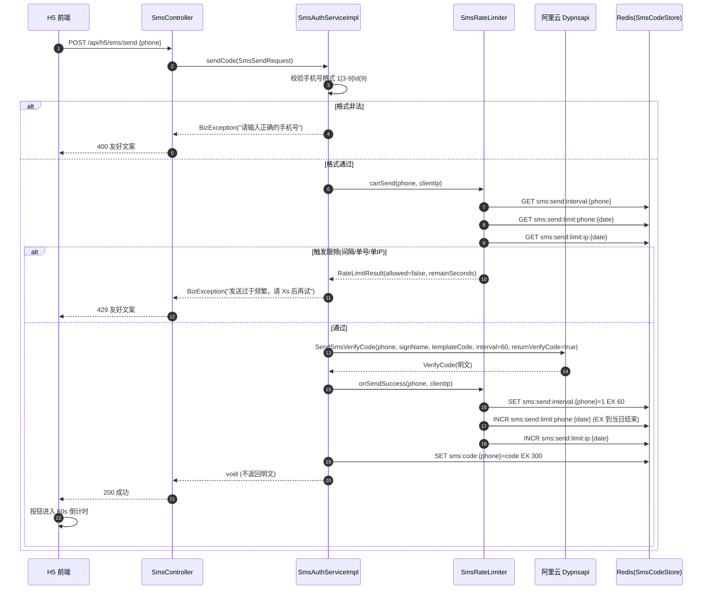
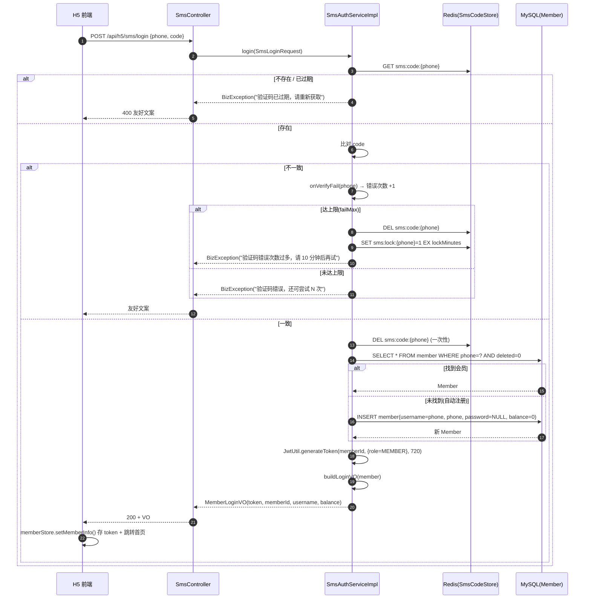
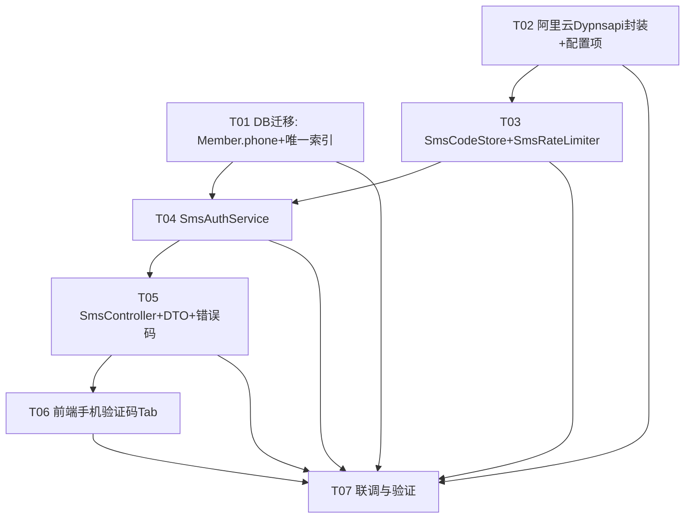

# 系统架构设计文档：手机验证码登录（H5 用户端）

> 文档版本：v1.0　|　架构师：高见远（Gao）　|　创建日期：2025-07-09
> 上游输入：`docs/prd-sms-login.md`（产品经理 许清楚）
> 技术栈：后端 Java 21 + Spring Boot 3.2.5 + MyBatis-Plus + jjwt 0.12.6 + StringRedisTemplate；前端 Vue3 + Vant

---

## 一、实现方案 + 框架选型

### 1.1 核心技术难点

| # | 难点 | 说明 |
|---|------|------|
| D1 | 阿里云通道接入 | 采用 Dypnsapi `SendSmsVerifyCode`（`ReturnVerifyCode=true` 取回明文），官方 `VerifySmsCode` 已下线，必须**自校验** |
| D2 | 验证码安全存储 | 明文仅存 Redis（TTL=300s），不落 MySQL、不落日志；校验成功即删（一次性） |
| D3 | 多维限频 | 发送间隔 60s、单号日上限、单 IP 日上限、错误次数上限 + 锁定，全部基于 Redis 计数 |
| D4 | 账号策略 | 按手机号匹配会员，无则**自动注册**（新增 `phone` 字段 + 唯一索引 + 迁移脚本）；新会员无密码 |
| D5 | 统一友好文案 | 屏蔽阿里云原始错误，后端映射为固定友好文案（P0-10） |

### 1.2 框架 / 库选型

| 维度 | 选型 | 理由 |
|------|------|------|
| 后端主体 | **复用** 现有 Spring Boot 3.2.5 + MyBatis-Plus + jjwt | 与 `MemberAuthServiceImpl` / `JwtUtil` / `MemberAuthInterceptor` 完全一致，零改造接入会员 token 体系 |
| 缓存 | **复用** `spring-boot-starter-data-redis` 的 `StringRedisTemplate` | `pom.xml` 已引入；开发机 `localhost:6379` 已启动 |
| 短信 SDK | **新增** 阿里云 `com.aliyun:dypnsapi20170525`（官方 SDK，自带基于 tea-openapi 的 HTTP 客户端） | 无需额外 HTTP 客户端库；`SendSmsVerifyCode` 直接返回明文 `VerifyCode` |
| 配置绑定 | Spring `@ConfigurationProperties`（`sms.rate-limit.*` / `aliyun.dypnsapi.*`） | 限频阈值与签名/模板全部可配置，便于运营调整 |
| 前端 | **复用** 现有 H5 登录页 + `member` store + `request` 拦截器（Vant `van-count-down` 做倒计时） | 仅新增「手机验证码」Tab 与 `sms` API 模块，无新增 npm 依赖 |

### 1.3 架构模式

分层架构（与现有 H5 认证结构一致）：`SmsController`（REST）→ `SmsAuthService`（业务编排）→ `SmsCodeStore` / `SmsRateLimiter`（Redis 基础设施）+ `DypnsapiClient`（外部通道）+ `MemberMapper` / `JwtUtil`（账号与令牌）。前端保持 `api → store → view` 分层。

---

## 二、文件列表（相对路径）

### 2.1 后端（Java）

| 类型 | 路径 | 动作 |
|------|------|------|
| 实体 | `backend/src/main/java/com/restaurant/entity/Member.java` | **修改**：新增 `phone` 字段 |
| Mapper | `backend/src/main/java/com/restaurant/mapper/MemberMapper.java` | 不变（沿用 `BaseMapper` + `QueryWrapper`，无需自定义方法） |
| 配置属性 | `backend/src/main/java/com/restaurant/config/AliyunDypnsapiProperties.java` | **新增**：`@ConfigurationProperties("aliyun.dypnsapi")` |
| 配置属性 | `backend/src/main/java/com/restaurant/config/SmsRateLimitProperties.java` | **新增**：`@ConfigurationProperties("sms.rate-limit")` |
| 客户端封装 | `backend/src/main/java/com/restaurant/config/DypnsapiConfig.java` | **新增**：构建 `DypnsapiClient` Bean |
| 验证码存储接口 | `backend/src/main/java/com/restaurant/service/SmsCodeStore.java` | **新增** |
| 验证码存储实现 | `backend/src/main/java/com/restaurant/service/impl/RedisSmsCodeStore.java` | **新增** |
| 限频组件 | `backend/src/main/java/com/restaurant/service/impl/SmsRateLimiter.java` | **新增** |
| 认证服务接口 | `backend/src/main/java/com/restaurant/service/SmsAuthService.java` | **新增** |
| 认证服务实现 | `backend/src/main/java/com/restaurant/service/impl/SmsAuthServiceImpl.java` | **新增** |
| 控制器 | `backend/src/main/java/com/restaurant/controller/h5/SmsController.java` | **新增**：`/api/h5/sms/send`、`/api/h5/sms/login` |
| DTO | `backend/src/main/java/com/restaurant/dto/SmsSendRequest.java` | **新增**：`{phone}` |
| DTO | `backend/src/main/java/com/restaurant/dto/SmsLoginRequest.java` | **新增**：`{phone, code}` |
| 错误码 | `backend/src/main/java/com/restaurant/common/ResultCode.java` | **修改**：新增短信相关枚举（统一文案映射） |
| 迁移脚本 | `backend/src/main/resources/db/migration_member_phone.sql` | **新增**：`member.phone` 字段 + 唯一索引 + `password` 改可空 |

> 注：`GlobalExceptionHandler`、`MemberAuthInterceptor`、`JwtUtil`、`MemberLoginVO` **均无需改动**——异常由 `BizException` 兜底，JWT 体系原样复用。

### 2.2 后端配置改动

| 文件 | 动作 | 内容 |
|------|------|------|
| `backend/src/main/resources/application-dev.yml` | **修改** | 新增 `sms.rate-limit.*`（默认值）与 `aliyun.dypnsapi.endpoint` / `sign-name` / `template-code`（非密钥，可入库） |
| `backend/src/main/resources/application-local.yml`（gitignored） | **修改** | 新增 `aliyun.dypnsapi.access-key-id` / `access-key-secret` |
| `backend/src/main/resources/application-local.yml.example` | **修改** | 同步示例占位，提示密钥来自本地文件 |
| `backend/pom.xml` | **修改** | 新增 `com.aliyun:dypnsapi20170525` 依赖 |

### 2.3 前端（H5）

| 类型 | 路径 | 动作 |
|------|------|------|
| API 模块 | `frontend-h5/src/api/sms.ts` | **新增**：`sendSmsCode` / `smsLogin` |
| 登录页 | `frontend-h5/src/views/login/index.vue` | **修改**：新增「手机验证码」Tab（手机号输入、60s 倒计时获取、验证码输入、登录、错误/过期提示、成功跳转） |
| 会员 Store | `frontend-h5/src/store/modules/member.ts` | **修改**：新增 `smsLogin` action（复用 `setMemberInfo`） |
| 类型 | `frontend-h5/src/api/sms.ts`（内联类型） | **新增**：`SmsSendRequest` / `SmsLoginRequest` / `SmsLoginVO` |

---

## 三、数据结构和接口（类图）

```mermaid
classDiagram
    %% ===== 配置 / 外部依赖 =====
    class AliyunDypnsapiProperties {
        +String accessKeyId
        +String accessKeySecret
        +String signName
        +String templateCode
        +String endpoint
        +getAccessKeyId() String
        +getSignName() String
        +getTemplateCode() String
    }

    class SmsRateLimitProperties {
        +int codeTtlSeconds = 300
        +int intervalSeconds = 60
        +int phoneDailyLimit = 10
        +int ipDailyLimit = 50
        +int failMax = 5
        +int lockMinutes = 10
        +getCodeTtlSeconds() int
        +getIntervalSeconds() int
        +getPhoneDailyLimit() int
    }

    class DypnsapiClient {
        <<阿里云官方 SDK>>
        +sendSmsVerifyCode(phone, signName, templateCode, interval, returnVerifyCode) VerifyCode
    }

    %% ===== 验证码存储 =====
    class SmsCodeStore {
        <<interface>>
        +save(phone, code, ttlSeconds) void
        +get(phone) String
        +delete(phone) void
        +exists(phone) boolean
    }

    class RedisSmsCodeStore {
        -StringRedisTemplate redis
        -String KEY_PREFIX = "sms:code:"
        +save(phone, code, ttlSeconds) void
        +get(phone) String
        +delete(phone) void
        +exists(phone) boolean
    }
    RedisSmsCodeStore ..|> SmsCodeStore

    %% ===== 限频组件 =====
    class SmsRateLimiter {
        -StringRedisTemplate redis
        -SmsRateLimitProperties props
        +canSend(phone, ip) RateLimitResult
        +onSendSuccess(phone, ip) void
        +onVerifyFail(phone) FailResult
        +isLocked(phone) boolean
    }
    SmsRateLimiter --> SmsRateLimitProperties : reads

    %% ===== 业务服务 =====
    class SmsAuthService {
        <<interface>>
        +sendCode(SmsSendRequest) void
        +login(SmsLoginRequest) MemberLoginVO
    }

    class SmsAuthServiceImpl {
        -SmsCodeStore smsCodeStore
        -SmsRateLimiter rateLimiter
        -DypnsapiClient dypnsapiClient
        -MemberMapper memberMapper
        -JwtUtil jwtUtil
        -SmsRateLimitProperties props
        +sendCode(SmsSendRequest) void
        +login(SmsLoginRequest) MemberLoginVO
        -autoRegisterOrGetMember(phone) Member
        -buildLoginVO(member) MemberLoginVO
    }
    SmsAuthServiceImpl ..|> SmsAuthService
    SmsAuthServiceImpl --> SmsCodeStore : uses
    SmsAuthServiceImpl --> SmsRateLimiter : uses
    SmsAuthServiceImpl --> DypnsapiClient : calls
    SmsAuthServiceImpl --> MemberMapper : uses
    SmsAuthServiceImpl --> JwtUtil : signs
    SmsAuthServiceImpl ..> Member : reads/writes
    SmsAuthServiceImpl ..> MemberLoginVO : returns

    %% ===== 控制器 / DTO =====
    class SmsController {
        -SmsAuthService smsAuthService
        +send(SmsSendRequest) Result~Void~
        +login(SmsLoginRequest) Result~MemberLoginVO~
    }
    SmsController --> SmsAuthService : calls
    SmsController ..> SmsSendRequest : maps
    SmsController ..> SmsLoginRequest : maps

    class SmsSendRequest {
        +String phone
    }
    class SmsLoginRequest {
        +String phone
        +String code
    }

    %% ===== 实体 / VO（复用） =====
    class Member {
        +Long id
        +String username
        +String password
        +BigDecimal balance
        +Long tempUserId
        +String phone
        +LocalDateTime createTime
        +LocalDateTime updateTime
        +Integer deleted
    }
    class MemberLoginVO {
        +String token
        +Long memberId
        +String username
        +BigDecimal balance
    }

    %% ===== 配置类 =====
    class DypnsapiConfig {
        +dypnsapiClient(AliyunDypnsapiProperties) DypnsapiClient
    }
    DypnsapiConfig --> AliyunDypnsapiProperties : reads
```



> 说明：`SmsRateLimiter` 内部 Redis Key 设计见「共享知识」；`RateLimitResult` / `FailResult` 为限频结果内部值对象（含 `allowed` / `remainSeconds` / `remainCount` / `locked` 等字段），不对外暴露。

---

## 四、程序调用流程（时序图）

### 4.1 获取验证码（主链路一）



### 4.2 验证码登录（主链路二）



---

## 五、任务列表（有序 + 依赖）

> 说明：下表严格遵循主理人给定的 ①–⑧ 分解结构；每个任务标注依赖与优先级（P0=必须，P1=增强）。工程师按 ①→⑧ 顺序实现，T01 为阻塞前置项。

| 任务ID | 任务名称 | 源文件（新增/修改） | 依赖 | 优先级 |
|--------|----------|----------------------|------|--------|
| **T01** | DB 迁移：`member.phone` + 唯一索引 + `password` 改可空 | `db/migration_member_phone.sql`（新）、`entity/Member.java`（改） | 无 | **P0** |
| **T02** | 阿里云 Dypnsapi 客户端封装 + 配置项（`aliyun.dypnsapi.*` / `sms.rate-limit.*`） | `config/AliyunDypnsapiProperties.java`（新）、`config/SmsRateLimitProperties.java`（新）、`config/DypnsapiConfig.java`（新）、`pom.xml`（改）、`application-dev.yml`（改）、`application-local.yml`（改，gitignored） | 无 | **P0** |
| **T03** | `SmsCodeStore` + `SmsRateLimiter`（Redis 基础设施） | `service/SmsCodeStore.java`（新）、`service/impl/RedisSmsCodeStore.java`（新）、`service/impl/SmsRateLimiter.java`（新） | T02 | **P0** |
| **T04** | `SmsAuthService`（发码 / 登录 / 限频编排 / 账号策略 / 统一文案） | `service/SmsAuthService.java`（新）、`service/impl/SmsAuthServiceImpl.java`（新） | T01, T03 | **P0** |
| **T05** | H5 `SmsController` + DTO + 错误码映射 | `controller/h5/SmsController.java`（新）、`dto/SmsSendRequest.java`（新）、`dto/SmsLoginRequest.java`（新）、`common/ResultCode.java`（改） | T04 | **P0** |
| **T06** | 前端 H5 登录页「手机验证码」Tab | `api/sms.ts`（新）、`views/login/index.vue`（改）、`store/modules/member.ts`（改） | T05 | **P0** |
| **T07** | 联调与验证（发码/登录/限频/过期/错误/自动注册全链路） | 上述全部（验证 + 微调） | T01–T06 | **P0** |

> 关于全局异常处理与统一文案（原 ⑥）：`GlobalExceptionHandler` **无需改动**——所有友好文案在 `SmsAuthServiceImpl` 中以 `BizException(友好文案)` 抛出，由既有处理器映射为 `Result`。仅需在 `ResultCode` 中补充短信相关枚举常量（见 T05）。

### 5.1 任务依赖图



---

## 六、依赖包列表

### 6.1 Maven（后端 `pom.xml`）

```
<!-- 新增：阿里云号码认证服务 SDK（含 SendSmsVerifyCode，自带 tea-openapi HTTP 客户端） -->
<dependency>
    <groupId>com.aliyun</groupId>
    <artifactId>dypnsapi20170525</artifactId>
    <version>1.0.6</version>
</dependency>
<!-- 注：tea-openapi / tea-util / tea 由 dypnsapi SDK 传递引入；若构建报缺可显式补：
     com.aliyun:tea-openapi:0.3.x、com.aliyun:tea-util:0.2.x -->
```

```
<!-- 已就位（无需新增）： -->
org.springframework.boot:spring-boot-starter-data-redis   <!-- StringRedisTemplate -->
com.baomidou:mybatis-plus-spring-boot3-starter:3.5.7
io.jsonwebtoken:jjwt-api:0.12.6 / jjwt-impl / jjwt-jackson
cn.hutool:hutool-all:5.8.27
org.springframework.boot:spring-boot-starter-validation
```

### 6.2 npm（前端 H5）

```
无需新增依赖：Vant 已含 van-field / van-button / van-count-down（倒计时）；
axios 已由 request.ts 封装。仅新增 sms.ts API 模块与改造现有 login 页。
```

---

## 七、共享知识（跨文件约定）

### 7.1 Redis Key 命名规范

| Key | 类型 | 值 | TTL | 用途 |
|-----|------|----|-----|------|
| `sms:code:{phone}` | String | 验证码明文 | `codeTtlSeconds`(300) | 登录时比对，成功后 `DEL`（一次性） |
| `sms:send:interval:{phone}` | String("1") | 占位 | `intervalSeconds`(60) | 发送间隔限频 |
| `sms:send:limit:phone:{yyyyMMdd}` | String(计数器) | INCR | 到当日 23:59:59 | 单号日上限 |
| `sms:send:limit:ip:{yyyyMMdd}` | String(计数器) | INCR | 到当日 23:59:59 | 单 IP 日上限 |
| `sms:fail:{phone}` | String(计数器) | INCR | `lockMinutes`(10) | 验证码错误次数 |
| `sms:lock:{phone}` | String("1") | 占位 | `lockMinutes`(10) | 达错误上限后锁定，期间禁止发码/登录 |

> 日期格式统一 `yyyyMMdd`（Asia/Shanghai）；日计数器 TTL 设为「当日剩余秒数」或固定 86400 均可，建议用「结束时刻 - now」精确值。

### 7.2 错误码 / 友好文案映射表

| 场景 | HTTP/业务码 | 友好文案（前端仅见此） |
|------|-------------|------------------------|
| 手机号格式非法 | 400 | 请输入正确的手机号 |
| 发送间隔不足（<60s） | 429 | 发送过于频繁，请 59s 后再试 |
| 单号日上限（≥10） | 429 | 今日验证码发送次数已达上限，请明天再试 |
| 单 IP 日上限（≥50） | 429 | 当前网络发送过于频繁，请稍后再试 |
| 阿里云调用失败 / 限流 | 429 | 验证码发送失败，请稍后再试（**不暴露原始错误**） |
| 验证码不存在 / 过期 | 400 | 验证码已过期，请重新获取 |
| 验证码错误（未达上限） | 400 | 验证码错误，还可尝试 N 次 |
| 验证码错误（达上限） | 429 | 验证码错误次数过多，请 10 分钟后再试 |
| 登录成功 | 200 | （success，返回 `MemberLoginVO`） |

> 静态文案放入 `ResultCode` 枚举；含动态变量的文案（`N 次` / `Xs`）以 `BizException(String)` 格式化抛出。

### 7.3 JWT Claims 约定（与现有会员体系完全一致）

- `subject` = `String.valueOf(memberId)`
- `claims` = `{ "role": "MEMBER" }`（若 `tempUserId` 非空则追加）
- `expiryHours` = **720**（=30 天，H5 端会员 token）
- 因 claims / 有效期 / 拦截逻辑与现有一致，`MemberAuthInterceptor` **无需改动**即可识别短信登录下发的 token。

### 7.4 配置项命名

```yaml
# application-dev.yml（非密钥，可入库）
sms:
  rate-limit:
    code-ttl-seconds: 300      # 验证码 Redis TTL
    interval-seconds: 60        # 发送间隔
    phone-daily-limit: 10       # 单号日上限
    ip-daily-limit: 50          # 单 IP 日上限
    fail-max: 5                 # 验证码错误次数上限
    lock-minutes: 10            # 达上限后锁定时长
aliyun:
  dypnsapi:
    endpoint: dypnsapi.aliyuncs.com
    sign-name: <赠送签名>        # 控制台「赠送签名」
    template-code: <赠送模板CODE> # 控制台「赠送模板」

# application-local.yml（gitignored，仅本地）
aliyun:
  dypnsapi:
    access-key-id: <本地AK>
    access-key-secret: <本地SK>
```

### 7.5 日志脱敏约定

- 验证码明文**绝不**进入任何日志（仅写入 Redis）。
- 手机号日志统一脱敏为 `138****0000`（建议抽取 `SmsCodeStore.maskPhone(phone)` 工具方法）。
- 阿里云返回的 `VerifyCode` 仅用于 Redis 写入与登录比对，禁止 `log.info(verifyCode)`。
- 异常日志只记录脱敏手机号 + 限频/错误计数，**不记录验证码值与阿里云原始报文**。

---

## 八、待明确事项（含建议默认值）

| # | 事项 | 影响 | 建议默认 |
|---|------|------|----------|
| U1 | 自动注册会员的 `username` 取值 | `member.username` 有唯一索引 `uk_username`；需保证唯一 | **username = phone**（与 `phone` 唯一索引天然一致）；`password = NULL` |
| U2 | 现有 `member.password` 为 `NOT NULL` | 短信注册用户无密码 | 迁移脚本将其改为 **NULL** 可空（注释：短信注册用户可空） |
| U3 | 阿里云赠送签名 / 模板具体值（`SignName` / `TemplateCode`） | 发码必须 | 由运营/主理人在阿里云控制台确认后填入 gitignored 本地/prod 配置；开发期先用控制台提供的测试值占位 |
| U4 | `sms:fail:{phone}` 的 TTL 与锁定关系 | 错误计数窗口 | 失败计数 TTL = `lockMinutes`(10min)，与锁定窗口对齐；达上限额外写 `sms:lock:{phone}` |
| U5 | 单 IP 真实获取方式 | H5 经 Nginx/网关，需取真实 IP | 优先取 `X-Forwarded-For` 第一个非 `unknown` IP，降级 `request.getRemoteAddr()`（建议封装 `ClientIpResolver`） |
| U6 | 微信登录与短信同手机号「账号归一」（Q5） | 数据一致性 | 本期仅「按手机号唯一匹配 + 自动注册」，**不主动合并**微信账号；归一留待后续迭代 |
| U7 | 登录接口是否独立限频（防爆破） | 资损/安全 | 本期仅对「发码」做 IP/单号日上限 + 验证码错误次数上限；登录接口本身无独立限频，如需后续补 |
| U8 | 微信/账号密码登录入口与「手机验证码」并列方式（P1-02） | 前端布局 | 登录页采用 Vant `van-tabs`：①账号密码 ②手机验证码（微信若已有入口则作为第三 Tab；现有 login 页无微信按钮，本期先实现前两 Tab） |

---

## 九、设计结论摘要

- **零侵入会员体系**：复用 `JwtUtil`(720h) + `MemberAuthInterceptor`，短信登录下发与账号密码完全相同的会员 JWT。
- **安全自校验**：验证码仅存 Redis（300s TTL），成功后即删；全链路不落库、不落日志、统一友好文案。
- **可配置限频**：发送间隔 / 单号 / 单 IP / 错误次数 / 锁定全部走 `sms.rate-limit.*` 配置，运营可调。
- **平滑账号策略**：按手机号匹配，无则自动注册（新增 `phone` 字段 + 唯一索引 + 迁移脚本）。
- **分工清晰**：后端 T01–T05 与前端 T06 解耦，T07 统一联调验证。

---

## 设计修订记录

- 2026-07-10 修订：Q2 由「不加滑块」改为「加滑块前置」；`SmsSendRequest` 增加 `captchaToken` 字段；`SmsController.send` 在限频前调用 `CaptchaService.verifyAndConsumeCaptcha` 复用现有滑块机制；其余维持原设计。

- 2026-07-10 修订（SDK 版本）：原设计依赖 `com.aliyun:dypnsapi20170525:1.0.6` 的 `SendSmsVerifyCode`（`ReturnVerifyCode=true` 取回明文）。经验证，1.0.6 仅含 `VerifySmsCode`（官方已停服），不含 `SendSmsVerifyCode`；故将依赖升级至 `1.2.3`（同 1.x 线，最小变更）。`SendSmsVerifyCodeRequest` 关键字段类型确认：`phoneNumber/signName/templateCode(String)`、`returnVerifyCode(Boolean)`、`interval(Long)`、`validTime(Long)`、`templateParam(String, JSON)`；明文取回路径：`response.getBody().getModel().getVerifyCode()`。其余维持原设计。

- 2026-07-10 修订（用户决策）：老密码注册未存 phone（username 唯一索引），故 SmsAuthServiceImpl.login 增加「按 username==phone 回填 phone 并直接登录、不新建」的兼容逻辑；仅全新手机号才自动注册。

