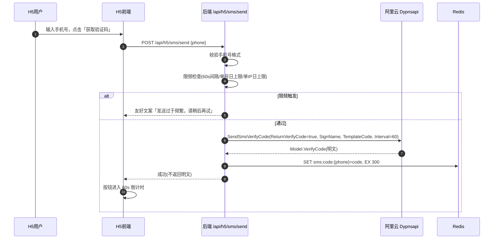
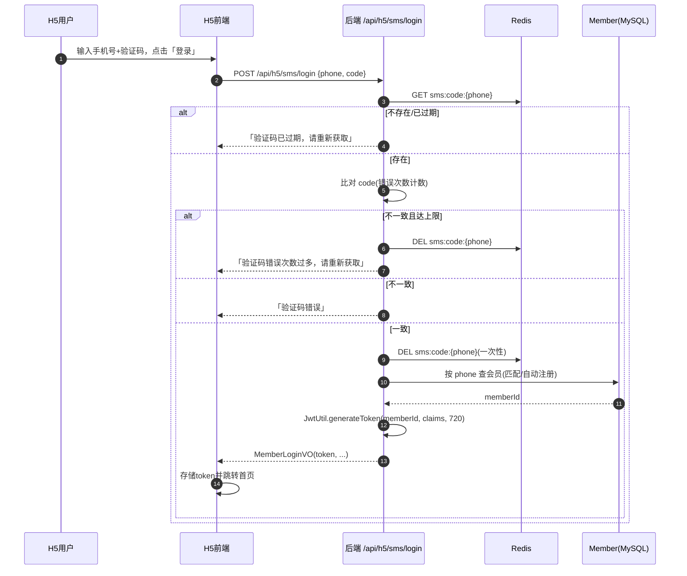

# 产品需求文档（PRD）：手机验证码登录（H5 用户端）

> 类型：简单 PRD（产品目标 + 用户故事 + 需求池 P0/P1/P2 + UI 设计稿 + 待确认问题）
> 文档版本：v1.0　|　创建日期：2025-07-09　|　产品经理：许清楚（Xu）

## 项目信息

| 项目 | 内容 |
|------|------|
| 项目名称 | sms_login（order_food 子功能） |
| 编程语言/技术栈 | 后端：Java 21 + Spring Boot 3.2.5 + MyBatis-Plus + jjwt 0.12.6；H5：Vue3 + Vant；Admin：Vue3 + Element Plus；缓存：Redis（StringRedisTemplate） |
| 关联模块 | `H5MemberAuthController` / `MemberAuthService` / `JwtUtil` / `Member` 实体 |
| 原始需求复述 | 为 H5 用户端新增「手机号 + 短信验证码」登录方式，作为账号密码/微信/临时用户登录的补充，降低注册/登录门槛、提升下单转化。采用阿里云 Dypnsapi `SendSmsVerifyCode`（自校验方案，官方 `VerifySmsCode` 已下线）。 |

---

## 一、产品目标

| # | 目标 | 说明（可衡量） |
|---|------|----------------|
| G1 | **降低登录门槛、提升转化** | 新用户无需记忆密码即可在 ≤ 2 步内完成登录（手机号 → 验证码），减少因注册/登录流失导致的下单放弃 |
| G2 | **平滑接入现有会员体系** | 验证码登录复用电户现有 JWT 会员 token 体系（H5 端 30 天 / 720h），与账号密码、微信登录并列，不新建独立账号孤岛 |
| G3 | **可控的资损与防刷** | 通过发送间隔、单号/单 IP 日上限、错误次数上限与统一安全文案，将短信资损与刷量风险控制在可配置阈值内 |

---

## 二、用户故事

| # | 角色 | 场景 | 用户故事（As a … I want … so that …） |
|---|------|------|----------------------------------------|
| US1 | H5 顾客（新/老） | 发码 | 作为一名顾客，我想输入手机号后一键获取短信验证码，以便无需密码就能快速登录下单 |
| US2 | H5 顾客 | 登录 | 作为一名顾客，我想填入收到的 6 位验证码即可登录，以便旧设备/忘密码时仍能顺畅进入点餐页 |
| US3 | H5 顾客 | 限频拦截 | 作为一名频繁点击的用户，当发送过于频繁时我想看到友好提示而非报错，以便知道需等待多久再试 |
| US4 | H5 顾客 | 异常态 | 当验证码错误/过期时，我想得到清晰文案与「重新获取」入口，以便自助纠正完成登录 |
| US5 | 运营/风控 | 可观测 | 作为一名运营，我想看到发码成功率、限频触发与失败原因统计，以便监控短信成本与刷量风险 |

---

## 三、需求池（P0 / P1 / P2 分级）

> 优先级说明：P0 = 必须有（MVP）；P1 = 应该有（体验/风控增强）；P2 = 可以有（后续迭代）。
> 功能性 + 非功能性（安全 / 限频 / 可观测）均纳入。

### P0 — 必须有（MVP 核心）

| 编号 | 模块 | 需求 | 验收标准 |
|------|------|------|----------|
| P0-01 | 发码接口 | 新增 `POST /api/h5/sms/send {phone}`：后端调阿里云 `SendSmsVerifyCode`（参数 `ReturnVerifyCode=true`，`SignName`/`TemplateCode` 用赠送签名/模板，`Interval=60`），从返回 `Model.VerifyCode` 取明文 | 调通阿里云通道；使用赠送签名/模板；异常（限流/参数错）不抛原始错误 |
| P0-02 | 验证码存储 | 发码成功后，后端将明文验证码写入 Redis：`key = sms:code:{手机号}`，`TTL = 300s`；校验成功后立即 `DEL` | 验证码仅存 Redis；不落 MySQL；日志中绝不明文出现 |
| P0-03 | 自校验登录接口 | 新增 `POST /api/h5/sms/login {phone, code}`：比对 Redis 中的码，一致且未过期则签发 JWT | 复用 `JwtUtil.generateToken(subject=memberId, claims, 720)`；返回 `MemberLoginVO`（与现有登录一致） |
| P0-04 | 手机号格式校验 | 后端校验手机号：11 位、`1[3-9]\d{9}` 号段；前端同步做基础校验与输入过滤 | 非法手机号在发码前即被拦截并返回友好文案 |
| P0-05 | 限频-发送间隔 | 同手机号两次发送间隔 ≥ 60s（阿里云 `Interval` + 后端计数双重保障） | 间隔内重复点击返回「发送过于频繁，请稍后再试」，按钮进入倒计时 |
| P0-06 | 限频-单号日上限 | 单手机号单日发送上限（默认 10 条/日，可配置）；超限拒绝 | 超限返回友好文案，不调用阿里云 |
| P0-07 | 限频-单 IP 日上限 | 单 IP 单日发送上限（默认 50 条/日，可配置）；超限拒绝 | 超限返回友好文案 |
| P0-08 | 限频-错误尝试上限 | 同一验证码错误尝试次数上限（默认 5 次）；达上限锁定该手机号（默认 10 分钟）并失效当前验证码 | 达上限后需重新获取；期间登录被拒 |
| P0-09 | 安全-一次性 | 校验成功后立即删除 Redis 中的码，防重放 | 同一验证码不可二次登录 |
| P0-10 | 安全-统一文案 | 不透传阿里云原始错误；统一文案：「验证码错误」「验证码已过期，请重新获取」「发送过于频繁，请稍后再试」 | 前端仅见友好文案；错误码映射在后端完成 |
| P0-11 | 安全-不落库/不落日志 | 验证码明文只进 Redis，日志统一脱敏（如 `sms:code:138****0000`） | 代码评审/日志抽查无明文验证码 |
| P0-12 | 账号处理（最小可行策略） | 登录后按手机号匹配：有 `phone` 匹配会员则登录该会员；无则**自动注册**新会员并写入手机号 | 见待确认 Q1；需 `Member` 实体新增 `phone` 字段（唯一索引）+ DB 迁移脚本 |
| P0-13 | H5 UI 入口 | 登录页提供「手机验证码」登录入口，含手机号输入、获取验证码按钮（60s 倒计时）、验证码输入、登录按钮；成功回调现有 token 存储与路由跳转 | 与账号密码/微信登录并列；登录成功跳转首页且后续请求带 JWT |
| P0-14 | Redis 依赖 | 复用 `spring-boot-starter-data-redis` 的 `StringRedisTemplate`；开发机 `localhost:6379` 已起 | 线上服务器 Redis 上线前补齐（上线前置条件，需在发布清单标注） |
| P0-15 | 可观测 | 埋点：发码成功/失败数、校验成功/失败数、限频触发次数、各步耗时；接入现有日志/监控 | 运营可在看板（或日志）查看核心指标 |

### P1 — 应该有（体验 / 风控增强）

| 编号 | 模块 | 需求 | 验收标准 |
|------|------|------|----------|
| P1-01 | 前置图形验证/滑块 | 复用现有滑块 `captchaToken` 机制作为「获取验证码」前置（若 Q2 决定启用） | 未通过滑块不可发码；与现有密码登录滑块一致 |
| P1-02 | 多方式并列 | H5 登录页提供「账号密码 / 微信 / 手机验证码」切换入口 | 三种方式互斥可切换，均产出同一会员 JWT |
| P1-03 | 重发 UX | 验证码按钮禁用 + 60s 倒计时；倒计时结束可重新获取 | 倒计时内点击无效且有视觉反馈 |
| P1-04 | 自动填充 | H5 利用系统短信自动填充（iOS/Android autofill）输入验证码 | 收到短信后输入框可一键填充 |
| P1-05 | token 一致性 | 验证码登录签发的会员 JWT 在 `claims`、有效期（720h）、刷新策略上与现有会员体系完全一致 | 后续接口鉴权（`MemberAuthInterceptor`）无需改动即可识别 |

### P2 — 可以有（后续迭代）

| 编号 | 模块 | 需求 | 验收标准 |
|------|------|------|----------|
| P2-01 | Admin 端 | Admin 管理端手机验证码登录（一般不需，见 Q3） | 若启用，仅限特定管理员且走独立权限 |
| P2-02 | 资料引导 | 验证码自动注册的新会员引导完善昵称/头像 | 非强制，可跳过 |
| P2-03 | 成本看板 | 按日/渠道统计短信发送量与资费 | 运营可查看成本趋势 |
| P2-04 | 账号归一 | 微信登录与验证码登录同手机号合并为同一会员（统一用户中心） | 见 Q5 |

---

## 四、UI 设计稿

### 4.1 H5 登录页布局（手机验证码 Tab）

```
┌───────────────────────────────┐
│  ←  登录 / 注册          [×]   │  ← 顶部导航
├───────────────────────────────┤
│  [账号密码]  [微信]  [手机验证码]│  ← 登录方式切换（当前高亮「手机验证码」）
├───────────────────────────────┤
│                                │
│  手机号                        │
│  ┌─────────────────────────┐  │
│  │ +86  请输入手机号          │  │  ← 数字键盘，11 位限制
│  └─────────────────────────┘  │
│                                │
│  验证码                        │
│  ┌─────────────────┐ [获取]  │  │  ← 「获取」点击后变 60s 倒计时
│  │ 请输入6位验证码     │ 59s   │  │
│  └─────────────────┘         │
│                                │
│  ┌─────────────────────────┐  │
│  │        登  录             │  │  ← 主按钮，校验通过后提交
│  └─────────────────────────┘  │
│                                │
│  未注册的手机号将自动创建账号    │  ← 策略提示（依 Q1 定稿）
│                                │
│  遇到问题？查看帮助              │
└───────────────────────────────┘

异常态提示（底部 Toast / 内联）：
  · 手机号格式错误 → 「请输入正确的手机号」
  · 限频 → 「发送过于频繁，请 59s 后再试」
  · 验证码错误 → 「验证码错误，还可尝试 4 次」
  · 验证码过期 → 「验证码已过期，请重新获取」
```

### 4.2 业务流程图（输入手机号 → 获取验证码 → 输入验证码 → 登录）

```mermaid
flowchart TD
    A[输入手机号] --> B{格式校验<br/>1[3-9]XXXXXXXXX}
    B -- 失败 --> B1[提示:手机号格式错误]
    B -- 通过 --> C[点击获取验证码]
    C --> D{限频校验<br/>60s间隔 / 单号日上限 / 单IP日上限}
    D -- 拦截 --> D1[友好文案:请稍后再试]
    D -- 通过 --> E[后端调阿里云发码<br/>明文存Redis TTL=300s]
    E --> F[按钮60s倒计时]
    F --> G[输入6位验证码]
    G --> H{提交登录}
    H --> I{校验Redis中的码}
    I -- 过期/不存在 --> I1[提示:验证码已过期]
    I -- 错误·未达上限 --> I2[提示:验证码错误+剩余次数]
    I -- 错误·达上限 --> I3[删除码+锁定提示]
    I -- 一致 --> J[删码+签发JWT 720h<br/>匹配/注册会员]
    J --> K[登录成功·跳转首页]
```

### 4.3 时序图：获取验证码



### 4.4 时序图：验证码登录



---

## 五、待确认问题清单（Open Questions）

| # | 问题 | 影响范围 | 建议默认 / 选项 |
|---|------|----------|-----------------|
| Q1 | **登录后账号处理策略（最关键）**：验证码登录的手机号若无对应会员，是①自动注册新会员并写入手机号，还是②仅允许已有手机号会员登录（未绑定则提示先绑定）？自动注册的新会员是否需要强制设置密码/昵称？ | P0-12、`Member` 表结构、DB 迁移 | 建议①自动注册（降低门槛，契合 G1）；需 `Member` 加 `phone` 字段 + 唯一索引；新会员初始无密码，后续可在「设置」中补设 |
| Q2 | **是否需要图形验证码/滑块作为「获取验证码」前置防刷**？项目现有密码登录已用滑块 `captchaToken` 机制，可复用 | P1-01、P0-05~08 限频策略 | 外部限频（60s/单号/单IP/错误次数）已定；滑块前置为可选增强，建议高风险场景（如新设备/异地）启用 |
| Q3 | **Admin 管理端是否需要手机验证码登录**？本期聚焦 H5 | P2-01、范围边界 | 一般不需；若管理员需手机登录请明确，建议本期不纳入 |
| Q4 | **限频阈值默认值与可调范围**：单号日上限（默认10）、单 IP 日上限（默认50）、错误尝试上限（默认5）、锁定时长（默认10min）是否需产品侧拍板？ | P0-06~08 | 给出上表默认值，要求做成可配置（配置文件/配置中心），便于运营按实调整 |
| Q5 | **账号归一化**：微信登录用户若手机号与验证码登录手机号一致，是合并为同一会员还是并存？ | P2-04、数据一致性 | 建议本期「按手机号唯一匹配、自动合并」，避免账号孤岛；需与微信登录逻辑对齐 |

### 回传主理人的 5 个最关键待确认点（需用户/架构师拍板）

1. **Q1 登录后账号策略**：自动注册 vs 仅绑定已有；新会员是否强制设密码 → 决定 `Member.phone` 字段、唯一索引与 DB 迁移方案（P0 阻塞项）。
2. **Q2 滑块/图形验证前置**：是否在「获取验证码」前加滑块（复用现有 `captchaToken`）→ 影响发码链路与风控强度。
3. **Q3 Admin 端范围**：本期是否彻底排除 Admin 手机登录 → 影响范围边界与工作量。
4. **Q4 限频默认值**：单号/单IP 日上限、错误次数上限、锁定时长的最终数值与是否可配置 → 影响资损与防刷效果。
5. **Q5 账号归一化**：微信登录与验证码登录同手机号是否合并为同一会员 → 影响用户中心设计与数据一致性。
