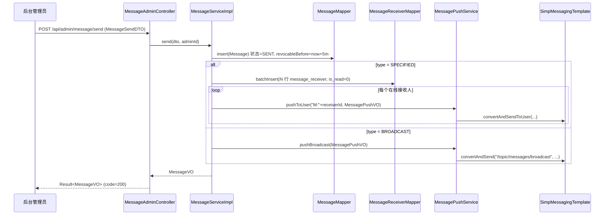
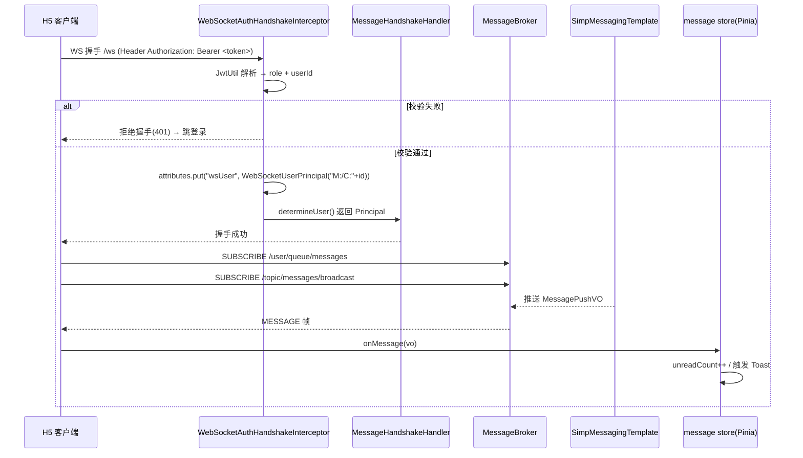
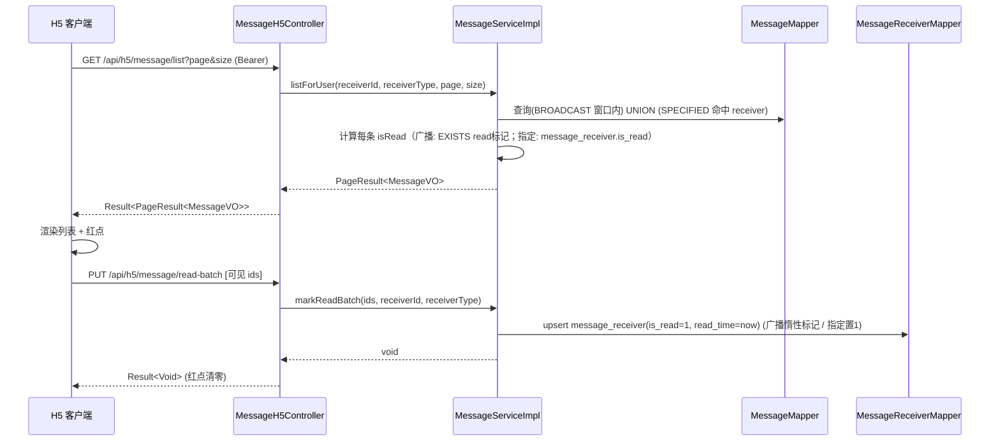
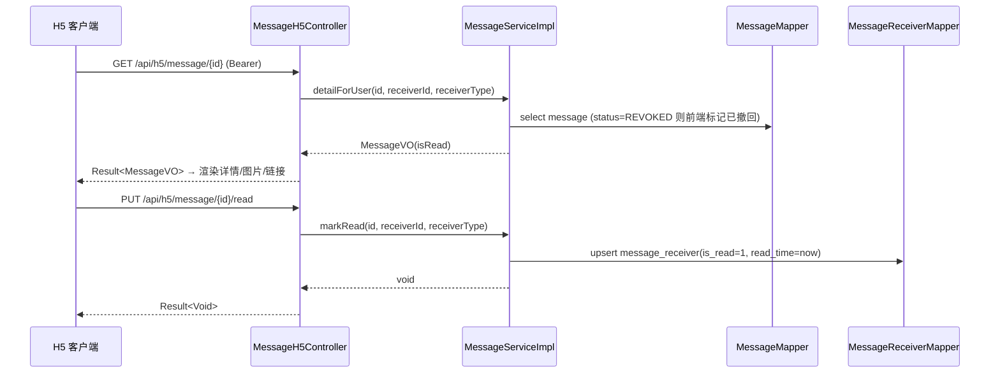
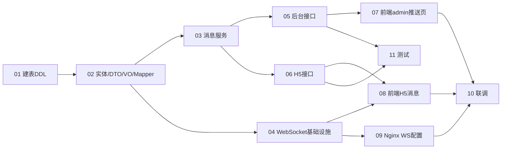

# 订单点餐系统 · 消息模块增量架构设计（规划稿）

> 文档版本：v0.1（架构规划）
> 作者：高见远（Architect）
> 关联 PRD：`docs/prd-message-module.md`
> 落地路径：`docs/system-design-message-module.md`
> 配套图：`docs/class-diagram.mermaid`、`docs/sequence-diagram.mermaid`

本文档为**增量规划**，明确消息模块的实现方案、框架选型、文件清单、数据结构与接口契约、调用流程、任务分解与待拍板事项。**不含业务实现代码**，仅给出接口签名、配置片段、DDL 草案与 Mermaid 图，供工程实现阶段按任务列表顺序施工。

---

## A. 实现方案 + 框架选型

### A.1 技术难点与总体策略

| 难点 | 方案 |
|------|------|
| 实时触达（管理员 → 在线用户） | 全新引入 `spring-boot-starter-websocket`，采用 **Spring STOMP + SockJS**，`/ws` 端点。单实例用内置 `SimpMessagingTemplate` 应用内推送；多实例 Redis pub/sub 列为 P2 后续。 |
| H5 鉴权（会员/游客双轨） | **复用现有 JWT**。WS 握手时由 `WebSocketAuthHandshakeInterceptor` 解析 `Authorization: Bearer <token>`（复用 `JwtUtil`），解析出 `role` 与用户 ID，封装为 `WebSocketUserPrincipal`（name=`M:<memberId>` / `C:<tempUserId>`），由 `MessageHandshakeHandler` 绑定到 WS Session。**不新增鉴权体系**。 |
| 离线消息不丢失 | 发送即落库。在线用户经 WS 实时推；不在线用户打开「消息中心」或上线时由 REST 拉取未读 + 历史。 |
| 广播 vs 指定接收人存储 | 见 C.4 推荐方案：指定 → 展开 `message_receiver` 多行；广播 → 主表存储、不展开，已读用惰性写回 `message_receiver` 标记。 |
| 最小侵入接入 | 新增接口仅把路径注册进现有拦截器：`/api/h5/message/**` 注册进 `CustomerAuthInterceptor`（已同时接受 MEMBER/CUSTOMER，**覆盖会员与游客**）；`/api/admin/message/**` 已匹配 `AdminAuthInterceptor`（`/api/admin/**`），无需改动。 |

### A.2 框架 / 库选型

- **后端**：`spring-boot-starter-websocket`（与现有 Spring Boot 3.2.5 同版本，starter 自带 STOMP/SockJS 支持）。沿用 MyBatis-Plus 3.5.7、jjwt 0.12.6、Redis `StringRedisTemplate`（仅用 String 操作，本期不引入 pub/sub）、MySQL 8。
- **前端 H5**：`@stomp/stompjs`（^7，类型友好、Promise 化）+ `sockjs-client`（^1.6，提供 SockJS 传输工厂）。理由：项目已用 Vite+Vue3+TS，`@stomp/stompjs` 的 TS 类型与重连/心跳 API 成熟，配合 SockJS 兼容旧浏览器与代理。
- **前端 admin**：沿用 Vue3 + Element Plus，无新增依赖。

### A.3 WebSocket 通道设计

- 端点：`/ws`（SockJS 启用），允许跨域按域名收紧（CORS `setAllowedOriginPatterns`）。
- 个人通道（指定用户）：`/user/queue/messages`（Spring user destination，按 `WebSocketUserPrincipal.name` 路由）。
- 广播通道（全员）：`/topic/messages/broadcast`（所有在线连接订阅）。
- 客户端统一订阅以上两个目的地；推送 Payload 为 `MessagePushVO`（含 `type`/`status`，前端据状态决定红点/Toast/隐藏）。
- 撤回事件：复用同一 Payload，`status=REVOKED`，前端据此隐藏或标记「已撤回」。

### A.4 撤回（P1-04）

- `message.revocable_before = create_time + 5 分钟`（落库字段）。
- 后台调 `POST /api/admin/message/{id}/revoke`：校验 `status=SENT` 且 `now < revocable_before`，否则返回 `MESSAGE_REVOKE_NOT_ALLOWED`；通过则置 `status=REVOKED` 并向原接收通道推「撤回事件」。

---

## B. 文件列表（相对路径，标注【新增】/【修改现有】）

> 后端包根：`backend/src/main/java/com/restaurant/`（以下路径省去该前缀）
> 前端 admin 根：`frontend-admin/src/`；前端 H5 根：`frontend-h5/src/`

### B.1 后端

| 路径 | 类型 | 说明 |
|------|------|------|
| `pom.xml` | 【修改现有】 | 增加 `spring-boot-starter-websocket` 依赖 |
| `common/ResultCode.java` | 【修改现有】 | 增加 `MESSAGE_*` 业务码 |
| `config/WebMvcConfig.java` | 【修改现有】 | 将 `/api/h5/message/**` 追加注册到 `CustomerAuthInterceptor`（同时覆盖会员/游客） |
| `resources/db/migration_message.sql` | 【新增】 | 建表 DDL（`message` + `message_receiver`），遵循 `migration_*.sql` 习惯（IF NOT EXISTS，禁止 DROP） |
| `entity/Message.java` | 【新增】 | 消息主表实体 |
| `entity/MessageReceiver.java` | 【新增】 | 接收人/已读维度实体 |
| `dto/MessageSendDTO.java` | 【新增】 | 后台发送请求体 |
| `vo/MessageVO.java` | 【新增】 | 消息视图对象（列表/详情/推送共用字段） |
| `vo/MessagePushVO.java` | 【新增】 | WS 实时推送 Payload |
| `vo/MessageUnreadVO.java` | 【新增】 | 未读计数响应（如 `{unreadCount}`） |
| `mapper/MessageMapper.java` | 【新增】 | MyBatis-Plus Mapper（含自定义分页查询方法） |
| `mapper/MessageReceiverMapper.java` | 【新增】 | 接收人 Mapper（含 upsert 标记已读、未读统计方法） |
| `service/MessageService.java` | 【新增】 | 服务接口 |
| `service/impl/MessageServiceImpl.java` | 【新增】 | 落库 + 展开 receiver + 列表/详情/已读/未读计数/撤回 |
| `realtime/WebSocketUserPrincipal.java` | 【新增】 | 实现 `java.security.Principal`，封装 `M:/C:` 名称与 userId/role |
| `realtime/MessageHandshakeHandler.java` | 【新增】 | 继承 `DefaultHandshakeHandler`，`determineUser` 产出 Principal |
| `realtime/WebSocketAuthHandshakeInterceptor.java` | 【新增】 | 握手解析 Bearer、鉴权、写入 Principal 到 attributes |
| `realtime/WebSocketAuthChannelInterceptor.java` | 【新增】 | 入站通道校验：无 Principal 的 `/app/**` 消息拒绝 |
| `realtime/MessagePushService.java` | 【新增】 | 封装 `SimpMessagingTemplate` 推送（个人/广播/撤回） |
| `config/WebSocketConfig.java` | 【新增】 | `@EnableWebSocketMessageBroker` + 注册端点/拦截器/代理 |
| `controller/admin/MessageAdminController.java` | 【新增】 | `send/list/detail/revoke` |
| `controller/h5/MessageH5Controller.java` | 【新增】 | `list/detail/read/read-batch/unread-count` |

### B.2 前端 admin

| 路径 | 类型 | 说明 |
|------|------|------|
| `src/api/message.ts` | 【新增】 | 发送/列表/详情/撤回接口 + 类型定义（复用现有会员列表 `/api/admin/members` 做选择器、复用现有上传 API 做图片） |
| `src/views/message/push.vue` | 【新增】 | 消息推送页（发送表单 + 发送记录表） |
| `src/layout/Sidebar.vue` | 【修改现有】 | 新增「消息推送」菜单项（`index="/message-push"`，图标 `Bell`） |
| `src/router/index.ts` | 【修改现有】 | children 新增 `/message-push` 路由（`meta:{title:'消息推送',icon:'Bell'}`） |

### B.3 前端 H5

| 路径 | 类型 | 说明 |
|------|------|------|
| `package.json` | 【修改现有】 | 增加 `@stomp/stompjs`、`sockjs-client` |
| `src/utils/websocket.ts` | 【新增】 | WS 客户端：connect(token)、自动重连(指数退避)、心跳、401 跳登录、订阅双通道 |
| `src/store/modules/message.ts` | 【新增】 | Pinia store：持有 WS 单例、未读计数、最新消息（供 Toast/红点） |
| `src/api/message.ts` | 【新增】 | 列表/详情/单读/批量读/未读计数接口 + 类型 |
| `src/views/message/index.vue` | 【新增】 | 消息中心（列表 + 未读红点 + 打开即批量已读） |
| `src/views/message/detail.vue` | 【新增】 | 消息详情（图文 + 跳转链接 + 进入即已读） |
| `src/views/me/index.vue` | 【修改现有】 | 「我的」页新增「消息中心」入口与未读红点徽标 |
| `src/router/index.ts` | 【修改现有】 | 新增 `/message`、`/message/:id` 路由 |

### B.4 测试（后端）

| 路径 | 类型 | 说明 |
|------|------|------|
| `src/test/java/com/restaurant/controller/admin/MessageAdminControllerTest.java` | 【新增】 | standalone MockMvc + MockitoExtension，覆盖 send/list/detail/revoke |
| `src/test/java/com/restaurant/controller/h5/MessageH5ControllerTest.java` | 【新增】 | 覆盖 list/detail/read/unread-count（注入 memberId/tempUserId attribute 模拟双轨） |
| `src/test/java/com/restaurant/service/impl/MessageServiceTest.java` | 【新增】 | Mockito standalone，覆盖落库、广播不展开、指定展开、已读回写、撤回窗口 |

### B.5 部署（服务器侧，非代码改动，列为待办）

- 生产 Nginx(80) 反代 8080，需新增 `/ws` 的 `Upgrade`/`Connection` 转发（见 H 节配置片段）。由运维/主理人操作。

---

## C. 数据结构与接口

### C.1 类图（Mermaid）

> 完整图另存 `docs/class-diagram.mermaid`。

```mermaid
classDiagram
    %% ---------- 数据实体 ----------
    class Message {
        +Long id
        +String type           %% BROADCAST/SPECIFIED/SYSTEM
        +String receiverScope  %% ALL/SPECIFIED
        +Long senderId         %% admin_user.id
        +String title
        +String content
        +String imageUrl
        +String linkUrl
        +String status         %% SENT/REVOKED
        +LocalDateTime revocableBefore
        +LocalDateTime createTime
        +LocalDateTime updateTime
    }

    class MessageReceiver {
        +Long id
        +Long messageId
        +Long receiverId       %% member.id 或 temp_user.id
        +String receiverType   %% MEMBER/TEMP
        +Integer isRead        %% 0/1
        +LocalDateTime readTime
        +LocalDateTime createTime
    }

    %% ---------- DTO / VO ----------
    class MessageSendDTO {
        +String type
        +String title
        +String content
        +String imageUrl
        +String linkUrl
        +List~Long~ receiverIds  %% 仅 SPECIFIED：member.id 列表
    }

    class MessageVO {
        +Long id
        +String type
        +String receiverScope
        +Long senderId
        +String title
        +String content
        +String imageUrl
        +String linkUrl
        +String status
        +Boolean revocable       %% 前端判断是否可撤回
        +LocalDateTime createTime
        +Boolean isRead          %% H5 视角已读态
    }

    class MessagePushVO {
        +Long id
        +String type
        +String title
        +String content
        +String imageUrl
        +String linkUrl
        +String status
        +LocalDateTime createTime
    }

    class MessageUnreadVO {
        +Long unreadCount
    }

    %% ---------- 服务与组件 ----------
    class MessageService {
        <<interface>>
        +send(MessageSendDTO, Long senderId) MessageVO
        +adminList(page, size, type, scope, status, keyword) PageResult~MessageVO~
        +adminDetail(Long id) MessageVO
        +revoke(Long id, Long adminId) void
        +listForUser(Long receiverId, String receiverType, page, size) PageResult~MessageVO~
        +detailForUser(Long id, Long receiverId, String receiverType) MessageVO
        +markRead(Long id, Long receiverId, String receiverType) void
        +markReadBatch(List~Long~ ids, Long receiverId, String receiverType) void
        +unreadCount(Long receiverId, String receiverType) Long
    }

    class MessageServiceImpl {
        -MessageMapper messageMapper
        -MessageReceiverMapper receiverMapper
        -MessagePushService pushService
        +send() MessageVO
        +adminList() PageResult~MessageVO~
        +adminDetail() MessageVO
        +revoke() void
        +listForUser() PageResult~MessageVO~
        +detailForUser() MessageVO
        +markRead() void
        +markReadBatch() void
        +unreadCount() Long
    }

    class MessagePushService {
        -SimpMessagingTemplate messagingTemplate
        +pushToUser(String principalName, MessagePushVO) void
        +pushBroadcast(MessagePushVO) void
        +pushRevoke(Long messageId, MessagePushVO) void
    }

    class MessageAdminController {
        -MessageService messageService
        +send(@Valid MessageSendDTO) Result~MessageVO~
        +list(...) Result~PageResult~MessageVO~~
        +detail(Long id) Result~MessageVO~
        +revoke(Long id) Result~Void~
    }

    class MessageH5Controller {
        -MessageService messageService
        +list(...) Result~PageResult~MessageVO~~
        +detail(Long id) Result~MessageVO~
        +read(Long id) Result~Void~
        +readBatch(List~Long~ ids) Result~Void~
        +unreadCount() Result~MessageUnreadVO~
    }

    class WebSocketConfig {
        +registerStompEndpoints(registry)
        +configureMessageBroker(registry)
        +configureClientInboundChannel(reg)
    }

    class WebSocketAuthHandshakeInterceptor {
        +beforeHandshake(req, res, wsHandler, attributes) boolean
    }

    class MessageHandshakeHandler {
        +determineUser(req, wsHandler, attributes) Principal
    }

    class WebSocketUserPrincipal {
        +String name   %% M:123 / C:456
        +Long userId
        +String role   %% MEMBER / CUSTOMER
        +getName() String
    }

    class WebSocketAuthChannelInterceptor {
        +preSend(channel, message) Message
    }

    %% ---------- 关系 ----------
    MessageServiceImpl ..|> MessageService
    MessageServiceImpl --> MessageMapper : 读写
    MessageServiceImpl --> MessageReceiverMapper : 读写
    MessageServiceImpl --> MessagePushService : 实时推送
    MessageAdminController --> MessageService
    MessageH5Controller --> MessageService
    MessagePushService --> SimpMessagingTemplate : 依赖(外部)

    WebSocketConfig --> WebSocketAuthHandshakeInterceptor : 注册
    WebSocketConfig --> MessageHandshakeHandler : 注册
    WebSocketAuthHandshakeInterceptor ..> WebSocketUserPrincipal : 构建
    MessageHandshakeHandler ..> WebSocketUserPrincipal : 产出
    WebSocketUserPrincipal ..|> Principal

    Message "1" *-- "0..*" MessageReceiver : 指定展开/Broadcast已读标记
    MessageServiceImpl ..> MessageVO : 组装
    MessagePushService ..> MessagePushVO : 推送
```



### C.2 核心接口签名（契约）

**MessageSendDTO（后台发送请求体）**
```java
public class MessageSendDTO {
    @NotNull(message = "消息类型必填")
    private String type;                 // BROADCAST / SPECIFIED
    @NotBlank @Size(max = 50)
    private String title;
    @NotBlank
    private String content;
    private String imageUrl;            // 复用 /api/admin/upload 的 OSS 地址
    @jakarta.validation.constraints.Pattern(regexp = "^(https?://|/).*$", message = "跳转链接非法")
    private String linkUrl;
    private List<Long> receiverIds;     // SPECIFIED 时必填（member.id 列表）；BROADCAST 忽略
}
```

**MessageService 接口（关键方法）**
```java
MessageVO send(MessageSendDTO dto, Long senderId);
PageResult<MessageVO> adminList(int page, int size, String type, String scope, String status, String keyword);
MessageVO adminDetail(Long id);
void revoke(Long id, Long adminId);
PageResult<MessageVO> listForUser(Long receiverId, String receiverType, int page, int size);
MessageVO detailForUser(Long id, Long receiverId, String receiverType);
void markRead(Long id, Long receiverId, String receiverType);
void markReadBatch(List<Long> ids, Long receiverId, String receiverType);
long unreadCount(Long receiverId, String receiverType);
```

**REST 端点汇总**

| 方法 | 路径 | 鉴权 | 说明 |
|------|------|------|------|
| POST | `/api/admin/message/send` | AdminAuthInterceptor | 发送（P0-04） |
| GET | `/api/admin/message/list` | AdminAuthInterceptor | 发送记录（P0-02） |
| GET | `/api/admin/message/{id}` | AdminAuthInterceptor | 后台详情 |
| POST | `/api/admin/message/{id}/revoke` | AdminAuthInterceptor | 撤回（P1-04） |
| GET | `/api/h5/message/list` | CustomerAuthInterceptor | H5 消息中心列表（P0-08） |
| GET | `/api/h5/message/{id}` | CustomerAuthInterceptor | H5 详情 |
| PUT | `/api/h5/message/{id}/read` | CustomerAuthInterceptor | 单条已读回写（P0-09） |
| PUT | `/api/h5/message/read-batch` | CustomerAuthInterceptor | 进入列表批量已读 |
| GET | `/api/h5/message/unread-count` | CustomerAuthInterceptor | 未读红点计数（供 me 页与轮询） |

> 会员选择器复用 `GET /api/admin/members?page&size&keyword`；图片上传复用 `POST /api/admin/upload`。二者均已存在，无需新建。

### C.3 枚举与常量（共享）

```java
// 消息类型
BROADCAST("全员广播"), SPECIFIED("指定用户"), SYSTEM("系统通知");
// 接收范围
ALL("全员"), SPECIFIED("指定");
// 状态
SENT("已发送"), REVOKED("已撤回");
// 接收人类型
MEMBER("会员"), TEMP("游客");
// 撤回窗口
REVOKE_WINDOW_MINUTES = 5;
// 广播保留窗口（用于未读统计/列表回溯）
BROADCAST_RETENTION_DAYS = 30;
// WS 目的地
USER_QUEUE = "/user/queue/messages";
BROADCAST_TOPIC = "/topic/messages/broadcast";
// Principal name 前缀
PRINCIPAL_PREFIX_MEMBER = "M:", PRINCIPAL_PREFIX_TEMP = "C:";
```

### C.4 广播 vs 指定：接收人存储策略（推荐方案）

**指定用户（SPECIFIED）→ 发送时展开**
- 仅支持会员（`receiverIds` 为 `member.id` 列表；P0 指定不含游客，依据 Q1 推荐）。
- 落库 `message` 1 行（`receiver_scope=SPECIFIED`）+ `message_receiver` N 行（`receiver_id=memberId`, `receiver_type=MEMBER`, `is_read=0`）。
- 推送：`message_receiver` 中每条接收人 → `convertAndSendToUser("M:"+receiverId, "/queue/messages", vo)`（仅在线会话收到；离线由 REST 列表补齐）。

**全员广播（BROADCAST）→ 发送时不展开**
- 仅落库 `message` 1 行（`receiver_scope=ALL`），**不**展开 `message_receiver`（避免海量行）。
- 推送：`convertAndSend("/topic/messages/broadcast", vo)`，所有在线连接（会员+游客）收到。
- 离线/后续进入：H5 列表接口返回保留窗口内（`create_time >= now-30d`）全部 `BROADCAST` 消息（不限接收人）。
- **已读标记（惰性写回）**：用户打开某条广播（`detail` 或进入列表）时，`upsert` 一行 `message_receiver(message_id, receiver_id, receiver_type, is_read=1, read_time=now)`（唯一键 `(message_id, receiver_id, receiver_type)` 保证一行）。未读广播数 = 窗口内广播总数 − 该用户已写回的广播标记数。

**统一未读计数（H5 视角，用户身份 = memberId 或 tempUserId）**
- 指定未读：`COUNT(message_receiver WHERE receiver_id=? AND receiver_type=? AND is_read=0 AND message.status='SENT')`
- 广播未读：`COUNT(message WHERE type='BROADCAST' AND status='SENT' AND create_time>=?) − COUNT(message_receiver WHERE message_id IN(窗口内广播ids) AND receiver_id=? AND receiver_type=? AND is_read=1)`

> 该方案用单张 `message_receiver` 同时承载「指定展开」与「广播已读标记」两种语义，行数可控，未读统计准确，推荐采用。

### C.5 DDL 草案（`migration_message.sql`）

```sql
-- =============================================
-- 消息模块增量迁移（message + message_receiver）
-- 部署阶段在线上 MySQL 手动执行；禁止 DROP TABLE。
-- =============================================

CREATE TABLE IF NOT EXISTS `message` (
    `id`              BIGINT       NOT NULL AUTO_INCREMENT COMMENT '主键ID',
    `type`            VARCHAR(20)  NOT NULL COMMENT '消息类型：BROADCAST/SPECIFIED/SYSTEM',
    `receiver_scope`  VARCHAR(20)  NOT NULL DEFAULT 'SPECIFIED' COMMENT '接收范围：ALL/SPECIFIED',
    `sender_id`       BIGINT       DEFAULT NULL COMMENT '发送者ID（admin_user.id）',
    `title`           VARCHAR(50)  NOT NULL COMMENT '标题',
    `content`         TEXT         DEFAULT NULL COMMENT '正文',
    `image_url`       VARCHAR(512) DEFAULT NULL COMMENT '图片OSS地址（复用 /api/admin/upload）',
    `link_url`        VARCHAR(512) DEFAULT NULL COMMENT '跳转链接',
    `status`          VARCHAR(20)  NOT NULL DEFAULT 'SENT' COMMENT '状态：SENT/REVOKED',
    `revocable_before` DATETIME    DEFAULT NULL COMMENT '撤回截止时间（发送后5分钟）',
    `create_time`     DATETIME     DEFAULT CURRENT_TIMESTAMP COMMENT '创建时间',
    `update_time`     DATETIME     DEFAULT CURRENT_TIMESTAMP ON UPDATE CURRENT_TIMESTAMP COMMENT '更新时间',
    `deleted`         TINYINT      DEFAULT 0 COMMENT '逻辑删除：0未删除，1已删除',
    PRIMARY KEY (`id`),
    KEY `idx_type` (`type`),
    KEY `idx_create_time` (`create_time`),
    KEY `idx_sender_id` (`sender_id`)
) ENGINE=InnoDB DEFAULT CHARSET=utf8mb4 COMMENT='消息主表';

CREATE TABLE IF NOT EXISTS `message_receiver` (
    `id`           BIGINT       NOT NULL AUTO_INCREMENT COMMENT '主键ID',
    `message_id`   BIGINT       NOT NULL COMMENT '消息ID',
    `receiver_id`  BIGINT       NOT NULL COMMENT '接收人ID（member.id 或 temp_user.id）',
    `receiver_type` VARCHAR(20) NOT NULL COMMENT '接收人类型：MEMBER/TEMP',
    `is_read`      TINYINT      NOT NULL DEFAULT 0 COMMENT '是否已读：0未读，1已读',
    `read_time`    DATETIME     DEFAULT NULL COMMENT '阅读时间',
    `create_time`  DATETIME     DEFAULT CURRENT_TIMESTAMP COMMENT '创建时间',
    `deleted`      TINYINT      DEFAULT 0 COMMENT '逻辑删除：0未删除，1已删除',
    PRIMARY KEY (`id`),
    KEY `idx_message_id` (`message_id`),
    KEY `idx_receiver` (`receiver_id`, `receiver_type`),
    UNIQUE KEY `uk_msg_receiver` (`message_id`, `receiver_id`, `receiver_type`)
) ENGINE=InnoDB DEFAULT CHARSET=utf8mb4 COMMENT='消息接收人/已读维度表';
```

---

## D. 程序调用流程（时序图，Mermaid ×4）

> 完整 4 图另存 `docs/sequence-diagram.mermaid`。

### D.1 ① 后台发送（admin → 落库 + 展开 receiver → 推在线）



### D.2 ② H5 实时接收（WS 握手鉴权 → 订阅 → 收推送 → 红点/Toast）



### D.3 ③ 拉历史与已读（打开消息中心 → 列表 → 批量已读）



### D.4 ④ 点击详情已读回写



---

## E. 任务列表（有序、含依赖、按实现顺序）

> 优先级：P0 = MVP 核心；P1 = 体验增强（撤回/红点聚合已在接口层预埋）。

| 任务 | 名称 | 依赖 | 优先级 | 关键产出文件 |
|------|------|------|--------|--------------|
| **T01** | 数据库建表（DDL） | 无 | P0 | `resources/db/migration_message.sql` |
| **T02** | 后端实体 / DTO / VO / Mapper | T01 | P0 | `entity/Message.java`, `entity/MessageReceiver.java`, `dto/MessageSendDTO.java`, `vo/MessageVO.java`, `vo/MessagePushVO.java`, `vo/MessageUnreadVO.java`, `mapper/MessageMapper.java`, `mapper/MessageReceiverMapper.java`, `common/ResultCode.java`(改) |
| **T03** | 后端消息服务（落库+展开+列表+已读+未读+撤回） | T02 | P0 | `service/MessageService.java`, `service/impl/MessageServiceImpl.java` |
| **T04** | WebSocket 基础设施 + 路径注册 + 依赖 | T02 | P0(P0-05) | `realtime/WebSocketUserPrincipal.java`, `realtime/MessageHandshakeHandler.java`, `realtime/WebSocketAuthHandshakeInterceptor.java`, `realtime/WebSocketAuthChannelInterceptor.java`, `realtime/MessagePushService.java`, `config/WebSocketConfig.java`, `pom.xml`(改), `config/WebMvcConfig.java`(改) |
| **T05** | 后台管理接口（send/list/detail/revoke） | T03, T04 | P0(P0-04)；revoke=P1 | `controller/admin/MessageAdminController.java`, `frontend-admin/src/api/message.ts` |
| **T06** | H5 接口（list/detail/read/read-batch/unread-count） | T03 | P0(P0-08/09) | `controller/h5/MessageH5Controller.java` |
| **T07** | 前端 admin 消息推送页（表单+记录+菜单+路由） | T05 | P0(P0-01/02) | `frontend-admin/src/views/message/push.vue`, `layout/Sidebar.vue`(改), `router/index.ts`(改) |
| **T08** | 前端 H5 消息（WS封装+store+api+中心+详情+me入口+路由+依赖） | T04, T06 | P0(P0-07/08/09) | `frontend-h5/src/utils/websocket.ts`, `store/modules/message.ts`, `api/message.ts`, `views/message/index.vue`, `views/message/detail.vue`, `views/me/index.vue`(改), `router/index.ts`(改), `package.json`(改) |
| **T09** | Nginx WS 升级转发配置（服务器侧） | T04 | P0(P0-05 部署项) | （运维/主理人操作，非仓库文件；见 H 配置片段） |
| **T10** | 联调（前后端 + WS 端到端） | T07, T08, T09 | P0 | — |
| **T11** | 测试（Controller + Service） | T05, T06 | P0（CI 当前跳过测试，新增不强制门禁） | `test/.../MessageAdminControllerTest.java`, `test/.../MessageH5ControllerTest.java`, `test/.../MessageServiceTest.java` |

### E.1 任务依赖图（Mermaid）



---

## F. 依赖包列表

**后端 `pom.xml`（新增）**
```
- spring-boot-starter-websocket  (版本随父工程 Spring Boot 3.2.5，无需显式指定)
  说明：与现有依赖共存；若 classpath 存在 spring-boot-starter-security，需确保其 SecurityFilterChain 对
       /ws/** 与 /topic/**、/user/** 放行（项目当前为自定义 JWT 拦截器，大概率无 SecurityFilterChain，确认即可）。
```

**前端 H5 `package.json`（新增 dependencies）**
```
- @stomp/stompjs ^7.0.0   推荐：类型完善、Promise 化、重连/心跳 API 成熟
- sockjs-client ^1.6.0    推荐：为 @stomp/stompjs 提供 SockJS 传输工厂（webSocketFactory），兼容旧浏览器/代理
  说明：现有 axios 请求拦截器已自动带 Authorization: Bearer，WS 连接时由 utils/websocket.ts 显式注入 connectHeaders。
```

**前端 admin**：无新增依赖（复用 Element Plus + 现有 `/api/admin/members`、`/api/admin/upload`）。

---

## G. 共享知识（跨文件约定）

1. **统一响应**：所有接口返回 `Result<T>{code,message,data}`，成功 `code=200`（`Result.success(...)`）；分页用 `PageResult<T>{records,total,current,size}`（`PageResult.of(IPage)`）。
2. **消息类型枚举** `MessageType{BROADCAST, SPECIFIED, SYSTEM}`；**接收范围** `ReceiverScope{ALL, SPECIFIED}`；**状态** `MessageStatus{SENT, REVOKED}`；**接收人类型** `ReceiverType{MEMBER, TEMP}`。枚举值统一用大写字符串落库（与现有 `schema.sql` 风格一致）。
3. **错误码（ResultCode 新增）**：
   - `MESSAGE_NOT_FOUND(404, "消息不存在")`
   - `MESSAGE_REVOKE_NOT_ALLOWED(400, "该消息不可撤回（已超时或已撤回）")`
   - `MESSAGE_RECEIVER_EMPTY(400, "指定用户发送时接收人不能为空")`
   - （参数级错误优先复用现有 `PARAM_ERROR(400, "参数错误")`）
4. **WebSocket Principal 取法**：与现有 HTTP 请求 attribute 语义对齐——`WebSocketUserPrincipal.name` = `M:<memberId>`（会员）/ `C:<tempUserId>`（游客），`role` = `MEMBER`/`CUSTOMER`。`MessagePushService.pushToUser` 直接传该 name；H5 取当前用户身份同现有 `memberStore`/`userStore` 的 memberId/tempUserId。
5. **图片复用**：消息图片直接复用 `POST /api/admin/upload` 返回的 OSS URL，存入 `message.image_url`，前端 `` 直显。
6. **时间格式**：出入参统一 `yyyy-MM-dd HH:mm:ss`（`DateTimeFormatter` 与现有 VO 一致）；DB 用 `DATETIME`。
7. **跳转链接校验**：后端对 `linkUrl` 做基础校验（以 `http(s)://` 或 `/` 开头），前端打开使用 `window.location.href` 或受控跳转，避免 `javascript:` 等注入。
8. **撤回窗口**：服务端以 `revocable_before` 字段强校验 5 分钟；前端据 `MessageVO.revocable` 显隐撤回按钮。
9. **多实例备注**：当前单实例用 `SimpMessagingTemplate` 应用内推送即可；若未来多实例，将 `MessagePushService` 的推送改为 `RedisTemplate.convertAndSend` + `MessageListener` 跨实例转发（P2，本期不实现）。

---

## H. 待明确事项（需用户/主理人拍板）

复用 PRD Q1–Q6，并补充架构视角：

| # | 决策点 | 架构推荐 | 说明 |
|---|--------|----------|------|
| Q1 | 指定用户 / 全员广播是否含临时游客 | **广播含游客（在线即可达）；指定 P0 仅会员** | 已由 `CustomerAuthInterceptor` 双角色覆盖 + 广播不展开设计天然支持游客；指定因 temp_user 身份易逝，P0 仅会员更稳。 |
| Q2 | 是否支持图片 / 富文本 | **P0 图片（复用 OSS）；富文本 P1** | 已按此设计（`content` 纯文本，`image_url` 可选）。 |
| Q3 | 离线落库 + 未读聚合 | **P0 落库；未读红点 P1 但数据接口已预埋** | `unread-count` 接口已纳入 H5 接口集，红点由前端据返回值渲染。 |
| Q4 | 是否支持撤回 | **P1（5 分钟内）** | `revoke` 接口 + `revocable_before` 已设计；前端撤回按钮按 `revocable` 显隐。 |
| Q5 | 实时 Toast | **P1（常驻 WS 连接下弹出）** | `message` store 收到推送即触发 Toast，已在 T08 范围。 |
| Q6 | WS 鉴权方式 | **复用现有 H5 token（Bearer）+ JwtUtil 解析** | 已设计 `WebSocketAuthHandshakeInterceptor` + `MessageHandshakeHandler`，不新增体系。 |
| Q7 | SockJS 是否启用 | **启用** | 兼容旧浏览器/代理，Nginx 直接转发 `/ws` 即可覆盖 SockJS 全部子路径。 |
| Q8 | 心跳间隔与重连策略 | **心跳 10s/10s；重连指数退避 1s→30s 上限** | 写入 `utils/websocket.ts`，可配置常量。 |
| Q9 | Nginx WS 转发由谁改 | **运维/主理人（非代码）** | 见下方配置片段，属 T09 部署项；工程师不改动服务器。 |
| Q10 | 本期是否做多实例 Redis pub/sub | **否（单实例）** | 已在 G.9 备注后续方案，本期 `MessagePushService` 单实例实现。 |

### H.1 Nginx WS 转发配置片段（待办，服务器侧）

```nginx
# 在 80 端口 server 块内新增；反代到 8080
location /ws {
    proxy_pass http://127.0.0.1:8080/ws;
    proxy_http_version 1.1;
    proxy_set_header Upgrade $http_upgrade;
    proxy_set_header Connection "upgrade";
    proxy_set_header Host $host;
    proxy_set_header X-Real-IP $remote_addr;
    proxy_set_header X-Forwarded-For $proxy_add_x_forwarded_for;
    proxy_read_timeout 3600s;
    proxy_send_timeout 3600s;
}
# 说明：SockJS 使用 /ws/info、/ws/** 等子路径，本 location 已整体覆盖。
```

---

## 下一步

若用户确认本规划，进入**实现阶段**时，工程师应按任务列表顺序施工：**T01 → T02 → T03 → T04 → T05 → T06 → T07 → T08 → T09 → T10 → T11**。其中 T04（WebSocket 基础设施）与 T02 解耦度较高，可与 T03 并行启动；T07/T08 依赖各自后端接口（T05/T06）就绪；T09 为运维侧部署项，可与前端联调并行推进。测试（T11）建议与服务实现同步编写，确保 `MessageService` 的广播不展开、指定展开、已读回写、撤回窗口等核心逻辑有覆盖。
