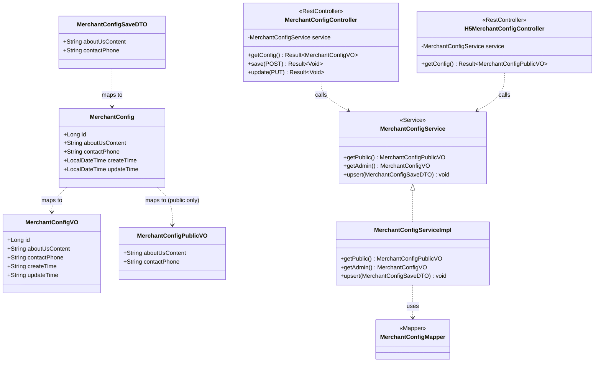
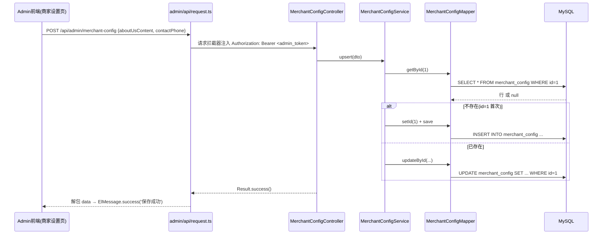
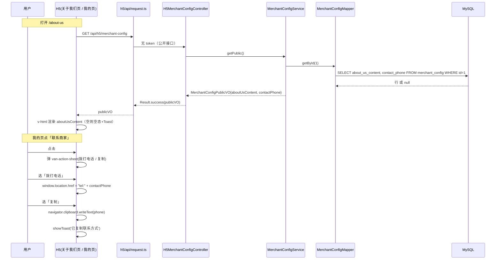

# 增量设计：商家可配置内容（关于我们 / 联系商家）

> 范围：仅覆盖本次变更（后台可配「关于我们」富文本 + 「联系商家」电话，H5 公开展示与交互）。
> 设计依据：增量 PRD + 主理人 4 个决策 + 现有代码侦察事实（已逐一核对源码）。

---

## 1. 实现方案与框架选型

- **沿用现有栈**：后端 Spring Boot 3.2.5 + MyBatis-Plus 3.5.7 + Java 21；admin 前端 Vue3 + Element Plus + Vite；H5 前端 Vue3 + Vant + Vite。全部复用既有 `Result<T>` 统一返回、`@RestController` + `@RequiredArgsConstructor` 注入、`entity/mapper/service/controller` 分层与 `dto/vo` 分包。
- **零依赖富文本（决策 1）**：不引入 wangEditor / TinyMCE。新增 `RichTextEditor.vue`，内部用原生 `<div contenteditable>` + 轻量工具栏（加粗 / 标题 / 列表 / 插入图片）。插入图片走现有 `FileController.POST /api/admin/upload` 上传拿到 OSS 公网 URL 后，用 `document.execCommand('insertImage', false, url)` 插入 ``。富文本以 **HTML 字符串**原样存储于 `about_us_content`（longtext）。
- **单行配置 upsert（决策 2）**：`merchant_config` 表固定只有一行，`id` 恒为 `1`。保存时：`getById(1)`，为 null 则 `setId(1)` 后 `save`，否则 `updateById`（等价于 `saveOrUpdate`）。POST 与 PUT 语义一致（都是 upsert），无需区分。
- **图片 URL 处理**：`FileController` 返回 `Result<String>`，`data` 即 OSS 公网 URL。admin（插入富文本 ``）与 H5（`v-html` 渲染）均直接使用该 URL，无需拼接/转换。
- **admin 入口（决策 3）**：在 `Sidebar.vue` 增加「商家设置」一级菜单项，路由指向新视图 `views/merchant-config/index.vue`。
- **联系商家交互（决策 4）**：H5「我的」页「联系商家」点击后弹 `van-action-sheet`（含「📞 拨打电话」「📋 复制」）；拨号用 `tel:` 协议，复制用 `navigator.clipboard.writeText` + `showToast`。

---

## 2. 文件列表及相对路径

> 路径基准：`backend/src/main/java/com/restaurant/`（后端）、`frontend-admin/src/`（admin 前端）、`frontend-h5/src/`（H5 前端）。

### 后端（新增为主，1 处修改）
| 状态 | 文件 | 说明 |
|---|---|---|
| 新增 | `entity/MerchantConfig.java` | 单行配置实体，`@TableId(INPUT)` 固定 id=1 |
| 新增 | `mapper/MerchantConfigMapper.java` | extends `BaseMapper<MerchantConfig>` |
| 新增 | `service/MerchantConfigService.java` | 接口 |
| 新增 | `service/impl/MerchantConfigServiceImpl.java` | upsert / getAdmin / getPublic |
| 新增 | `controller/admin/MerchantConfigController.java` | GET/POST/PUT `/api/admin/merchant-config` |
| 新增 | `controller/h5/H5MerchantConfigController.java` | GET `/api/h5/merchant-config`（公开） |
| 新增 | `dto/MerchantConfigSaveDTO.java` | 保存入参 |
| 新增 | `vo/MerchantConfigVO.java` | admin 回显（全字段） |
| 新增 | `vo/MerchantConfigPublicVO.java` | H5 公开（仅两字段） |
| 修改 | `resources/db/schema.sql` | 新增 `merchant_config` 建表 DDL |

> 无需改 `data.sql`：服务层 upsert 已兜底（首保存自动插入 id=1 行），不预置空行也可正常运行。

### admin 前端
| 状态 | 文件 | 说明 |
|---|---|---|
| 新增 | `views/merchant-config/index.vue` | 商家设置表单页（富文本 + 电话） |
| 新增 | `components/RichTextEditor.vue` | 零依赖富文本编辑器组件 |
| 新增 | `api/merchant-config.ts` | getConfig / saveConfig |
| 修改 | `layout/Sidebar.vue` | 增加「商家设置」菜单项 |
| 修改 | `router/index.ts` | 增加 `merchant-config` 子路由 |

### H5 前端
| 状态 | 文件 | 说明 |
|---|---|---|
| 新增 | `views/about-us/index.vue` | 关于我们页（`v-html` 渲染） |
| 新增 | `api/merchant-config.ts` | getMerchantConfig（公开） |
| 修改 | `router/index.ts` | 增加 `/about-us` 路由 |
| 修改 | `views/me/index.vue` | 两个 cell 绑事件 + 联系商家弹层 |
| 修改 | `types/index.ts` | 增加 `MerchantConfigPublic` 类型 |

---

## 3. 数据结构与接口

### 3.1 `merchant_config` 表结构

| 字段 | 类型 | Nullable | 默认值 | 注释 |
|---|---|---|---|---|
| `id` | BIGINT | NOT NULL | —（固定 1） | 主键，单行配置恒为 1 |
| `about_us_content` | LONGTEXT | YES | NULL | 关于我们富文本 HTML |
| `contact_phone` | VARCHAR(32) | YES | NULL | 联系电话（中国大陆手机 11 位或固话） |
| `create_time` | DATETIME | YES | CURRENT_TIMESTAMP | 创建时间 |
| `update_time` | DATETIME | YES | CURRENT_TIMESTAMP ON UPDATE | 更新时间 |

> 设计取舍：不含 `deleted`（单行永久配置，无需逻辑删除）；`id` 用 `IdType.INPUT` 以便显式写入 1（否则 `AUTO` 会忽略手写 id）。`create_time/update_time` 沿用 `@TableField(fill=...)` 自动填充（与 Banner 一致）。

**DDL（写入 `resources/db/schema.sql`）：**
```sql
DROP TABLE IF EXISTS `merchant_config`;
CREATE TABLE `merchant_config` (
  `id`                BIGINT       NOT NULL COMMENT '主键，固定为1（单行配置）',
  `about_us_content` LONGTEXT     DEFAULT NULL COMMENT '关于我们富文本HTML',
  `contact_phone`     VARCHAR(32)  DEFAULT NULL COMMENT '联系电话（中国大陆手机11位或固话）',
  `create_time`      DATETIME     DEFAULT CURRENT_TIMESTAMP COMMENT '创建时间',
  `update_time`      DATETIME     DEFAULT CURRENT_TIMESTAMP ON UPDATE CURRENT_TIMESTAMP COMMENT '更新时间',
  PRIMARY KEY (`id`)
) ENGINE=InnoDB DEFAULT CHARSET=utf8mb4 COMMENT='商家配置表（单行）';
```

### 3.2 admin 接口

**`GET /api/admin/merchant-config`**（需 admin token）
- 响应：`Result<MerchantConfigVO>`
```json
{
  "code": 200,
  "message": "操作成功",
  "data": {
    "id": 1,
    "aboutUsContent": "<h2>关于我们</h2><p>欢迎光临～</p>",
    "contactPhone": "13800138000",
    "createTime": "2025-01-01 12:00:00",
    "updateTime": "2025-01-01 12:00:00"
  }
}
```
- 若从未配置（id=1 不存在）：返回默认空 VO（`aboutUsContent:""`、`contactPhone:""`、`createTime:null`、`updateTime:null`），**不报错**。

**`POST /api/admin/merchant-config`** / **`PUT /api/admin/merchant-config`**（均需 admin token，语义一致 = upsert）
- 请求体：`MerchantConfigSaveDTO`
```json
{
  "aboutUsContent": "<h2>关于我们</h2><p>欢迎光临～</p>",
  "contactPhone": "13800138000"
}
```
- 响应：`Result<Void>`（success，无 data）
- 校验（P1）：
  - `contactPhone` 允许为空（空 = 未配置联系方式）；
  - 非空时必须匹配 中国大陆手机 `^1[3-9]\d{9}$` 或 固话 `^0\d{2,3}-?\d{7,8}$`，否则 `Result.error("联系电话格式不正确")`；
  - `aboutUsContent` 非空时长度 ≤ 20000 字符，否则 `Result.error("关于我们内容过长")`。

### 3.3 H5 公开接口

**`GET /api/h5/merchant-config`**（无需登录）
- 响应：`Result<MerchantConfigPublicVO>`
```json
{
  "code": 200,
  "message": "操作成功",
  "data": {
    "aboutUsContent": "<h2>关于我们</h2><p>欢迎光临～</p>",
    "contactPhone": "13800138000"
  }
}
```
- 仅返回 `aboutUsContent` + `contactPhone` 两个字段；两字段均可能为空串/未返回。前端按「共享知识」兜底。
- 绝不返回 `id` / `createTime` 等内部字段。

### 3.4 DTO / VO 字段

```java
// dto/MerchantConfigSaveDTO.java
@Data
public class MerchantConfigSaveDTO {
    private String aboutUsContent;   // 富文本HTML，可空
    private String contactPhone;     // 联系电话，可空
}

// vo/MerchantConfigVO.java  (admin 回显)
@Data
public class MerchantConfigVO {
    private Long id;
    private String aboutUsContent;
    private String contactPhone;
    private String createTime;
    private String updateTime;
}

// vo/MerchantConfigPublicVO.java  (H5 公开)
@Data
public class MerchantConfigPublicVO {
    private String aboutUsContent;
    private String contactPhone;
}
```

### 3.5 类关系图（Mermaid classDiagram）



---

## 4. 程序调用流程（时序图）

### ① admin 保存「关于我们 / 联系商家」→ 后端 upsert



### ② H5 打开关于我们页 / 点击联系商家 → 拉取配置 → 渲染 / 拨号复制



---

## 5. 任务列表（按实现顺序，含依赖与验收点）

| 任务 | 名称 | 源文件（新增/修改） | 依赖 | 优先级 | 验收点 |
|---|---|---|---|---|---|
| **T1** | 后端实体 + 表 | `entity/MerchantConfig.java`(新)、`mapper/MerchantConfigMapper.java`(新)、`resources/db/schema.sql`(改) | 无 | P0 | 编译通过；`merchant_config` 表可建；Mapper 可注入 |
| **T2** | 后端 service + DTO/VO | `service/MerchantConfigService.java`(新)、`service/impl/MerchantConfigServiceImpl.java`(新)、`dto/MerchantConfigSaveDTO.java`(新)、`vo/MerchantConfigVO.java`(新)、`vo/MerchantConfigPublicVO.java`(新) | T1 | P0 | upsert 正确（首保存插 id=1，再次更新）；`getPublic` 仅返回两字段；电话/长度校验生效 |
| **T3** | 后端 admin controller | `controller/admin/MerchantConfigController.java`(新) | T2 | P0 | GET/POST/PUT 在 admin token 下可用；无 token 返回 401；校验生效 |
| **T4** | 后端 H5 controller | `controller/h5/H5MerchantConfigController.java`(新) | T2 | P0 | GET 无需登录可访问；仅返回两字段 |
| **T5** | admin 视图 + 富文本组件 + 路由 + sidebar + api | `views/merchant-config/index.vue`(新)、`components/RichTextEditor.vue`(新)、`api/merchant-config.ts`(新)、`layout/Sidebar.vue`(改)、`router/index.ts`(改) | T3 | P0 | 菜单出现「商家设置」；富文本可编辑/插图片；保存后回显；电话格式错有提示 |
| **T6** | H5 路由 + about-us 视图 + api | `views/about-us/index.vue`(新)、`api/merchant-config.ts`(新)、`router/index.ts`(改)、`types/index.ts`(改) | T4 | P0 | `/about-us` 可打开并 `v-html` 渲染；空内容有兜底 |
| **T7** | H5「我的」改造 + 联系商家弹层 | `views/me/index.vue`(改) | T4, T6 | P0 | 两个 cell 可点；联系商家弹 action-sheet；拨号/复制可用；空电话 Toast/隐藏 |
| **T8** | 联调自测 | 无新增（验证为主） | T5, T6, T7 | P0 | admin 配 → H5 看 全链路通过；边界（空值、超长、错误电话）均符合预期 |

依赖关系：**T1 → T2 → {T3, T4}**；T3→T5；T4→{T6, T7}；T5/T6/T7→T8。

---

## 6. 依赖包列表

**本次不新增任何后端或前端依赖。**

- 零依赖富文本：仅用浏览器原生 `document.execCommand(...)` 与 `navigator.clipboard`，均为 Web API，无需 npm 包。
- `tel:` 拨号、`v-html` 渲染、Toast 均为 Vant / Vue 原生能力。
- 若后续强需求 XSS 净化，可评估引入 `DOMPurify`，但**本决策（零依赖）下不引入**，改用轻量自研白名单（见待明确事项 2）。

---

## 7. 共享知识（跨文件约定）

- **接口前缀**：admin `/api/admin/*`（需 `admin_token`，由 `frontend-admin/src/api/request.ts` 拦截器自动注入 `Authorization: Bearer`）；H5 公开 `/api/h5/*`（无 token）。
- **统一返回**：`Result<T>` = `{code:200, message, data}`。前端拦截器已自动解包 `data`，业务层直接拿 `data`（如 `getConfig()` 返回 `MerchantConfigVO` 而非 `Result<...>`）。
- **图片 URL**：`FileController.POST /api/admin/upload` 返回 `Result<String>`，`data` 即 OSS 公网 URL。admin 插入富文本 ``、H5 `v-html` 渲染均**直接使用**该 URL，不做拼接。
- **contenteditable 输出约定**：编辑器通过 `v-model` 直接绑定 HTML 字符串；存储原样存 `about_us_content`；H5 用 `v-html` 渲染。约定 HTML 仅含白名单标签（h1-h3/p/br/ul/ol/li/strong/em/img/a），`img` 仅 `https` 且来自本 OSS 域名。
- **空值兜底**（VO 返回 null/空串时）：
  - `/about-us` 页：`aboutUsContent` 为空 → 显示空态提示 + `showToast('商家暂未配置关于我们')`，不渲染空白页。
  - 「我的」页「联系商家」：`contactPhone` 为空 → 直接 `showToast('暂无商家联系方式')`（本设计**默认隐藏该 cell**，更干净，待明确事项 1 确认）。
  - 复制/拨号前再次判空，避免 `tel:undefined`。
- **电话格式（P1）**：admin 保存时后端 + 前端双校验；H5 仅展示与拨号，信任后端已校验。
- **XSS 提示**：富文本来源为 admin（内部可信），H5 公开渲染用 `v-html`。本决策不引入净化库；建议在 `RichTextEditor` 内对插入的图片 URL 做白名单，并在存储前做基础清洗（去除 `<script>` 等），列为后续增强（见待明确事项 2）。

---

## 8. 待明确事项（需主理人 / 工程师确认，非写代码）

以下为侦察时无法仅凭源码确定、需拍板的点（已尽量通过读源码消除不确定性，仅留真正需决策项）：

1. **「联系商家」空值处理二选一**：P1 说"未配置时隐藏或 Toast"。本设计默认**隐藏该 cell**（更干净）；请确认是要"隐藏"还是"显示但点击弹 Toast"。
2. **富文本 XSS 净化策略**：零依赖前提下，是否接受"仅允许白名单标签/属性"的轻量自研净化（推荐），还是暂不做（内部可信即可）？影响 `RichTextEditor` 与存储前清洗的实现量。
3. **`about_us_content` 长度上限**：本设计默认 20000 字符，是否合适 / 是否需要更严（如 10000）？
4. **admin「商家设置」菜单图标**：用哪个 Element Plus 图标（如 `Service` / `Shop` / `Setting`）？无功能影响，纯视觉。
5. **预置 id=1 空行**：本设计选择"upsert 兜底，不改 `data.sql`"。是否同意？还是希望 `data.sql` 预置一行避免首次写入路径分叉？
6. **H5 公开接口鉴权**：当前 `H5DishController` 也未加鉴权注解，推测 `/api/h5/**` 在 Security/网关层放行。请工程师确认 `GET /api/h5/merchant-config` **确实无需登录**、不会被拦截器要求 token（否则 H5 需改调用方式）。

> 备注：侦察中已确认、无需再确认的事实（供主理人知悉）：FileController 上传返回确为 OSS 公网 URL；admin 拦截器确自动带 `admin_token`；H5 路由确为 `routes` 数组 + 懒加载 `import()`，新增 `/about-us` 同此模式；`me/index.vue` 第 78-79 行确为两个未绑事件的 `van-cell`。
