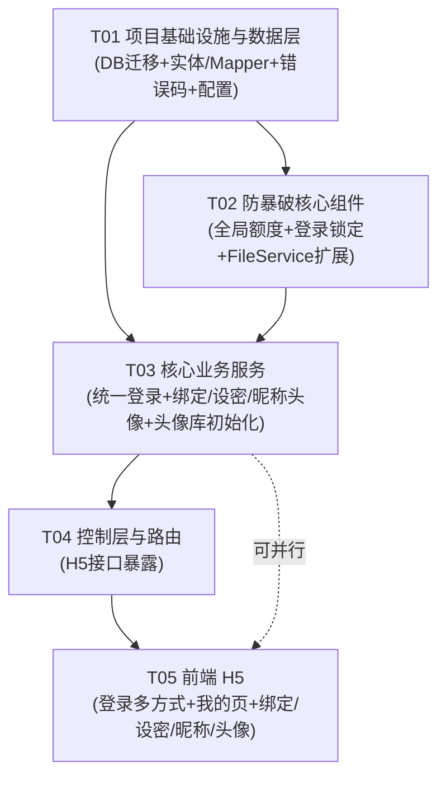

# 账号增强系统架构设计 + 任务分解

> 产出人：架构师 高见远（software-architect）　|　面向对象：主理人 / 产品经理 / 工程师
> 配套图：`docs/class-diagram.mermaid`（类图）、`docs/sequence-diagram.mermaid`（时序图）

---

## 0. 探查结论（先行确认，供设计背书）

在进入设计前，已按主理人要求逐一读取关键代码，结论如下：

| # | 探查项 | 结论（直接影响设计） |
|---|--------|----------------------|
| 0.1 | **手机注册用户如何建 Member**（`SmsAuthServiceImpl.login`） | 匹配顺序：①按 `phone` 查；②查不到再按 `username == phone` 回填（兼容老账号）；③仍查不到则**新建** `Member`，`username = phone`、`phone = phone`、`password = null`、`balance = 0`。**→ 手机注册用户 `password` 恒为 null（除非走 F1-2），`username` 即手机号，满足唯一约束。这是 F1-3 融合的前提。** |
| 0.2 | **`FileServiceImpl` 是否可复用**（决策 #11） | 确认 `FileServiceImpl.upload(MultipartFile)` 复用 `OssConfig` 提供的 `OSS` Bean + `bucket-name` + `url-prefix`。**建议新增重载 `upload(byte[] data, String ext)`** 供头像库初始化程序化上传（无需 `MultipartFile`）。→ **复用，仅需小幅扩展接口。** |
| 0.3 | **`ResultCode` 如何扩展错误码** | `ResultCode` 为 Java 枚举；`GlobalExceptionHandler` 已能将 `BizException(code, message)` 映射为 `Result`。**→ 直接追加枚举常量即可**，无需改异常框架。 |
| 0.4 | **DB 初始化方式**（Flyway？data.sql？） | 项目**未接入 Flyway/Liquibase**；采用 `src/main/resources/db/` 下**手动迁移脚本**（如既有 `migration_member_phone.sql` 改 `member` 表）+ `schema.sql` 全量建表，部署时由 DBA 执行。**→ 新增 `migration_member_profile.sql`，并同步更新 `schema.sql` 与 `deploy/sql/` 镜像。** |
| 0.5 | **登录失败调用链是否接通**（决策 #10） | `MemberAuthServiceImpl.login`（账号名+密码）**未调用任何失败记录**；`SmsRateLimiter.onVerifyFail(phone)` 仅用于**短信验证码错误**（锁 `sms:lock:phone`），并非登录失败锁定。**→ 登录失败锁定调用链当前未接通**，需新增 `LoginDefenseService.onLoginFail(account, ip)` 并在统一登录四个分支的凭据校验失败时调用（详见 §3 / §4 / §7）。 |
| 0.6 | **`customer` 鉴权拦截** | `CustomerAuthInterceptor` 同时接受 `role=CUSTOMER` 与 `role=MEMBER`，并把 `memberId` 写入 `request.setAttribute("memberId", …)`。**→ 绑定手机/设密码/昵称/头像等需登录态接口，直接读取该属性即可。** |
| 0.7 | **滑块验证码** | `CaptchaService.verifyAndConsumeCaptcha(token)` 为一次性消费。现有登录（账号名+密码）已强制校验；手机验证码登录仅在**发送侧**校验。`SmsSendRequest`/`SmsLoginRequest` 承载短信请求。 |

---

## Part A：系统设计

### 1. 实现方案 + 框架选型

**技术栈（沿用现有，无新增学习成本）：** 后端 Spring Boot 3.2.5 / Java 21 / MyBatis-Plus 3.5.7 / hutool / Redis / MySQL；前端 H5 Vite + Vue3 + TS + Vant + Pinia；OSS 用既有阿里云 `oss-client` SDK。

**1.1 统一登录接口（决策 #2）**
- 合并为单一 `POST /api/h5/member/login`，请求体统一 `MemberLoginDTO`，由 `loginType` 字段分支：
  - `ACCOUNT_PASSWORD`：账号名 + 密码（+滑块）。查 `username`，BCrypt 比对。
  - `PHONE_CODE`：手机号 + 验证码（+滑块）。复用短信验证码匹配/自动注册逻辑。
  - `PHONE_PASSWORD`：**新增**。手机号 + 密码（+滑块）。查 `phone`，BCrypt 比对；`password` 为 null 时返回 `PASSWORD_NOT_SET`。
  - `ACCOUNT_CODE`：**新增**。账号名 + 验证码（+滑块）。按 `username` 定位 → 取该账号已绑 `phone` → 向其发码/验码；`phone` 为 null 返回 `ACCOUNT_NO_PHONE`。
- **account 判定**：后端以正则 `^1[3-9]\d{9}$` 归一化（与 `SmsAuthServiceImpl.PHONE_REGEX` 一致）；`loginType` 优先，正则作为兜底校验。
- **滑块**：四种组合**均在登录请求携带 `captchaToken` 并校验**（决策 #4「与登录一致」；现有账号名+密码已如此，手机验证码登录原为发送侧校验，本次统一为登录侧也校验，属预期行为变更，前端需相应调整）。

**1.2 避免重复实现（融合策略）**
- `SmsAuthService.sendCode(phone, captchaToken, ip)` **保留**，发送侧逻辑（滑块+限流+阿里云+Redis）不变；`PHONE_CODE` 的「发码」与 `ACCOUNT_CODE` 的「发码」都复用它（account 模式先按 username 解析出绑定 phone 再调用）。
- 从 `SmsAuthServiceImpl.login` 中抽取 `phoneCodeLogin(phone, code, ip)`（含自动注册与老账号回填），统一登录的 `PHONE_CODE` 分支直接调用，消除双份登录实现。`SmsAuthService.login(SmsLoginRequest)` 标记为 `@Deprecated`，过渡期保留，后续删除。
- 旧 `SmsController` 的 `/api/h5/sms/login` 标记废弃（统一走 `/member/login`）；`/api/h5/sms/send` 保留用于向手机号发码。

**1.3 防暴破（F2，标准）**
- **发送侧全局日额度**：`SmsRateLimitProperties` 新增 `globalDailyLimit=500`；`SmsRateLimiter.canSend` 增加 `sms:send:limit:global:{yyyyMMdd}` 判定，`onSendSuccess` 自增。原有单号10/单IP50/60s 间隔全部保留。
- **登录侧失败锁定**：新增 `LoginDefenseService`（独立组件，因需按 `account`+`IP` 双维度锁定，与短信验证码 `phone` 锁定语义不同）。Redis key：`login:fail:{account}`、`login:lock:{account}`、`login:fail:ip:{ip}`、`login:lock:ip:{ip}`；阈值 `loginFailMax=5`、`loginLockMinutes=15`（可配）。统一登录**每个分支凭据失败时调用 `onLoginFail(account, ip)`**，成功调用 `resetOnSuccess`。
- 决策 #10 落地：统一登录接入 `LoginDefenseService.onLoginFail`，接通此前缺失的登录失败锁定链。

**1.4 昵称 + 头像（F3）**
- `member` 增加 `nickname`（VARCHAR 20）、`avatar`（VARCHAR 512，直接存 `oss_url`，决策 #6）。
- 新建 `avatar` 表：`id, oss_url, sort, create_time, update_time, deleted`。
- `AvatarInitService`（CommandLineRunner，幂等）：程序生成 12 张卡通 SVG（纯字符串，**无外部图片依赖**）→ 经 `FileServiceImpl.upload(byte[], "svg")` 上传 OSS → seed `avatar` 表（已存在 ≥12 条则跳过）。
- 注册时默认昵称 `美食家` + hutool `RandomUtil.randomString(8)`（英文），并随机从 `avatar` 表取一条 `oss_url` 写入 `member.avatar`。
- 昵称每日 ≤3、头像每日 ≤5（决策 #5 自然日计数）：Redis `member:nick:count:{memberId}:{yyyyMMdd}`、`member:avatar:count:{memberId}:{yyyyMMdd}`，后端**强制拦截**超限（返回 `NICK_CHANGE_LIMIT` / `AVATAR_CHANGE_LIMIT`）。

**1.5 绑定手机 / 设密码（F1-1 / F1-2）**
- 绑定手机：需登录态 + 滑块 + 短信码；仅 `phone` 为 null 可绑（决策 #7，不支持改绑）；手机号若已被其他账号占用返回 `PHONE_ALREADY_REGISTERED`。
- 设密码：需登录态 + 滑块；仅 `password` 为 null 可设（决策 #1），`BCrypt` 写入；最小长度 8（可配 `password.min-length`）。

---

### 2. 文件列表及相对路径（backend + frontend-h5）

> 标记：**〔新〕** 新增文件　**〔改〕** 修改文件　**〔弃〕** 标记废弃（过渡期保留）

#### 2.1 后端 `backend/src/main/java/com/restaurant/`

**实体 / Mapper**
- `entity/Member.java` 〔改〕：加 `nickname`、`avatar` 字段及 getter/setter（`@Data` 已含）。
- `entity/Avatar.java` 〔新〕：`id, ossUrl, sort, createTime, updateTime, deleted`（MyBatis-Plus 注解）。
- `mapper/MemberMapper.java` 〔改/无〕：MyBatis-Plus 接口，无需改（自动继承 `selectById/updateById/insert`）。
- `mapper/AvatarMapper.java` 〔新〕：继承 `BaseMapper<Avatar>`。

**DTO（入参）**
- `dto/MemberLoginDTO.java` 〔改〕：改为统一结构——`loginType`(String, 必填)、`account`(String, 必填)、`password`、`code`、`captchaToken`；去掉原 `@NotBlank` 强校验，改为 service 内按 `loginType` 分支校验。
- `dto/BindPhoneDTO.java` 〔新〕：`phone, code, captchaToken`。
- `dto/SetPasswordDTO.java` 〔新〕：`password, captchaToken`。
- `dto/UpdateNicknameDTO.java` 〔新〕：`nickname`(@Size max=20)。
- `dto/UpdateAvatarDTO.java` 〔新〕：`avatarId`(Long)。
- `dto/SendLoginCodeDTO.java` 〔新〕：`account, captchaToken`（账号名+验证码登录的发码请求）。
- `dto/SmsSendRequest.java` / `dto/SmsLoginRequest.java` 〔留〕：发送侧复用，登录侧标记废弃。

**VO（出参）**
- `vo/MemberLoginVO.java` 〔改〕：加 `nickname`、`avatar`。
- `vo/MemberInfoVO.java` 〔改〕：加 `nickname`、`avatar`。
- `vo/AvatarVO.java` 〔新〕：`id, ossUrl`。
- `vo/ChangeLimitVO.java` 〔新〕：`remaining`（昵称/头像修改后剩余次数）。

**Service 接口 / 实现**
- `service/MemberAuthService.java` 〔改〕：接口增 `login(MemberLoginDTO, HttpServletRequest)`；保留 `register`。
- `service/impl/MemberAuthServiceImpl.java` 〔改〕：`login` 改为统一分发（四种分支）+ 接入 `LoginDefenseService`；`register` 增加默认昵称/头像（调 `MemberProfileService`）。
- `service/SmsAuthService.java` 〔改〕：保留 `sendCode`；登录方法改名为 `phoneCodeLogin(...)`（被统一登录调用），原 `login(SmsLoginRequest)` 标记 `@Deprecated`。
- `service/impl/SmsAuthServiceImpl.java` 〔改〕：抽取 `phoneCodeLogin(phone, code, ip)`（含自动注册/老账号回填）；自动注册分支调 `MemberProfileService` 生成默认昵称/头像；`login(SmsLoginRequest)` 改为委托 `phoneCodeLogin` 并 `@Deprecated`。
- `service/MemberProfileService.java` 〔新〕：绑定手机、设密码、改昵称、改头像、发登录码、头像列表、默认昵称/头像生成。
- `service/impl/MemberProfileServiceImpl.java` 〔新〕：上述接口实现，含 Redis 自然日计数。
- `service/LoginDefenseService.java` 〔新〕：登录失败锁定接口。
- `service/impl/LoginDefenseServiceImpl.java` 〔新〕：基于 Redis 实现。
- `service/FileService.java` 〔改〕：接口加 `upload(byte[] data, String ext)`。
- `service/impl/FileServiceImpl.java` 〔改〕：实现字节数组上传重载，复用 `ossClient/bucketName/urlPrefix`。
- `service/AvatarInitService.java` 〔新〕：头像库初始化接口（含 `initIfNeeded()`）。
- `service/impl/AvatarInitServiceImpl.java` 〔新〕：CommandLineRunner 实现，程序生成 SVG + 上传 + 幂等 seed；受 `avatar.init.enabled` 开关控制。

**配置 / 限流**
- `config/SmsRateLimitProperties.java` 〔改〕：加 `globalDailyLimit = 500`。
- `config/LoginDefenseProperties.java` 〔新〕：`loginFailMax = 5`、`loginLockMinutes = 15`（前缀 `login.defense`）。
- `service/impl/SmsRateLimiter.java` 〔改〕：`canSend` 增加全局日额度判定；`onSendSuccess` 自增全局计数（新增 key `sms:send:limit:global:{yyyyMMdd}`）。
- `common/ResultCode.java` 〔改〕：追加新错误码（见 §7）。

**Controller**
- `controller/h5/H5MemberAuthController.java` 〔改〕：仅保留统一 `POST /api/h5/member/login` 分发。
- `controller/h5/MemberProfileController.java` 〔新〕：`POST /bind-phone`、`POST /set-password`、`POST /nickname`、`POST /avatar`、`POST /send-login-code`、`GET /avatars`。
- `controller/h5/SmsController.java` 〔弃〕：`/login` 标记废弃（重定向到统一登录）；`/send` 保留。

#### 2.2 数据库脚本 `backend/src/main/resources/db/` 与 `deploy/sql/`

- `db/migration_member_profile.sql` 〔新〕：ALTER `member` ADD `nickname` / `avatar`；CREATE TABLE `avatar`（与既有 `migration_member_phone.sql` 风格一致，附 DBA 说明）。
- `db/schema.sql` 〔改〕：`member` 表补 `nickname`/`avatar` 列；新增 `avatar` 建表语句（供全新部署）。
- `deploy/sql/migration_member_profile.sql` 〔新〕：与上镜像，供生产部署。

#### 2.3 配置 `backend/src/main/resources/`

- `application.yml` 〔改〕：补充默认阈值（全局日发码、登录锁定、`password.min-length`、自然日限额、头像数）。
- `application-dev.yml` 〔改〕：显式写入 `sms.rate-limit.global-daily-limit: 500`、`login.defense.login-fail-max: 5`、`login.defense.login-lock-minutes: 15`、`password.min-length: 8`、`profile.nick-daily-limit: 3`、`profile.avatar-daily-limit: 5`、`avatar.count: 12`、`avatar.init.enabled: true`。

#### 2.4 前端 H5 `frontend-h5/src/`

- `api/member.ts` 〔改〕：登录改调统一接口（新增 `loginType`/`account`）；加 `bindPhone`、`setPassword`、`updateNickname`、`updateAvatar`、`sendLoginCode`；`MemberLoginVO` 加 `nickname/avatar`。
- `api/avatar.ts` 〔新〕：`getAvatars()`。
- `types/index.ts` 〔改〕：新增 `AvatarVO`、`UnifiedLoginData`、`BindPhoneData`、`SetPasswordData`、`UpdateNicknameData`、`UpdateAvatarData`；`MemberInfo`/`MemberLoginVO` 加 `nickname/avatar` 与剩余次数可选字段。
- `store/modules/member.ts` 〔改〕：`state` 加 `nickname/avatar`；`setMemberInfo` 存储；新增 `bindPhone/setPassword/updateNickname/updateAvatar/sendLoginCode/getAvatars` action；`refreshInfo` 同步昵称/头像。
- `router/index.ts` 〔改〕：加 `/bind-phone`、`/set-password`、`/avatar` 路由。
- `views/login/index.vue` 〔改〕：四 Tab（账号密码 / 手机号+验证码 / 手机号+密码 / 账号名+验证码），四者均走滑块 + 统一登录；账号名模式支持「获取验证码」。
- `views/me/index.vue` 〔改〕：展示昵称/头像；新增菜单（绑定手机、设置密码、编辑昵称、更换头像）并显示剩余次数。
- `views/bind-phone/index.vue` 〔新〕：绑定手机页（先发码到手机，再提交）。
- `views/set-password/index.vue` 〔新〕：设密码页（仅未设密码可见）。
- `views/avatar/index.vue` 〔新〕：从 `avatar` 表拉取并选择头像。
- `components/EditNicknamePopup.vue` 〔新〕：编辑昵称弹窗（`van-dialog`/`van-popup`）。
- `views/register/index.vue` 〔改/轻〕：注册后端已自动生成昵称/头像，仅需确保 `MemberLoginVO` 回写 store（基本无需改 UI，仅 store 适配）。

---

### 3. 数据结构和接口

> 类图见 `docs/class-diagram.mermaid`。关键结构如下：

**3.1 核心 DTO / VO（后端）**

| 类 | 关键字段 | 说明 |
|----|----------|------|
| `MemberLoginDTO` | `loginType, account, password, code, captchaToken` | 统一登录入参；按 `loginType` 决定必填项 |
| `BindPhoneDTO` | `phone, code, captchaToken` | 绑定手机 |
| `SetPasswordDTO` | `password, captchaToken` | 设密码 |
| `UpdateNicknameDTO` | `nickname`(@Size max=20) | 改昵称 |
| `UpdateAvatarDTO` | `avatarId`(Long) | 改头像（从 avatar 表选取） |
| `SendLoginCodeDTO` | `account, captchaToken` | 账号名+验证码登录的发码 |
| `MemberLoginVO` | `token, memberId, username, balance, nickname, avatar` | 登录/注册出参 |
| `MemberInfoVO` | `+ nickname, avatar` | 我的页资料 |
| `AvatarVO` | `id, ossUrl` | 头像选项 |
| `ChangeLimitVO` | `remaining` | 修改后剩余次数 |

**3.2 DB 表结构**

```sql
-- member 表新增列（迁移脚本）
ALTER TABLE `member`
    ADD COLUMN `nickname` VARCHAR(20) NULL COMMENT '昵称' AFTER `phone`,
    ADD COLUMN `avatar`   VARCHAR(512) NULL COMMENT '头像OSS地址（直接存url）' AFTER `nickname`;

-- avatar 表（新建）
CREATE TABLE `avatar` (
    `id`          BIGINT       NOT NULL AUTO_INCREMENT COMMENT '主键ID',
    `oss_url`     VARCHAR(512) NOT NULL COMMENT '头像OSS地址',
    `sort`        INT          DEFAULT 0 COMMENT '展示排序',
    `create_time` DATETIME     DEFAULT CURRENT_TIMESTAMP COMMENT '创建时间',
    `update_time` DATETIME     DEFAULT CURRENT_TIMESTAMP ON UPDATE CURRENT_TIMESTAMP COMMENT '更新时间',
    `deleted`     TINYINT      DEFAULT 0 COMMENT '逻辑删除',
    PRIMARY KEY (`id`),
    KEY `idx_sort` (`sort`)
) ENGINE=InnoDB DEFAULT CHARSET=utf8mb4 COMMENT='卡通头像库';
```

**3.3 关键方法签名（设计层，非实现代码）**

```java
// 统一登录分发
MemberLoginVO login(MemberLoginDTO dto, HttpServletRequest request);

// 资料服务
void    bindPhone(Long memberId, BindPhoneDTO dto);
void    setPassword(Long memberId, SetPasswordDTO dto);
ChangeLimitVO updateNickname(Long memberId, UpdateNicknameDTO dto);
ChangeLimitVO updateAvatar(Long memberId, UpdateAvatarDTO dto);
void    sendLoginCode(SendLoginCodeDTO dto, String clientIp);
List<AvatarVO> listAvatars();
String  generateDefaultNickname();   // "美食家" + RandomUtil.randomString(8)
String  randomAvatarUrl();           // 从 avatar 表随机取一条

// 登录防暴破
boolean isAccountLocked(String account);
boolean isIpLocked(String ip);
LoginFailResult onLoginFail(String account, String ip);
void    resetOnSuccess(String account, String ip);
```

---

### 4. 程序调用流程（时序图）

> 完整 mermaid 见 `docs/sequence-diagram.mermaid`，覆盖：① 统一登录四种分支　② 绑定手机　③ 设密码　④ 注册默认资料　⑤ 头像库初始化　⑥ 防暴破（发送侧+登录侧）。此处仅标注要点：

- **① 统一登录**：`H5MemberAuthController` → `MemberAuthServiceImpl.login` → `verifyAndConsumeCaptcha` → `LoginDefenseService.isAccountLocked/isIpLocked` → 按 `loginType` 分支（账号/手机 × 密码/验证码）→ 凭据失败 `onLoginFail`、成功 `resetOnSuccess` → `JwtUtil.generateToken(role=MEMBER, 720h)` → 返回含 `nickname/avatar` 的 `MemberLoginVO`。
- **② 绑定手机**：拦截器取 `memberId` → 滑块校验 → 校验手机号未被占用、当前 `phone` 为 null → 短信码校验（失败走 `SmsRateLimiter.onVerifyFail`）→ 写 `phone`。
- **③ 设密码**：取 `memberId` → 滑块校验 → 校验 `password` 为 null 且长度达标 → BCrypt 写入。
- **④ 注册默认资料**：账号注册（`MemberAuthServiceImpl.register`）与手机注册（`SmsAuthServiceImpl.phoneCodeLogin` 自动注册）均调 `MemberProfileService.generateDefaultNickname()` + `randomAvatarUrl()` 后入库。
- **⑤ 头像库初始化**：`AvatarInitServiceImpl.initIfNeeded()`（CommandLineRunner）→ 开关校验 + 计数幂等 → 生成 12 张 SVG 字节 → `FileService.upload(byte[], "svg")` → OSS → seed `avatar` 表。
- **⑥ 防暴破**：发送侧 `SmsRateLimiter.canSend/onSendSuccess` 增加全局日额度 key；登录侧凭据失败统一调 `LoginDefenseService.onLoginFail` 写 `login:fail:*` 并在达上限时置 `login:lock:*`。

---

### 5. 待明确事项 / 不确定点

1. **旧登录接口下线策略**：是否允许前端全面切到统一 `/api/h5/member/login`？本设计保留 `/api/h5/sms/send`、废弃 `/api/h5/sms/login` 作为过渡。需确认过渡窗口与是否允许短时间在两份逻辑并存。
2. **头像初始化环境**：`AvatarInitServiceImpl` 启动即上传 OSS，依赖 `application-local.yml` 的 OSS ak/sk。若本地/测试无可用 OSS 凭证，启动会失败——建议加 `avatar.init.enabled`（默认 true，本地可关），或改为「首次访问 `/avatars` 为空时由 admin 手动触发」。请确认采用哪种。
3. **`PHONE_PASSWORD` 未设密码提示**：手机注册用户未走 F1-2 时 `password` 为 null，登录应返回 `PASSWORD_NOT_SET`（新增错误码）。请确认文案与前端引导（跳转设密码页）。
4. **`ACCOUNT_CODE` 前置条件**：账号未绑手机（`phone` 为 null）时返回 `ACCOUNT_NO_PHONE`。老账号（有密码、未绑手机）是否应引导先「绑定手机」再使用此方式？本设计按此处理，请确认。
5. **全局日发码 500 的口径**：按「全站所有号码合计」计（单 Redis key `sms:send:limit:global:{yyyyMMdd}`）。需确认是否按此口径，还是按「单租户/单应用实例」。
6. **头像是否需要 CDN/缩略图**：当前直接存 `url-prefix` 原图。12 张 SVG 体积小，暂不做缩略，请确认。
7. **昵称/头像修改是否需审计日志**：本设计不做；如需合规追溯请告知。
8. **JWT 有效期**：沿用现有 `720h`（30 天）。新增登录方式不改变有效期，请确认。

---

## Part B：任务分解

### 6. 依赖包列表

**后端：无新增依赖。** 全部复用既有组件：
- 阿里云 OSS SDK（`com.aliyun.oss:aliyun-sdk-oss`，`OssConfig` 已提供 `OSS` Bean）——头像上传复用。
- hutool `RandomUtil`——默认昵称随机串、验证码随机。
- MyBatis-Plus / spring-boot-starter-data-redis / spring-boot-starter-validation——均已在用。
- 卡通头像用 **SVG 纯字符串生成**，无需任何图片处理库（符合决策 #1「避免引入重图片库」）。

**前端：无新增依赖。** Vant / Pinia / vue-router / axios 均已在用。

---

### 7. 任务列表（有序、含依赖、按实现顺序）

> 约束：≤5 个任务；每任务 ≥3 个文件；首任务为「项目基础设施」。

**T01　项目基础设施与数据层（DB 迁移 + 实体/Mapper + 错误码 + 配置）**【P0】
- 涉及文件：`db/migration_member_profile.sql`〔新〕、`db/schema.sql`〔改〕、`deploy/sql/migration_member_profile.sql`〔新〕、`entity/Member.java`〔改〕、`entity/Avatar.java`〔新〕、`mapper/AvatarMapper.java`〔新〕、`common/ResultCode.java`〔改〕、`config/SmsRateLimitProperties.java`〔改〕、`config/LoginDefenseProperties.java`〔新〕、`application.yml`〔改〕、`application-dev.yml`〔改〕
- 依赖：无（基础）
- 验证点：① `migration_member_profile.sql` 在测试库执行后 `member` 含 `nickname/avatar`、`avatar` 表存在；② `ResultCode` 编译通过且含新增码；③ 应用启动无字段映射错误；④ 配置项可被 `@ConfigurationProperties` 绑定。

**T02　防暴破核心组件（发送侧全局额度 + 登录失败锁定 + 文件上传扩展）**【P0】
- 涉及文件：`service/impl/SmsRateLimiter.java`〔改〕、`service/LoginDefenseService.java`〔新〕、`service/impl/LoginDefenseServiceImpl.java`〔新〕、`service/FileService.java`〔改〕、`service/impl/FileServiceImpl.java`〔改〕
- 依赖：T01（需 `SmsRateLimitProperties.globalDailyLimit`、`LoginDefenseProperties`、`ResultCode` 新码）
- 验证点：① 发码超 500/日 返回 `RATE_LIMIT_GLOBAL_DAILY`；② 连续 5 次登录失败锁定账号+IP 15 分钟，返回 `LOGIN_LOCKED`；③ `FileService.upload(byte[], "svg")` 能上传并返回 OSS URL。

**T03　核心业务服务（统一登录 + 绑定/设密/昵称头像 + 头像库初始化）**【P0】
- 涉及文件：`service/MemberAuthService.java`〔改〕、`service/impl/MemberAuthServiceImpl.java`〔改〕、`service/SmsAuthService.java`〔改〕、`service/impl/SmsAuthServiceImpl.java`〔改〕、`service/MemberProfileService.java`〔新〕、`service/impl/MemberProfileServiceImpl.java`〔新〕、`service/AvatarInitService.java`〔新〕、`service/impl/AvatarInitServiceImpl.java`〔新〕、`dto/MemberLoginDTO.java`〔改〕、`dto/BindPhoneDTO.java`〔新〕、`dto/SetPasswordDTO.java`〔新〕、`dto/UpdateNicknameDTO.java`〔新〕、`dto/UpdateAvatarDTO.java`〔新〕、`dto/SendLoginCodeDTO.java`〔新〕、`vo/MemberLoginVO.java`〔改〕、`vo/MemberInfoVO.java`〔改〕、`vo/AvatarVO.java`〔新〕、`vo/ChangeLimitVO.java`〔新〕
- 依赖：T01、T02
- 验证点：① 四种 `loginType` 分支均返回含 `nickname/avatar` 的 JWT；② 绑定手机需登录态+滑块+码、仅首次；③ 设密码仅 `password` 为 null 可设；④ 昵称每日 ≤3、头像每日 ≤5（超限拦截）；⑤ 启动后 `avatar` 表恰有 12 条且 OSS 有对应文件（幂等可重跑）；⑥ 注册自动生成默认昵称+随机头像。

**T04　控制层与路由（H5 接口暴露）**【P0】
- 涉及文件：`controller/h5/H5MemberAuthController.java`〔改〕、`controller/h5/MemberProfileController.java`〔新〕、`controller/h5/SmsController.java`〔弃〕
- 依赖：T03
- 验证点：① `POST /api/h5/member/login` 按 `loginType` 工作；② `/bind-phone`、`/set-password`、`/nickname`、`/avatar`、`/send-login-code`、`/avatars` 均按约定路径与鉴权生效；③ 旧 `/api/h5/sms/login` 标记废弃且不阻断。

**T05　前端 H5（登录多方式 + 我的页资料 + 绑定/设密/昵称/头像 + store/router/api/types）**【P1】
- 涉及文件：`views/login/index.vue`〔改〕、`views/me/index.vue`〔改〕、`views/bind-phone/index.vue`〔新〕、`views/set-password/index.vue`〔新〕、`views/avatar/index.vue`〔新〕、`components/EditNicknamePopup.vue`〔新〕、`store/modules/member.ts`〔改〕、`router/index.ts`〔改〕、`api/member.ts`〔改〕、`api/avatar.ts`〔新〕、`types/index.ts`〔改〕、`views/register/index.vue`〔轻改〕
- 依赖：T04（需后端契约稳定）；可与 T03 并行开发（前后端约定 DTO 后各自实现）
- 验证点：① 登录页四种方式可切换且均走滑块；② 我的页展示昵称/头像、显示剩余修改次数；③ 绑定手机/设密码/改昵称/换头像流程闭环；④ 头像选择页能从 `/avatars` 拉取并生效；⑤ store 正确持久化 `nickname/avatar`。

---

### 8. 共享知识（跨文件约定）

- **`loginType` 枚举值（字符串常量）**：`ACCOUNT_PASSWORD` / `PHONE_CODE` / `PHONE_PASSWORD` / `ACCOUNT_CODE`（后端用常量类或枚举，前端用同名字符串）。
- **手机号正则**：`^1[3-9]\d{9}$`（与 `SmsAuthServiceImpl.PHONE_REGEX` 一致）。
- **Redis Key 规范（统一前缀，自然日用 `yyyyMMdd`，时区 `Asia/Shanghai`）**：
  - 发送侧：`sms:code:{phone}`、`sms:send:interval:{phone}`、`sms:send:limit:phone:{yyyyMMdd}`、`sms:send:limit:ip:{yyyyMMdd}:{ip}`、**`sms:send:limit:global:{yyyyMMdd}`（新增）**、`sms:fail:{phone}`、`sms:lock:{phone}`
  - 登录侧（新增）：`login:fail:{account}`、`login:lock:{account}`、`login:fail:ip:{ip}`、`login:lock:ip:{ip}`
  - 资料修改：`member:nick:count:{memberId}:{yyyyMMdd}`、`member:avatar:count:{memberId}:{yyyyMMdd}`
- **自然日计数口径**：key 末段 `yyyyMMdd`；计数 TTL 设为「当日剩余秒数」于凌晨归零（复用 `SmsRateLimiter.secondsUntilEndOfDay()` 思路）。
- **错误码（`ResultCode` 新增，HTTP 建议码）**：
  - `PHONE_ALREADY_REGISTERED`(400) 手机号已被注册
  - `PHONE_ALREADY_BOUND`(400) 已绑定手机，不支持改绑
  - `PASSWORD_ALREADY_SET`(400) 已设置密码
  - `PASSWORD_NOT_SET`(400) 尚未设置密码（手机号+密码登录时）
  - `ACCOUNT_NO_PHONE`(400) 账号未绑定手机号，无法用验证码登录
  - `ACCOUNT_NOT_FOUND`(400) 账号不存在
  - `NICK_TOO_LONG`(400) 昵称超 20 字
  - `NICK_CHANGE_LIMIT`(429) 今日昵称修改次数达上限
  - `AVATAR_CHANGE_LIMIT`(429) 今日头像修改次数达上限
  - `AVATAR_NOT_FOUND`(400) 头像不存在
  - `RATE_LIMIT_GLOBAL_DAILY`(429) 今日验证码发送总量达上限
  - `LOGIN_LOCKED`(429) 账号/网络被锁定，请稍后再试
  - （沿用既有 `CAPTCHA_INVALID` / `SMS_CODE_EXPIRED` / `SMS_CODE_ERROR` / `RATE_LIMIT_*` / `SMS_PHONE_INVALID`）
- **默认昵称规则**：固定前缀 `美食家` + hutool `RandomUtil.randomString(8)`（小写英文 8 位）；碰撞概率极低，不强制唯一。
- **头像随机分配**：注册时 `randomAvatarUrl()` 从 `avatar` 表随机取一条 `oss_url` 写入 `member.avatar`；表为空则返回 null（初始化完成后由用户首次设置）。
- **JWT 约定**：`subject=memberId`，`claims={role=MEMBER}`，有效期 `720h`；与既有会员体系一致。
- **滑块一致性**：绑定手机、设密码、统一登录四分支**均需 `captchaToken`**（一次性消费）。
- **DDL 执行方式**：手动迁移脚本由 DBA 在低峰期、备份后执行；不引入 Flyway/Liquibase。

---

### 9. 任务依赖图



> 说明：T05 在后端 DTO/VO 契约（T03/T04）确定后即可并行开发，缩短关键路径。

---

## 附录：与既有设计的衔接

- **复用 `SmsAuthServiceImpl` 自动注册逻辑**：手机注册用户 `username=phone, password=null` 的事实（探查 0.1）使「手机号+密码」「账号名+验证码」两种新增组合自洽——前者对「已设密码的手机用户」生效，后者对「已绑手机的账号」生效。
- **不涉及 `tempUserId` 逻辑改动**：注册时 `tempUserId` 关联购物车逻辑保持不变。
- **`CustomerAuthInterceptor` 无需改动**：已同时接受 `MEMBER` 角色并注入 `memberId`。
